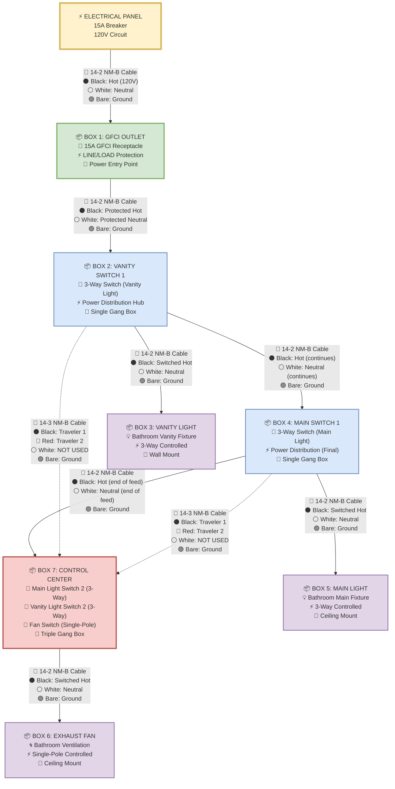

# Bathroom Electrical Wiring - Linear Feed-Through Design

This document provides a comprehensive, detailed wiring diagram using the optimal linear feed-through approach that follows the physical layout of boxes.

## ⚡ System Overview
- **Power Flow**: Linear feed-through from Box 1 → Box 2 → Box 4 → Box 7
- **Main Light**: 3-way control from Box 4 and Box 7
- **Vanity Light**: 3-way control from Box 2 and Box 7  
- **Exhaust Fan**: Single-pole control from Box 7
- **GFCI Protection**: All circuits protected by Box 1
- **Physical Order**: Box 1 → Box 2 → Box 3 → Box 4 → Box 6 → Box 5 → Box 7

## Complete Linear Circuit Flow Diagram

## 🔌 Detailed Wire Specifications

### **Power Feed Cables (14-2 NM-B)**
| Cable Run | Purpose | Black Wire | White Wire | Bare Wire |
|-----------|---------|------------|------------|-----------|
| Panel → Box 1 | Main power supply | Hot (120V) | Neutral | Equipment Ground |
| Box 1 → Box 2 | Protected power feed | Protected Hot | Protected Neutral | Ground |
| Box 2 → Box 4 | Power continuation | Hot (continues) | Neutral (continues) | Ground |
| Box 4 → Box 7 | Final power feed | Hot (end of line) | Neutral (end of line) | Ground |

### **3-Way Control Cables (14-3 NM-B)**
| Cable Run | Purpose | Black Wire | Red Wire | White Wire | Bare Wire |
|-----------|---------|------------|----------|------------|-----------|
| Box 2 ↔ Box 7 | Vanity 3-way control | Traveler 1 | Traveler 2 | **NOT USED** | Ground |
| Box 4 ↔ Box 7 | Main 3-way control | Traveler 1 | Traveler 2 | **NOT USED** | Ground |

**Note**: The white wires in the 14-3 cables are not used in this configuration. All fixture neutrals come from the main power feed chain.

### **Fixture Feed Cables (14-2 NM-B)**
| Cable Run | Purpose | Black Wire | White Wire | Bare Wire |
|-----------|---------|------------|------------|-----------|
| Box 2 → Box 3 | Vanity light feed | Switched Hot | Neutral | Ground |
| Box 4 → Box 5 | Main light feed | Switched Hot | Neutral | Ground |
| Box 7 → Box 6 | Fan feed | Switched Hot | Neutral | Ground |

## 🔧 How The Linear Design Works

### **Power Distribution Strategy**
1. **Box 1 (GFCI)**: Provides GFCI protection for entire circuit, simple LINE/LOAD connection
2. **Box 2 (Vanity SW 1)**: Receives power, distributes to Box 4, controls vanity light via 3-way circuit
3. **Box 4 (Main SW 1)**: Receives power, distributes to Box 7, controls main light via 3-way circuit
4. **Box 7 (Control Center)**: End of power feed, houses all "second" switches, controls fan directly

### **3-Way Switch Operation**

#### **Vanity Light 3-Way Circuit**
- **Box 2**: Vanity Switch 1 (COM gets constant hot, sends travelers to Box 7)
- **Box 7**: Vanity Switch 2 (receives travelers, COM sends switched hot back to Box 2)
- **Switched Hot Path**: Box 7 → Box 2 → Box 3 (Vanity Light)
- **Neutral Path**: Box 2 → Box 3 (direct from power feed chain)

#### **Main Light 3-Way Circuit**  
- **Box 4**: Main Switch 1 (COM gets constant hot, sends travelers to Box 7)
- **Box 7**: Main Switch 2 (receives travelers, COM sends switched hot back to Box 4)
- **Switched Hot Path**: Box 7 → Box 4 → Box 5 (Main Light)
- **Neutral Path**: Box 4 → Box 5 (direct from power feed chain)

#### **Fan Single-Pole Circuit**
- **Box 7**: Fan Switch (gets constant hot, sends switched hot directly to Box 6)
- **Direct Connection**: Box 7 → Box 6 (Fan) via 14-2 cable
- **Neutral Path**: Box 7 → Box 6 (direct from power feed chain)

## 💡 Design Advantages

### **Why Linear Feed-Through is Optimal**
✅ **Follows Physical Layout**: Power flows in natural box order (1→2→4→7)  
✅ **Simple GFCI Wiring**: Box 1 only needs 2 cables (LINE/LOAD)  
✅ **Standard Practice**: Most common residential wiring approach  
✅ **Easy Installation**: Install boxes in order, no complex backtracking  
✅ **Clear Power Path**: Easy to trace and troubleshoot  
✅ **Code Compliant**: All white wires remain neutrals  

### **User Experience Benefits**
✅ **Convenient Control**: Box 7 has all primary switches in one location  
✅ **Full 3-Way Function**: Both lights controllable from two locations each  
✅ **Logical Operation**: Switch behavior matches physical layout  

### **Installation Benefits**  
✅ **Minimal Cable Runs**: Efficient use of cable lengths  
✅ **Standard Materials**: Only 14-2 and 14-3 NM-B cables used  
✅ **Clear Documentation**: Each wire purpose explicitly defined  
✅ **No Wire Re-identification**: All conductors used for standard purposes  

## 📋 Cable Summary

**Total Cables Required:**
- **6 × 14-2 NM-B cables** (power feeds + fixture connections)
- **2 × 14-3 NM-B cables** (3-way traveler circuits)
- **Total: 8 cables**

**Wire Gauge:** 14 AWG throughout (suitable for 15A circuit)  
**Cable Type:** NM-B (Non-metallic sheathed, suitable for dry locations)  
**Ground:** Bare copper equipment grounding conductor in all cables

---
*This linear design provides the most standard, efficient, and maintainable approach for the bathroom electrical system while ensuring full code compliance and optimal user experience.*
