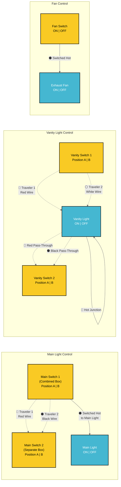
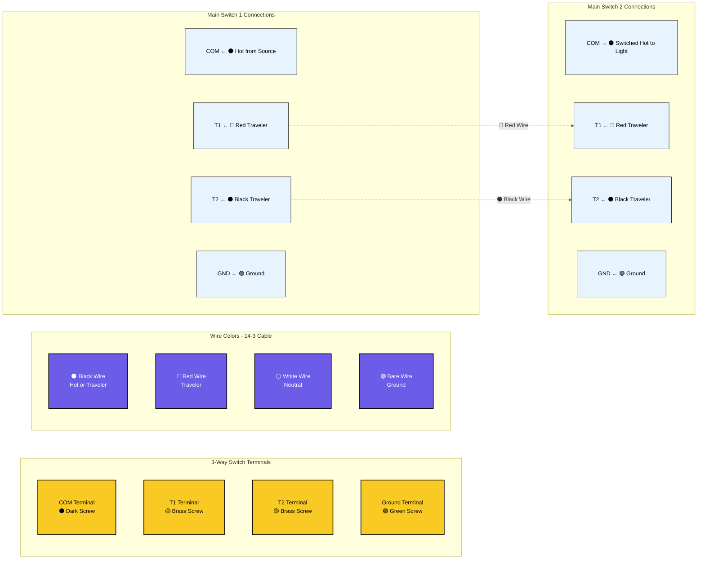
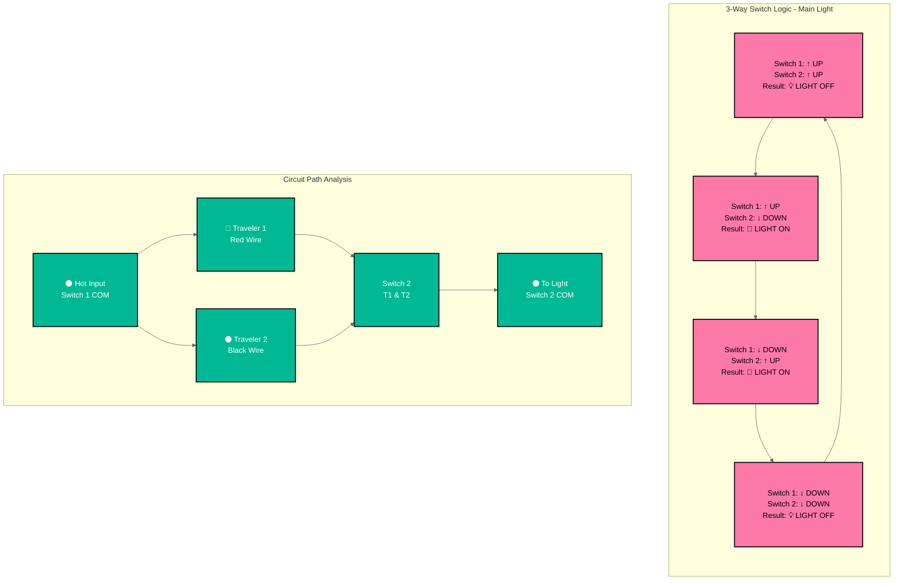
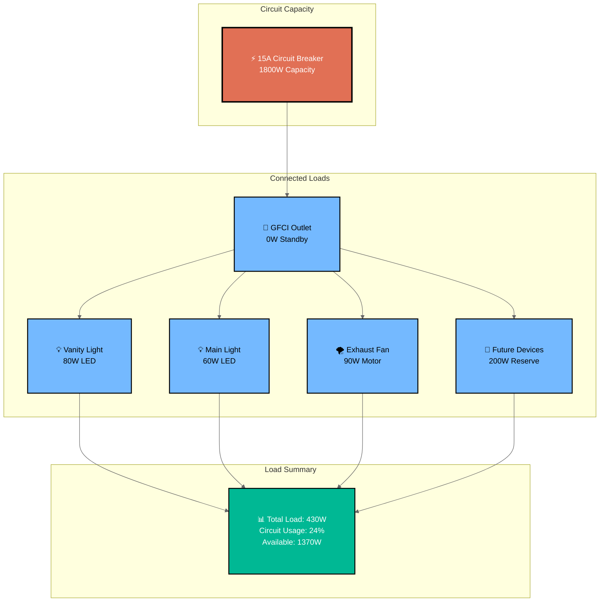
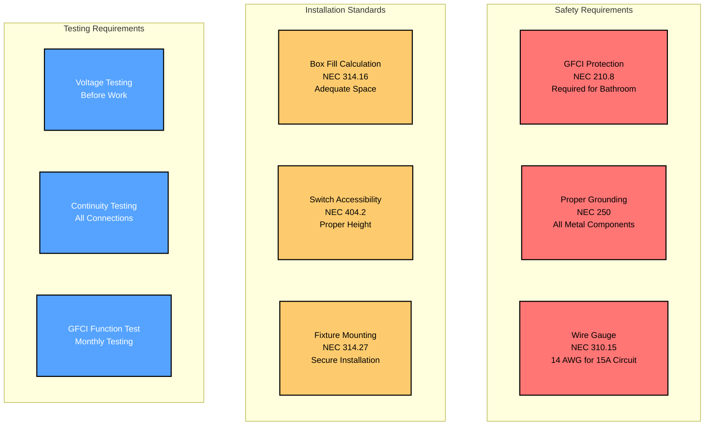

# Bathroom Electrical Wiring - Mermaid Diagram

This document provides a detailed Mermaid flowchart diagram of the bathroom electrical wiring system.

## Complete Circuit Flow Diagram

```mermaid
%%{init: {'theme':'default', 'flowchart': {'nodeSpacing': 80, 'rankSpacing': 100, 'padding': 30}, 'themeVariables': {'primaryColor': '#ffffff', 'primaryTextColor': '#000000', 'primaryBorderColor': '#000000', 'lineColor': '#666666', 'sectionBkgColor': '#ffffff', 'altSectionBkgColor': '#f9f9f9', 'gridColor': '#cccccc', 'c0': '#ffffff', 'c1': '#ffffff', 'c2': '#ffffff', 'c3': '#ffffff', 'c4': '#ffffff'}}}%%
flowchart TD
    A["Electrical Panel<br/>15A Breaker"] -->|"14-2 Cable<br/>⚫ Hot: Black<br/>⚪ Neutral: White<br/>🟢 Ground: Bare"| B["GFCI Outlet<br/>15A, 120V"]
     B -->|"14-2 Cable<br/>⚫ Hot: Black<br/>⚪ Neutral: White<br/>🟢 Ground: Bare"| D["Vanity Switch 1<br/>3-Way Switch"]

    D -->|"14-3 Cable<br/>⚫ Hot: Black<br/>🔴 Traveler: Red<br/>⚪ Hot to Light: White<br/>🟢 Ground: Bare"| C["Vanity Light Fixture<br/>LED Compatible"]

    C -->|"14-3 Cable<br/>⚪ White to VS2: White<br/>🔴 Traveler: Red<br/>⚫ Black from Light: Black<br/>🟢 Ground: Green"| F["Main Switch 2<br/>3-Way Switch"]

    F -->|"14-3 Cable A (Vanity)<br/>⚪ White Hot to VS2: White<br/>🔴 Vanity Traveler: Red<br/>⚫ Neutral: Black<br/>🟢 Ground: Bare"| E["Combined Switch Box<br/>Main SW1<br/>Vanity SW2<br/>Fan SW"]

    F -->|"14-3 Cable B (Main Light)<br/>🔴 Main Traveler: Red<br/>⚫ Main Traveler: Black<br/>⚪ Neutral Feed: White<br/>🟢 Ground: Bare"| E

    E -->|"14-2 Cable<br/>⚫ Switched Hot: Black<br/>⚪ Neutral: White<br/>🟢 Ground: Bare"| G["Main Light Fixture<br/>LED Compatible"]

    G -->|"14-2 Cable<br/>⚫ Hot Pass-Through: Black<br/>⚪ Neutral: White<br/>🟢 Ground: Bare"| H["Exhaust Fan<br/>CFM Rated"]
    
    %% Fan Control from Combined Box
    E -.->|"⚫ Switched Hot<br/>Fan Switch → Fan"| H
    
    %% Styling
    classDef boxPadding padding:10px 10px
    classDef panelStyle fill:#ff6b6b,stroke:#000,stroke-width:3px,color:#fff
    classDef gfciStyle fill:#4ecdc4,stroke:#000,stroke-width:2px,color:#000
    classDef fixtureStyle fill:#45b7d1,stroke:#000,stroke-width:2px,color:#fff
    classDef switchStyle fill:#f9ca24,stroke:#000,stroke-width:2px,color:#000
    classDef wireStyle stroke:#666,stroke-width:2px
    
    class A,B,C,D,E,F,G,H boxPadding
    class A panelStyle
    class B gfciStyle
    class C,G,H fixtureStyle
    class D,E,F switchStyle
```



## Circuit Control Power Flow Explanation

### ⚡ MAIN LIGHT CIRCUIT (3-Way Control)
**Primary Controller**: Main Switch 1 (Combined Box) - **SOURCES SWITCHED HOT**
**Secondary Controller**: Main Switch 2 (Separate Box) - **RECEIVES TRAVELERS**

**Power Flow**: Hot from vanity circuit → Main Switch 2 (pass-through via travelers) → Main Switch 1 (Combined Box) → **SWITCHED HOT OUTPUT** → Main Light

### ⚡ VANITY LIGHT CIRCUIT (3-Way Control)  
**Primary Controller**: Vanity Switch 1 (Separate Box) - **SOURCES HOT TO LIGHT**
**Secondary Controller**: Vanity Switch 2 (Combined Box) - **COMPLETES CIRCUIT**

**Power Flow**: GFCI → Vanity Switch 1 → **SWITCHED HOT TO VANITY LIGHT** → return via Vanity Switch 2

### ⚡ FAN CIRCUIT (Single-Pole Control)
**Controller**: Fan Switch (Combined Box)
**Power Flow**: Hot from main circuit → Fan Switch → **SWITCHED HOT TO FAN**

**Important Note**: The fan switch is located at the END of the circuit and controls the fan in the MIDDLE of the circuit. Here's how it works:

## Wire Identification Requirements (NEC 200.7)

**⚠️ CRITICAL: White Wires Used as Hot**
In 3-way switch circuits, white wires from switch loops carry hot (not neutral). These MUST be re-identified:
- **Mark with black electrical tape** at both ends (switch and fixture)
- **Required locations**: 
  - White wire at vanity light fixture (switched hot from Vanity Switch 2)
  - White wire at Main Switch 2 (carries hot to Combined Box)
- **Why**: Prevents dangerous confusion between true neutrals and hot wires

### Power Path to Fan Switch:
1. **Continuous Hot Wire**: Runs from GFCI → Vanity Switch 1 → Vanity Light → Main Switch 2 → **Combined Switch Box (Fan Switch)** 
2. **Fan Switch Location**: Physical end of the circuit run in Combined Switch Box
3. **Fan Location**: Between main light and combined switch box (receives power via main light circuit)

### Circuit Control Method:
- **⚫ Main Light Control**: Main Switch 1 (Combined Box) sends switched hot to Main Light via travelers from Main Switch 2
- **⚫ Vanity Light Control**: Vanity Switch 1 sends switched hot directly to Vanity Light, completed by Vanity Switch 2
- **⚫ Fan Control**: Fan switch in Combined Box sends switched hot to fan via main light pass-through
- **Result**: Each circuit controlled independently by its respective 3-way or single-pole switches

This configuration allows centralized control with the fan switch grouped with other switches.

### Visual Power Flow:
```
VANITY CIRCUIT:
Panel → GFCI → VS1 → Vanity Light ← VS2 (Combined Box)

MAIN LIGHT CIRCUIT:  
Panel → GFCI → VS1 → Vanity Light → MS2 ← Travelers → MS1 (Combined Box) → Main Light

FAN CIRCUIT:
Main Light → Fan ← Fan Switch (Combined Box)
```

## 3-Way Switch Control Logic Diagram



## Wire Routing and Box Connections

```mermaid
%%{init: {'theme':'default', 'flowchart': {'nodeSpacing': 80, 'rankSpacing': 100, 'padding': 30}, 'themeVariables': {'primaryColor': '#ffffff', 'primaryTextColor': '#000000', 'primaryBorderColor': '#000000', 'lineColor': '#666666', 'sectionBkgColor': '#ffffff', 'altSectionBkgColor': '#f9f9f9', 'gridColor': '#cccccc', 'c0': '#ffffff', 'c1': '#ffffff', 'c2': '#ffffff', 'c3': '#ffffff', 'c4': '#ffffff'}}}%%
flowchart TD
    subgraph "Electrical Panel"
        PANEL["15A Breaker<br/>⚫ Hot: Black<br/>⚪ Neutral: White<br/>🟢 Ground: Bare"]
    end
    
    subgraph "Box 1 - GFCI Outlet"
        GFCI_LINE[LINE Side<br/>⚫ From Panel Hot<br/>⚪ From Panel Neutral<br/>🟢 From Panel Ground]
        GFCI_LOAD[LOAD Side<br/>⚫ To Vanity Hot<br/>⚪ To Vanity Neutral<br/>🟢 To Vanity Ground]
        GFCI_LINE -->|"Internal GFCI Protection"| GFCI_LOAD
    end
    
    subgraph "Box 2 - Vanity Switch 1"
        VS1_SWITCH["Vanity Switch 1<br/>⚫ COM ← Hot from GFCI<br/>🔴 T1 → Red Traveler to Light<br/>⚪ T2 → White (Hot) to Light Fixture<br/>🟢 GND ← Ground"]
        VS1_NEUTRAL["⚪ Neutral Pass-Through<br/>Wire Nut Only"]
    end
    
    subgraph "Box 3 - Vanity Light"
        VL_FIXTURE["Vanity Light Fixture<br/>⚪ White from VS1 (Hot)<br/>⚫ Black to MS2 (Pass-Through)<br/>🟢 Green Ground"]
        VL_SPLICE["Wire Splices<br/>⚫ Black from VS1 COM → White to VS2 (via MS2 → Combined Box)<br/>⚪ White from VS1 T2 → Light Fixture (Hot)<br/>🔴 Red: VS1→VS2 Pass-Through (via MS2 → Combined Box)<br/>⚫ Black from Light → Continue to MS2<br/>🟢 Green: Continue to MS2"]
        VL_SPLICE -.-> VL_FIXTURE
    end
    
    subgraph "Box 4 - Main Switch 2"
        MS2_SWITCH["Main Switch 2<br/>⚫ COM INPUT ← Black Hot from Vanity Circuit<br/>🔴 T1 ↔ Red Traveler to/from MS1<br/>⚫ T2 ↔ Black Traveler to/from MS1<br/>🟢 GND ← Ground"]
        MS2_NEUTRAL["⚪ TRUE Neutral Pass-Through<br/>(To/From Combined Box and Main Light)"]
        MS2_HOT["⚪ WHITE HOT from Vanity Light<br/>(Switched Hot Return - NOT Neutral)<br/>**MARK WITH BLACK TAPE**<br/>Continues to Combined Box"]
        MS2_CONTROL["⚡ 3-Way Control Logic<br/>Works with Main Switch 1 to control Main Light<br/>via Traveler Wires (Red & Black)"]
    end
    
    subgraph "Box 5 - Main Light"
        ML_FIXTURE[Main Light Fixture<br/>⚫ Switched Hot<br/>⚪ Neutral Return<br/>🟢 Ground]
        ML_SPLICE["Wire Splices<br/>⚫ Hot: Fixture + Pass-Through<br/>⚪ Neutral: Fixture + Pass-Through<br/>🟢 Ground: Fixture + Pass-Through"]
        ML_SPLICE -.-> ML_FIXTURE
    end
    
    subgraph "Box 6 - Exhaust Fan"
        FAN_MOTOR["Fan Motor<br/>⚫ From Switch Control (via Combined Box)<br/>⚪ Neutral Direct<br/>🟢 Ground to Case"]
        FAN_PASS[Pass-Through Wires<br/>⚫ Hot Continue to Combined Box<br/>⚪ Neutral Continue to Combined Box<br/>🟢 Ground Continue to Combined Box]
    end
    
    subgraph "Box 7 - Combined Switch Box (END OF RUN)"
        direction TB
        COMB_MAIN["Main Switch 1<br/>⚫ COM → Switched Hot to Main Light<br/>🔴 T1 ↔ Red to MS2<br/>⚫ T2 ↔ Black to MS2<br/>🟢 GND ← Ground Pigtail"]
        COMB_VANITY["Vanity Switch 2<br/>⚪ COM ← White from Vanity Light (Hot)<br/>🔴 T1 ↔ Red to Vanity Light<br/>⚫ T2 → Neutral (black wire in Cable A)<br/>🟢 GND ← Ground Pigtail"]
        COMB_FAN["Fan Switch<br/>⚫ LINE ← Hot from Main Circuit<br/>⚫ LOAD → Fan Control<br/>🟢 GND ← Ground Pigtail"]
        COMB_BUNDLES["Wire Bundles<br/>⚫ Hot Distribution<br/>⚪ Neutral Termination<br/>🟢 Ground Collection"]
        
        COMB_BUNDLES -.-> COMB_MAIN
        COMB_BUNDLES -.-> COMB_VANITY
        COMB_BUNDLES -.-> COMB_FAN
    end
    
    %% Cable Connections with Wire Colors and Travelers
    PANEL -->|"14-2 Cable<br/>⚫⚪🟢"| GFCI_LINE
    GFCI_LOAD -->|"14-2 Cable<br/>⚫⚪🟢"| VS1_SWITCH
    
    %% Vanity 3-Way Circuit - 14-3 Cable with Travelers
    VS1_SWITCH -->|"14-3 Cable Run #1<br/>⚫🔴⚪🟢<br/>🔴Red = Traveler 1<br/>⚪White = Hot to Light"| VL_FIXTURE
    VL_FIXTURE -->|"14-3 Cable Run #2<br/>⚫🔴⚪🟢<br/>🔴Red = Traveler to VS2<br/>⚫Black = Hot continues to MS2"| MS2_SWITCH
    
    %% Two 14-3 Cables from MS2 to Combined Box
    MS2_SWITCH -->|"14-3 Cable A (Vanity)<br/>⚪⚫🔴🟢<br/>⚪White = Hot (marked)<br/>🔴Red = Traveler<br/>⚫Black = Neutral"| COMB_BUNDLES
    MS2_SWITCH -->|"14-3 Cable B (Main Light)<br/>🔴⚫⚪🟢<br/>🔴Red = Traveler 1<br/>⚫Black = Traveler 2<br/>⚪White = Neutral"| COMB_BUNDLES
    
    %% Main Circuit - Combined Box to Main Light to Fan  
    COMB_MAIN -->|"14-2 Cable<br/>⚫⚪🟢<br/>⚫ Switched Hot"| ML_SPLICE
    ML_SPLICE -->|"14-2 Cable<br/>⚫⚪🟢"| FAN_PASS
    
    %% Fan Control Wire
    COMB_FAN -.->|"⚫ Switched Hot"| FAN_MOTOR
    COMB_BUNDLES -.-> COMB_MAIN
    COMB_BUNDLES -.-> COMB_VANITY
    COMB_BUNDLES -.-> COMB_FAN
    
    classDef boxPadding padding:10px 10px
    classDef panelStyle fill:#ff6b6b,stroke:#000,stroke-width:3px,color:#fff
    classDef boxStyle fill:#e8f4fd,stroke:#000,stroke-width:2px,color:#000
    classDef deviceStyle fill:#fff3cd,stroke:#000,stroke-width:2px,color:#000
    classDef fixtureStyle fill:#45b7d1,stroke:#000,stroke-width:2px,color:#fff
    
    class PANEL,GFCI_LINE,GFCI_LOAD,VS1_SWITCH,VS1_NEUTRAL,VL_FIXTURE,COMB_MAIN,COMB_VANITY,COMB_FAN,COMB_BUNDLES,MS2_SWITCH,MS2_NEUTRAL,ML_FIXTURE,ML_SPLICE,FAN_MOTOR,FAN_PASS boxPadding
    class PANEL panelStyle
    class GFCI_LINE,GFCI_LOAD,VL_SPLICE,VS1_SWITCH,VS1_NEUTRAL,MS2_SWITCH,MS2_NEUTRAL,ML_SPLICE,FAN_PASS,COMB_BUNDLES boxStyle
    class COMB_MAIN,COMB_VANITY,COMB_FAN deviceStyle
    class VL_FIXTURE,ML_FIXTURE,FAN_MOTOR fixtureStyle
```



## Terminal Connection Diagram



## Switch Position Logic Table



## Circuit Load Analysis



## Safety and Code Compliance



## How to View These Diagrams

These Mermaid diagrams can be viewed in several ways:

1. **VS Code with Mermaid Preview Extension**
   - Install "Mermaid Preview" extension
   - Open this file and use the preview feature

2. **GitHub/GitLab**
   - These platforms natively render Mermaid diagrams

3. **Mermaid Live Editor**
   - Copy diagram code to https://mermaid.live/

4. **Documentation Platforms**
   - Most modern documentation platforms support Mermaid

## Diagram Features

- **Complete Circuit Flow**: Shows power routing from panel to each device
- **3-Way Switch Logic**: Illustrates how traveler wires control lights
- **Wire Specifications**: All diagrams show 14 AWG wire for 15A circuit
- **Terminal Connections**: Detailed switch terminal wiring
- **Load Analysis**: Circuit capacity and usage calculations
- **Safety Compliance**: Code requirements and testing procedures
- **High Contrast Styling**: Improved text readability with dark borders and contrasting colors

## Styling Notes

The diagrams use high-contrast color schemes for optimal readability:
- **Dark borders (#000)** on all elements for clear definition
- **White text on dark backgrounds** for critical components
- **Black text on light backgrounds** for detailed information
- **Bold stroke widths** to ensure visibility
- **Color-coded components** for easy identification while maintaining accessibility

These diagrams complement the ASCII art diagrams in the other documentation files and provide a more technical, structured view of the electrical system.

## Switch Box Configuration

**Important Configuration**: This bathroom wiring uses a combined switch box containing three switches:

1. **Vanity Switch 1**: Located in separate box near vanity light
2. **Combined Switch Box**: Contains three switches in one location:
   - Main Switch 1 (3-way for main light)
   - Vanity Switch 2 (3-way for vanity light)
   - Fan Switch (single pole for exhaust fan)
3. **Main Switch 2**: Located in separate box for main light control

### Benefits of Combined Switch Box:
- **Convenient Control**: All main switches in one location
- **Simplified Wiring**: Shared neutral and ground connections reduce wire nuts
- **Code Compliant**: Standard electrical practice for bathroom installations
- **Cost Effective**: Fewer boxes and less complex routing

## Detailed Wire Color Flow Diagram

```mermaid
%%{init: {'theme':'default', 'flowchart': {'nodeSpacing': 80, 'rankSpacing': 100, 'padding': 30}, 'themeVariables': {'primaryColor': '#ffffff', 'primaryTextColor': '#000000', 'primaryBorderColor': '#000000', 'lineColor': '#666666', 'sectionBkgColor': '#ffffff', 'altSectionBkgColor': '#f9f9f9', 'gridColor': '#cccccc', 'c0': '#ffffff', 'c1': '#ffffff', 'c2': '#ffffff', 'c3': '#ffffff', 'c4': '#ffffff'}}}%%
flowchart TD
    subgraph "Wire Color Legend"
        HOT["⚫ Hot | Switched Hot - Black Wire"]
        NEUT["⚪ Neutral - White Wire"]
        GND["🟢 Ground - Bare | Green Wire"]
        TRAV1["🔴 Traveler 1 - Red Wire"]
        TRAV2["⚫ Traveler 2 - Black Wire in 14-3"]
    end
    
    subgraph "Panel to GFCI (14-2)"
        P1["⚫ Panel Hot"] --> G1["⚫ GFCI LINE Hot"]
        P2["⚪ Panel Neutral"] --> G2["⚪ GFCI LINE Neutral"]
        P3["🟢 Panel Ground"] --> G3["🟢 GFCI Ground"]
    end
    
    subgraph "GFCI to Vanity Light (14-2)"
        G4["⚫ GFCI LOAD Hot"] --> V1["⚫ Vanity Fixture Hot + Switch Feed"]
        G5["⚪ GFCI LOAD Neutral"] --> V2["⚪ Vanity Fixture Neutral + Circuit"]
        G6["🟢 GFCI LOAD Ground"] --> V3["🟢 Vanity Fixture Ground + Circuit"]
    end
    
    subgraph "Vanity Switch 1 to Vanity Light (14-3)"
        S1["⚫ VS1 COM Terminal"] --> V4["⚫ Black to White VS2 Junction"]
        S2["🔴 VS1 T1 Terminal"] --> V5["🔴 Red Pass-Through to VS2"]
        S3["⚪ VS1 T2 Terminal"] --> V6["⚪ White to Light Fixture Hot"]
        S4["⚪ Neutral Pass-Through"] --> V7["⚪ Neutral Continue to VS2"]
        S5["🟢 VS1 Ground"] --> V8["🟢 Green Pass-Through to VS2"]
    end
    
    subgraph "Vanity Light to Main Switch 2 (14-3)"
        V9["⚪ White from Black VS1 Junction"] --> M_VS2_HOT["⚪ Hot continues to Combined Box"]
        V10["🔴 Red Pass-Through"] --> M_VS2_RED["🔴 Red continues to Combined Box"]
        V11["⚫ Black from Light Fixture"] --> M_VS2_BLACK["⚫ Black continues to Combined Box"]
        V12["⚪ Neutral Continue"] --> M_VS2_NEUT["⚪ Neutral continues to Combined Box"]
        V13["🟢 Green Continue"] --> M_VS2_GND["🟢 Ground continues to Combined Box"]
    end
    
    subgraph "Main Switch 2 to Combined Box (Two 14-3 Cables)"
        M_VS2_HOT --> C2_A["⚪ Cable A: VS2 COM Terminal"]
        M_VS2_RED --> C3_A["🔴 Cable A: VS2 T1 Terminal"] 
        M_VS2_BLACK --> C4_A["⚫ Cable A: Neutral to Bundle"]
        M_VS2_GND --> C6["🟢 Ground Bundle Wire Nut"]
        
        C7_B["⚫ Cable B: From Main SW1 COM"] --> M1["🔴 Main SW2 T1"]
        C11_B["🔴 Cable B: MS1 T1"] --> M2["⚫ Main SW2 T2"]
        C12_B["⚫ Cable B: MS1 T2"] --> M3["⚪ Main SW2 T2"]
        C5_B["⚪ Cable B: Neutral"] --> M4["⚪ Neutral Pass-Through"]
    end
    
    subgraph "Combined Box Connections"
        H1["⚫ Hot Distribution Bundle"] --> C7["⚫ Main SW1 COM → Main Light"]
        H1 --> C8["⚫ Fan Switch LINE"]
        C2_A --> C9["⚪ Vanity SW2 COM from Light"]
        C10["🔴 Red MS1 T1"] --> C11_B
        C12["⚫ Black MS1 T2"] --> C12_B
        C14["⚫ Fan Switch LOAD"] --> C15["⚫ Control to Fan Motor"]
        C6 --> C16["🟢 All Switch Grounds"]
        C6 --> M5["🟢 Main SW2 Ground"]
    end
    
    subgraph "Combined Box to Main Light (14-2)"
        C7 --> L1["⚫ Main Light Fixture + Pass-Through"]
        C5_B --> L2["⚪ Main Light Neutral + Pass-Through"]
        C6 --> L3["🟢 Main Light Ground + Pass-Through"]
    end
    
    subgraph "Main Light to Fan (14-2)"
        L1 --> F1["⚫ Fan Box Pass-Through"]
        L2 --> F2["⚪ Fan Neutral to Motor"]
        L3 --> F3["🟢 Fan Ground to Motor + Case"]
    end
    
    subgraph "Fan Control from Combined Box"
        C15 --> F4["⚫ Fan Motor Hot from Switch"]
    end
    
    classDef boxPadding padding:10px 10px
    classDef panelStyle fill:#ff6b6b,stroke:#000,stroke-width:3px,color:#fff
    classDef boxStyle fill:#e8f4fd,stroke:#000,stroke-width:2px,color:#000
    classDef deviceStyle fill:#fff3cd,stroke:#000,stroke-width:2px,color:#000
    classDef fixtureStyle fill:#45b7d1,stroke:#000,stroke-width:2px,color:#fff
    
    class PANEL,GFCI_LINE,GFCI_LOAD,VS1_SWITCH,VS1_NEUTRAL,VL_FIXTURE,COMB_MAIN,COMB_VANITY,COMB_FAN,COMB_BUNDLES,MS2_SWITCH,MS2_NEUTRAL,ML_FIXTURE,ML_SPLICE,FAN_MOTOR,FAN_PASS boxPadding
    class PANEL panelStyle
    class GFCI_LINE,GFCI_LOAD,VL_SPLICE,VS1_SWITCH,VS1_NEUTRAL,MS2_SWITCH,MS2_NEUTRAL,ML_SPLICE,FAN_PASS,COMB_BUNDLES boxStyle
    class COMB_MAIN,COMB_VANITY,COMB_FAN deviceStyle
    class VL_FIXTURE,ML_FIXTURE,FAN_MOTOR fixtureStyle
```



## Physical Wiring Diagrams - All Electrical Boxes

### Box 1 - GFCI Outlet Box

```
┌─────────────────────────────────────────────────────────────────────────────────┐
│                          BOX 1 - GFCI OUTLET (Single Gang)                     │
│                            Power Source from Panel                              │
└─────────────────────────────────────────────────────────────────────────────────┘

CABLE ENTRY POINTS:
                Cable from Panel (14-2)               Cable to Vanity (14-2)

┌─────────────────────────────────────────────────────────────────────────────────┐
│                                                                                 │
│  FROM PANEL (14-2)              GFCI OUTLET                TO VANITY SWITCH 1   │
│  ┌─────────────┐                ┌───────────┐             ┌─────────────────┐   │
│  │ ⚫ Hot       │───────────────→│ LINE Hot  │             │                 │   │
│  │ ⚪ Neutral   │───────────────→│ LINE Neut │             │                 │   │
│  │ 🟢 Ground   │──────────┬────→│ Ground    │             │                 │   │
│  └─────────────┘          │     └───────────┘             │                 │   │
│                           │                               │                 │   │
│                           │     ┌───────────┐             │                 │   │
│                           │     │ LOAD Hot  │────────────→│ ⚫ Hot to VS1   │   │
│                           │     │ LOAD Neut │────────────→│ ⚪ Neut to VS1  │   │
│                           └────→│ Ground    │────────────→│ 🟢 Grnd to VS1  │   │
│                                 └───────────┘             └─────────────────┘   │
│                                                                                 │
│ ⚠️  GFCI provides protection for entire bathroom circuit                        │
│ ⚠️  Test monthly using TEST/RESET buttons                                       │
└─────────────────────────────────────────────────────────────────────────────────┘
```

### Box 2 - Vanity Switch 1 Box

```
┌─────────────────────────────────────────────────────────────────────────────────┐
│                      BOX 2 - VANITY SWITCH 1 (Single Gang)                     │
│                         3-Way Switch for Vanity Light                          │
└─────────────────────────────────────────────────────────────────────────────────┘

CABLE ENTRY POINTS:
                Cable from GFCI (14-2)               Cable to Vanity Light (14-3)

┌─────────────────────────────────────────────────────────────────────────────────┐
│                                                                                 │
│  FROM GFCI (14-2)               VANITY SWITCH 1              TO VANITY LIGHT    │
│  ┌─────────────┐                ┌───────────┐               ┌─────────────────┐ │
│  │ ⚫ Hot       │───────────────→│ COM (⚫)  │──────────────→│ ⚫ Black (Hot   │ │
│  │             │                │           │               │    to VS2)      │ │
│  │             │                │ T1 (🟡)  │──────────────→│ 🔴 Red (Trav 1) │ │
│  │             │                │           │               │                 │ │
│  │             │                │ T2 (🟡)  │──────────────→│ ⚪ White (Hot   │ │
│  │             │                │           │               │    to Light)    │ │
│  │             │                │ GND (🟢) │──┐            │                 │ │
│  │ ⚪ Neutral   │──────────┬─────┘           │  │            │ ⚪ Neutral       │ │
│  │             │          │  ┌─ WIRE NUT ──┘  │            │    (continue)    │ │
│  │ 🟢 Ground   │──────────┼──┤  (YELLOW)      │            │                 │ │
│  │             │          │  │ ⚪ Neutral      │            │ 🟢 Green        │ │
│  │             │          │  │   Pass-Thru    │            │    (continue)    │ │
│  └─────────────┘          │  └────────────────┼───────────→│                 │ │
│                           │                   │            └─────────────────┘ │
│                           └───────────────────┘                                │
│                                                                                 │
│ WIRE CONNECTIONS:                                                               │
│ • COM Terminal: Always receives hot from GFCI                                  │
│ • T1 Terminal: Red traveler to vanity light                                    │
│ • T2 Terminal: White wire (hot to light fixture)                               │
│ • Neutral: Pass-through only (not connected to switch)                         │
└─────────────────────────────────────────────────────────────────────────────────┘
```

### Box 3 - Vanity Light Fixture Box

```
┌─────────────────────────────────────────────────────────────────────────────────┐
│                    BOX 3 - VANITY LIGHT FIXTURE (Round/Octagon)                │
│                        Critical 3-Way Switching Junction                       │
└─────────────────────────────────────────────────────────────────────────────────┘

CABLE ENTRY POINTS:
        Cable from VS1 (14-3)                           Cable to Main SW2 (14-3)

┌─────────────────────────────────────────────────────────────────────────────────┐
│                                                                                 │
│  FROM VS1 (14-3)         VANITY LIGHT FIXTURE & JUNCTION         TO MAIN SW2   │
│  ┌─────────────┐                                                ┌─────────────┐ │
│  │ ⚫ Black     │──┬─── WIRE NUT #1 (RED) ────────────────────→│ ⚪ White    │ │
│  │   (from COM)│  │    • Black from VS1 COM                   │   (Hot cont)│ │
│  │             │  │    • White to VS2 (via MS2)               │             │ │
│  │ 🔴 Red      │──┼─── WIRE NUT #2 (YELLOW) ──────────────→│ 🔴 Red      │ │
│  │   (Trav 1)  │  │    • Red pass-through to VS2             │   (Trav 1)  │ │
│  │             │  │                                           │             │ │
│  │ ⚪ White     │──┼─── WIRE NUT #3 (YELLOW) ──────────────┐  │             │ │
│  │   (Hot to   │  │    • White to light fixture (hot)     │  │             │ │
│  │    fixture) │  │                                       │  │             │ │
│  │             │  │                                       │  │             │ │
│  │ ⚪ Neutral   │──┼─── WIRE NUT #4 (YELLOW) ──────────────┼─→│ ⚪ Neutral   │ │
│  │   (circuit) │  │    • Neutral to fixture               │  │   (continue) │ │
│  │             │  │    • Neutral continue to circuit      │  │             │ │
│  │             │  │                                       │  │             │ │
│  │ 🟢 Green    │──┼─── WIRE NUT #5 (YELLOW) ──────────────┼─→│ 🟢 Green    │ │
│  │   (ground)  │  │    • Ground to fixture                │  │   (continue) │ │
│  │             │  │    • Ground continue to circuit       │  │             │ │
│  └─────────────┘  │                                       │  └─────────────┘ │
│                   │                                       │                  │
│                   │    ┌─────────────────────────────┐     │  ┌─────────────┐ │
│                   │    │     VANITY LIGHT FIXTURE    │     │  │ Cable B     │ │
│                   │    │                             │     │  │ TO COMBINED │ │
│                   └───→│ ⚫ Hot from Wire Nut #3     │    │  └─────────────┘ │
│                        │ ⚪ Neutral from Wire Nut #4 │    │  ⚫ From MS2    │ │
│                        │ 🟢 Ground from Wire Nut #5  │    │ ← COM (to ML)  │ │
│                        │                             │    │                 │ │
│                        │ ⚫ Black Return ─────────────┼────┘                  │
│                        │   (to VS2 via Wire Nut #6)  │                       │
│                        └─────────────────────────────┘                       │
│                                     │                                        │
│                        ┌─ WIRE NUT #6 (YELLOW) ──────────────────────────────┘ │
│                        │  • Black from light fixture                           │
│                        │  • Black to VS2 (via MS2 → Combined Box)             │
│                        └──────────────────────────────────────────────────────┘ │
│                                                                                 │
│ JUNCTION EXPLANATION:                                                           │
│ • VS1 sends hot via black to white junction (Wire Nut #1)                     │
│ • VS1 sends direct hot to light via white wire (Wire Nut #3)                  │
│ • Light returns via black wire to VS2 (Wire Nut #6)                           │
│ • Red traveler passes through to coordinate with VS2                           │
│ • Switching occurs at this junction - controlled by both VS1 and VS2          │
└─────────────────────────────────────────────────────────────────────────────────┘
```

### Box 4 - Main Switch 2 Box (Enhanced)

```
┌─────────────────────────────────────────────────────────────────────────────────┐
│                        BOX 4 - MAIN SWITCH 2 (4" × 4" × 2-1/8")                │
│                         Critical Junction Box - 7 Wire Nuts                     │
└─────────────────────────────────────────────────────────────────────────────────┘

CABLE ENTRY POINTS:
   Cable from Vanity (14-3)  Cable A to Combined (14-3)  Cable B to Combined (14-3)  Cable to Main Light (14-2)

┌─────────────────────────────────────────────────────────────────────────────────┐
│                                                                                 │
│  FROM VANITY LIGHT (14-3)        MAIN SWITCH 2 & JUNCTIONS        TO COMBINED  │
│  ┌─────────────────┐                                             ┌─────────────┐ │
│  │ ⚪ White (HOT)   │──┬─ WIRE NUT #1 (RED) ────────────────────→│ ⚪ White    │ │
│  │   **MARKED**    │  │  • White hot from vanity circuit                    │  │ │
│  │                 │  │  • To Vanity Switch 2 COM terminal                  │  │ │
│  │ 🔴 Red (VS Trav)│──┼─ WIRE NUT #2 (YELLOW) ─────────────────────────────┼─┐│ │
│  │                 │  │  • Red traveler to Vanity Switch 2 T1               │ ││ │
│  │ ⚫ Black (Neut)  │──┼─ WIRE NUT #3 (BLUE) ───────────────────────────────┼─┼┼─┐
│  │                 │  │  • Neutral bundle (all neutrals)                    │ │││ │
│  │ 🟢 Green (Grnd) │──┼─ WIRE NUT #4 (GREEN) ─────────────────────────────┼─┼┼─┼┐
│  └─────────────────┘  │  • Ground bundle (all grounds)                     │ │││ ││
│                       │                                                    │ │││ ││
│                       │  ┌─────────────────────────────────────────────────┘ │││ ││
│                       │  │ VANITY SWITCH 2 (3-Way)                           │││ ││
│                       │  │ COM (⚫) ←─ Wire Nut #1 (white hot)              │││ ││
│                       │  │ T1 (🟡)  ←─ Wire Nut #2 (red traveler)          │││ ││
│                       │  │ T2 (🟡)  ←─ Wire Nut #5 (black to neutral)      │││ ││
│                       │  │ GND (🟢) ←─ Wire Nut #4 (ground bundle)         │││ ││
│                       │  └─────────────────────────────────────────────────┐  │││ ││
│                       │                                                    │  │││ ││
│                       │─ WIRE NUT #5 (YELLOW) ────────────────────────────┘  │││ ││
│                       │  • Black from Cable A (neutral)                      │││ ││
│                       │  • To Vanity Switch 2 T2 terminal                    │││ ││
│                       │                                                       │││ ││
│  ┌─────────────────────┘                                                      │││ ││
│  │ 🔴 Red (MS Trav 1)   ──┬─ WIRE NUT #6 (YELLOW) ──────────────────────────┘││ ││
│  │                       │  • Red traveler to Main Switch 1 T1               ││ ││
│  │ ⚫ Black (MS Trav 2)  ──┼─ WIRE NUT #7 (YELLOW) ───────────────────────────┘│ ││
│  │                       │  • Black traveler to Main Switch 1 T2              │ ││
│  │ ⚪ White (True Neut)  ──┼─ WIRE NUT #3 (BLUE) ────────────────────────────┘ ││
│  │                       │  • True neutral to neutral bundle                   ││
│  │ 🟢 Green (Ground)     ──┼─ WIRE NUT #4 (GREEN) ──────────────────────────────┘│
│  └─────────────────────   │  • Ground to ground bundle                           │
│                           │                                                      │
│                           │  ┌─────────────────────────────────────────────────┐  │
│                           │  │ MAIN SWITCH 1 (3-Way)                           │  │
│                           │  │ COM (⚫) ←─ Wire Nut #8 (hot distribution)      │  │
│                           │  │ T1 (🟡)  ←─ Wire Nut #6 (red traveler)         │  │
│                           │  │ T2 (🟡)  ←─ Wire Nut #7 (black traveler)       │  │
│                           │  │ GND (🟢) ←─ Wire Nut #4 (ground bundle)        │  │
│                           │  └─────────────────────────────────────────────────┘  │
│                           │                                                       │
│                           │─ WIRE NUT #8 (RED) ─────────────────────────────────┐ │
│                           │  • Hot distribution to Main Switch 1 COM            │ │
│                           │  • Hot distribution to Fan Switch LINE              │ │
│                           │                                                     │ │
│  FROM FAN (14-2)          │                                                     │ │
│  ┌─────────────────┐      │  ┌─────────────────────────────────────────────────┘ │
│  │ ⚫ Hot (to sw)   │──────┼─→│ WIRE NUT #8 (continued)                           │
│  │ ⚪ Neutral       │──────┼─→│ WIRE NUT #3 (BLUE) (neutral bundle)             │
│  │ 🟢 Ground       │──────┼─→│ WIRE NUT #4 (GREEN) (ground bundle)             │
│  └─────────────────┘      │  └───────────────────────────────────────────────────┘
│                           │                                                        │
│                           │  ┌─────────────────────────────────────────────────┐   │
│                           │  │ FAN SWITCH (Single Pole)                        │   │
│                           │  │ LINE (⚫) ←─ Wire Nut #8 (hot distribution)     │   │
│                           │  │ LOAD (⚫) ←─ Wire Nut #9 (switched hot to fan)  │   │
│                           │  │ GND (🟢)  ←─ Wire Nut #4 (ground bundle)       │   │
│                           │  └─────────────────────────────────────────────────┘   │
│                           │                                                        │
│                           └─ WIRE NUT #9 (YELLOW) ──────────────────────────────┐  │
│                              • Switched hot from Fan Switch LOAD                │  │
│                              • Returns to fan motor                             │  │
│                                                                                 │  │
│                           ┌─ WIRE NUT #10 (YELLOW) ─────────────────────────────┘  │
│                           │  • Switched hot to Main Light                          │
│                           │  • From Main Switch 1 COM terminal                     │
│                           │                                                        │
│                           └─ TO MAIN LIGHT (via Main Switch 2)                     │
│                              • Main Switch 1 sends switched hot to Main Switch 2   │
│                              • Main Switch 2 sends to Main Light fixture           │
│                                                                                     │
│ WIRE NUT SUMMARY:                                                                   │
│ #1: White hot from vanity to VS2 COM                                               │
│ #2: Red traveler VS1 ↔ VS2                                                         │
│ #3: All neutrals (blue wire nut)                                                   │
│ #4: All grounds (green wire nut)                                                   │
│ #5: Black neutral from Cable A to VS2 T2                                           │
│ #6: Red traveler MS1 ↔ MS2                                                         │
│ #7: Black traveler MS1 ↔ MS2                                                       │
│ #8: Hot distribution (MS1 COM, Fan Switch LINE)                                    │
│ #9: Switched hot from Fan Switch to fan motor                                      │
│ #10: Switched hot from MS1 COM to Main Light (via MS2)                            │
└─────────────────────────────────────────────────────────────────────────────────────┘
```

## Box Fill Calculations (NEC 314.16)

### Wire Count per Box:

**Box 1 - GFCI Outlet (Single Gang):**
- Conductors: 4 (2 hot + 2 neutral)
- Grounds: 2 
- Device: 2 (GFCI outlet)
- **Total: 8 conductors** ✅ (within single gang limits)

**Box 2 - Vanity Switch 1 (Single Gang):**
- Conductors: 5 (2 hot + 2 traveler + 1 neutral pass-through)
- Grounds: 2
- Device: 2 (3-way switch)
- **Total: 9 conductors** ✅ (within single gang limits)

**Box 3 - Vanity Light (4" Round):**
- Conductors: 8 (multiple splice connections)
- Grounds: 3
- Device: 2 (light fixture)
- **Total: 13 conductors** ✅ (4" round box adequate)

**Box 4 - Main Switch 2 (4" × 4" × 2-1/8"):**
- Conductors: 12 (complex junction)
- Grounds: 4
- Device: 2 (3-way switch)
- **Total: 18 conductors** ✅ (4×4 deep box adequate)

**Box 5 - Main Light (4" Round):**
- Conductors: 6 (pass-through + fixture)
- Grounds: 3
- Device: 2 (light fixture)
- **Total: 11 conductors** ✅ (4" round box adequate)

**Box 6 - Exhaust Fan (4" Round):**
- Conductors: 8 (pass-through + fan connections)
- Grounds: 3
- Device: 2 (fan motor)
- **Total: 13 conductors** ✅ (4" round box adequate)

**Box 7 - Combined Switch Box (4" × 4" × 2-1/8"):**
- Conductors: 15 (3 switches + multiple circuits)
- Grounds: 4
- Devices: 6 (three switches)
- **Total: 25 conductors** ✅ (4×4 deep box adequate)
