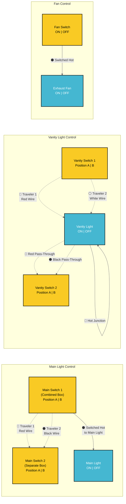
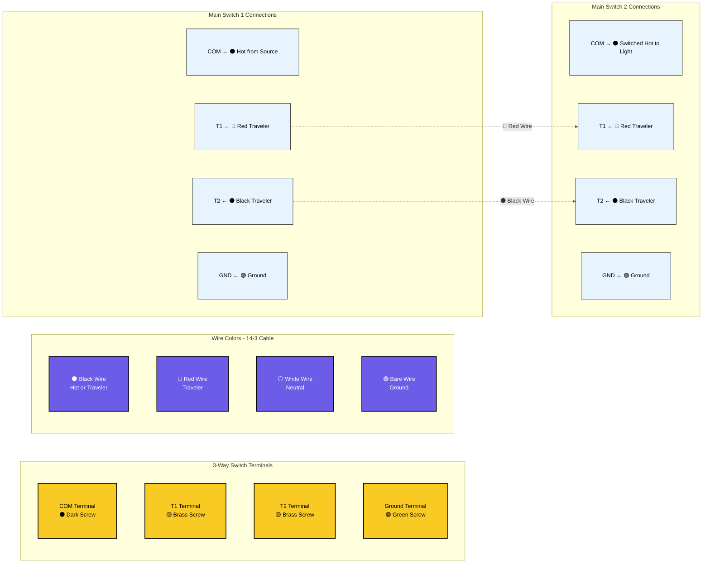
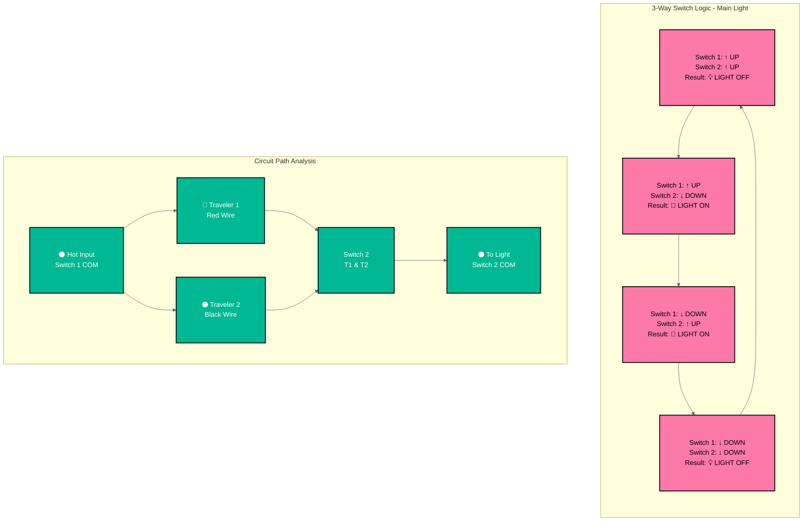
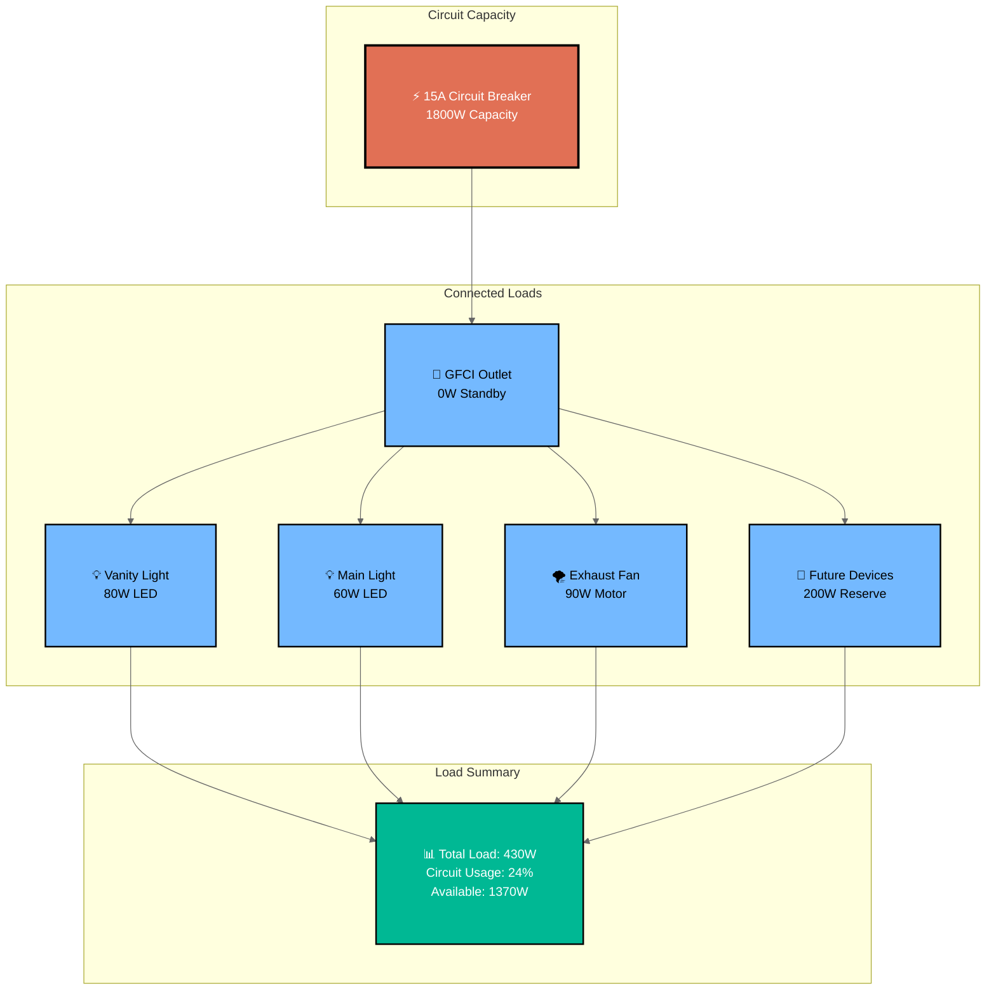
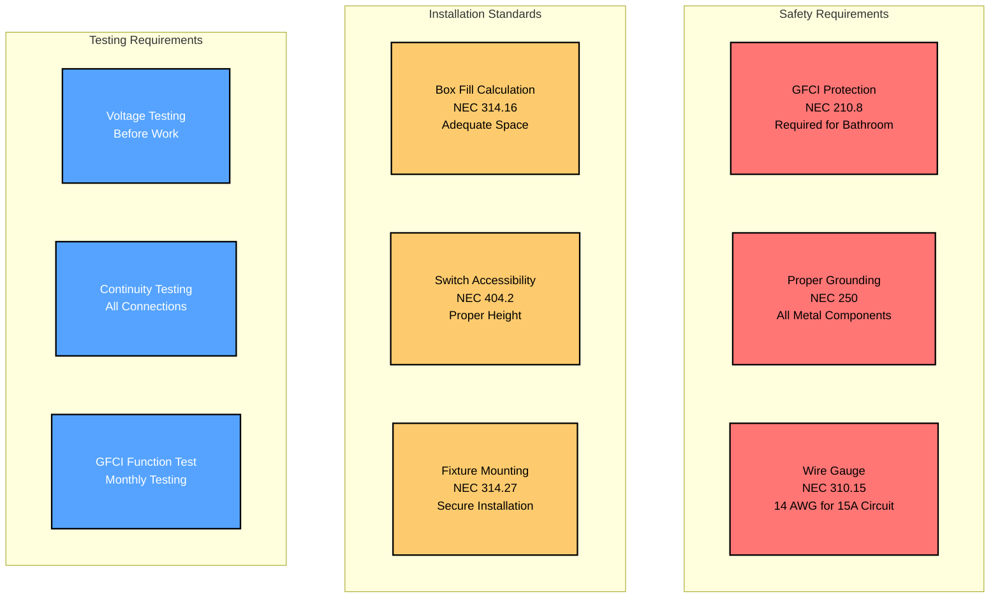

# Bathroom Electrical Wiring - Mermaid Diagram

This document provides a detailed Mermaid flowchart diagram of the bathroom electrical wiring system.

## Complete Circuit Flow Diagram

```mermaid
%%{init: {'theme':'default', 'flowchart': {'nodeSpacing': 80, 'rankSpacing': 100, 'padding': 30}, 'themeVariables': {'primaryColor': '#ffffff', 'primaryTextColor': '#000000', 'primaryBorderColor': '#000000', 'lineColor': '#666666', 'sectionBkgColor': '#ffffff', 'altSectionBkgColor': '#f9f9f9', 'gridColor': '#cccccc', 'c0': '#ffffff', 'c1': '#ffffff', 'c2': '#ffffff', 'c3': '#ffffff', 'c4': '#ffffff'}}}%%
flowchart TD
    A["Electrical Panel<br/>15A Breaker"] -->|"14-2 Cable<br/>⚫ Hot: Black<br/>⚪ Neutral: White<br/>🟢 Ground: Bare"| B["GFCI Outlet<br/>15A, 120V"]
    
    B -->|"14-2 Cable<br/>⚫ Hot: Black<br/>⚪ Neutral: White<br/>🟢 Ground: Bare"| D["Vanity Switch 1<br/>3-Way Switch<br/>Box 2"]
    
    D -->|"14-3 Cable<br/>⚫ Hot: Black<br/>⚪ Neutral: White<br/>🟢 Ground: Bare<br/>🔴 Red: Unused"| C["Vanity Light Fixture<br/>LED Compatible"]
    
    C -->|"14-3 Cable<br/>⚫ Hot Continue: Black<br/>⚪ Neutral: White<br/>🟢 Ground: Bare<br/>🔴 Red: Unused"| F["Main Switch 2<br/>3-Way Switch & Junction<br/>Box 4"]
    
    D -->|"14-3 Cable (Vanity Switching)<br/>⚫ Hot from VS1: Black<br/>🔴 Traveler 1: Red<br/>⚪ Traveler 2: White (MARK BLACK)<br/>🟢 Ground: Bare"| E["Combined Switch Box<br/>Main SW1<br/>Vanity SW2<br/>Fan SW<br/>Box 7"]

    F -->|"14-3 Cable A (Vanity Return)<br/>⚪ Hot Return: White (MARK BLACK)<br/>🔴 Traveler Return: Red<br/>⚫ Neutral: Black<br/>🟢 Ground: Bare"| E
    
    F -->|"14-3 Cable B (Main Travelers)<br/>🔴 Main Traveler 1: Red<br/>⚫ Main Traveler 2: Black<br/>⚪ Neutral: White<br/>🟢 Ground: Bare"| E

    E -->|"14-2 Cable<br/>⚫ Switched Hot: Black<br/>⚪ Neutral: White<br/>🟢 Ground: Bare"| G["Main Light Fixture<br/>LED Compatible"]

    G -->|"14-2 Cable<br/>⚫ Hot Pass-Through: Black<br/>⚪ Neutral: White<br/>🟢 Ground: Bare"| H["Exhaust Fan<br/>CFM Rated"]
    
    E -.->|"⚫ Switched Hot<br/>Fan Switch Control"| H
    
    %% Styling
    classDef boxPadding padding:10px 10px
    classDef panelStyle fill:#ff6b6b,stroke:#000,stroke-width:3px,color:#fff
    classDef gfciStyle fill:#4ecdc4,stroke:#000,stroke-width:2px,color:#000
    classDef fixtureStyle fill:#45b7d1,stroke:#000,stroke-width:2px,color:#fff
    classDef switchStyle fill:#f9ca24,stroke:#000,stroke-width:2px,color:#000
    classDef wireStyle stroke:#666,stroke-width:2px
    
    class A,B,C,D,E,F,G,H boxPadding
    class A panelStyle
    class B gfciStyle
    class C,G,H fixtureStyle
    class D,E,F switchStyle
```



## Circuit Control Power Flow Explanation

### ⚡ VANITY LIGHT CIRCUIT (3-Way Control)
**Primary Controller**: Vanity Switch 1 (Box 2) - **SOURCES TRAVELERS TO LIGHT**
**Secondary Controller**: Vanity Switch 2 (Box 7) - **COMPLETES VANITY CIRCUIT**

**Power Flow**: GFCI → Vanity Switch 1 → Vanity Light (always powered) → Control completed by Vanity Switch 2 (Box 7) via travelers

### ⚡ MAIN LIGHT CIRCUIT (3-Way Control)  
**Primary Controller**: Main Switch 1 (Box 7) - **SOURCES SWITCHED HOT TO LIGHT**
**Secondary Controller**: Main Switch 2 (Box 4) - **PROVIDES TRAVELER CONTROL**

**Power Flow**: Hot from main circuit → Main Switch 2 (Box 4) controls via travelers → Main Switch 1 (Box 7) → **SWITCHED HOT OUTPUT** → Main Light

### ⚡ FAN CIRCUIT (Single-Pole Control)
**Controller**: Fan Switch (Box 7)
**Power Flow**: Hot from main circuit → Fan Switch → **SWITCHED HOT TO FAN**

## Wire Identification Requirements (NEC 200.7)

**✅ Correct Wiring Practice**: In this optimized design, all white wires function as **neutrals**. No white wires carry hot voltage, so no re-identification with electrical tape is necessary. This aligns with modern code best practices for clarity and safety.

### Neutral Flow in Our Design:
- **One true neutral per cable**: Each 14-2 and 14-3 cable contains exactly one white neutral wire.
- **Neutral hub at Box 2**: All neutrals from the GFCI (Box 1), the 14-3 to Box 4, and the 14-3 to Box 7 are joined in a wire nut. This hub provides the neutral path for all fixtures.
- **No neutral switching**: Switches only control hot conductors.

### Power Path Summary:
```
MAIN CIRCUIT FLOW:
Panel → GFCI → Box 2 (Distribution Hub) → Other Boxes & Fixtures

VANITY LIGHT CONTROL (3-Way):
Box 2 (SW 1) ←→ Box 7 (SW 2) via RED traveler → Vanity Light

MAIN LIGHT CONTROL (3-Way):  
Box 2 (SW 1) ←→ Box 4 (SW 2) via BLACK & RED travelers → Main Light

FAN CONTROL (Single-Pole):
Box 7 (Fan Switch) → Fan
```

## 3-Way Switch Control Logic Diagram



## Wire Routing and Box Connections

```mermaid
%%{init: {'theme':'default', 'flowchart': {'nodeSpacing': 80, 'rankSpacing': 100, 'padding': 30}, 'themeVariables': {'primaryColor': '#ffffff', 'primaryTextColor': '#000000', 'primaryBorderColor': '#000000', 'lineColor': '#666666', 'sectionBkgColor': '#ffffff', 'altSectionBkgColor': '#f9f9f9', 'gridColor': '#cccccc', 'c0': '#ffffff', 'c1': '#ffffff', 'c2': '#ffffff', 'c3': '#ffffff', 'c4': '#ffffff'}}}%%
flowchart TD
    subgraph "Electrical Panel"
        PANEL["15A Breaker<br/>⚫ Hot: Black<br/>⚪ Neutral: White<br/>🟢 Ground: Bare"]
    end
    
    subgraph "Box 1 - GFCI Outlet"
        GFCI_LINE[LINE Side<br/>⚫ From Panel Hot<br/>⚪ From Panel Neutral<br/>🟢 From Panel Ground]
        GFCI_LOAD[LOAD Side<br/>⚫ To Vanity Hot<br/>⚪ To Vanity Neutral<br/>🟢 To Vanity Ground]
        GFCI_LINE -->|"Internal GFCI Protection"| GFCI_LOAD
    end
    
    subgraph "Box 2 - Vanity Switch 1"
        VS1_SWITCH["Vanity Switch 1<br/>⚫ COM ← Hot from GFCI<br/>🔴 T1 → Red Traveler to Light<br/>⚪ T2 → White (Hot) to Light Fixture<br/>🟢 GND ← Ground"]
        VS1_NEUTRAL["⚪ Neutral Pass-Through<br/>Wire Nut Only"]
    end
    
    subgraph "Box 3 - Vanity Light"
        VL_FIXTURE["Vanity Light Fixture<br/>⚪ White from VS1 (Hot)<br/>⚫ Black to MS2 (Pass-Through)<br/>🟢 Green Ground"]
        VL_SPLICE["Wire Splices<br/>⚫ Black from VS1 COM → White to VS2 (via MS2 → Combined Box)<br/>⚪ White from VS1 T2 → Light Fixture (Hot)<br/>🔴 Red: VS1→VS2 Pass-Through (via MS2 → Combined Box)<br/>⚫ Black from Light → Continue to MS2<br/>🟢 Green: Continue to MS2"]
        VL_SPLICE -.-> VL_FIXTURE
    end
    
    subgraph "Box 4 - Main Switch 2 & Main Junction (CRITICAL NEUTRAL HUB)"
        MS2_SWITCH["Main Switch 2<br/>⚫ COM INPUT ← Black Hot from Vanity Circuit<br/>🔴 T1 ↔ Red Traveler to/from MS1<br/>⚫ T2 ↔ Black Traveler to/from MS1<br/>🟢 GND ← Ground"]
        MS2_NEUTRAL["⚪ TRUE Neutral Pass-Through<br/>(To/From Combined Box and Main Light)"]
        MS2_HOT["⚪ WHITE HOT from Vanity Light<br/>(Switched Hot Return - NOT Neutral)<br/>**MARK WITH BLACK TAPE**<br/>Continues to Combined Box"]
        MS2_CONTROL["⚡ 3-Way Control Logic<br/>Works with Main Switch 1 to control Main Light<br/>via Traveler Wires (Red & Black)"]
    end
    
    subgraph "Box 5 - Main Light"
        ML_FIXTURE[Main Light Fixture<br/>⚫ Switched Hot<br/>⚪ Neutral Return<br/>🟢 Ground]
        ML_SPLICE["Wire Splices<br/>⚫ Hot: Fixture + Pass-Through<br/>⚪ Neutral: Fixture + Pass-Through<br/>🟢 Ground: Fixture + Pass-Through"]
        ML_SPLICE -.-> ML_FIXTURE
    end
    
    subgraph "Box 6 - Exhaust Fan"
        FAN_MOTOR["Fan Motor<br/>⚫ From Switch Control (via Combined Box)<br/>⚪ Neutral Direct<br/>🟢 Ground to Case"]
        FAN_PASS[Pass-Through Wires<br/>⚫ Hot Continue to Combined Box<br/>⚪ Neutral Continue to Combined Box<br/>🟢 Ground Continue to Combined Box]
    end
    
    subgraph "Box 7 - Combined Switch Box (END OF RUN)"
        direction TB
        COMB_MAIN["Main Switch 1<br/>⚫ COM → Switched Hot to Main Light<br/>🔴 T1 ↔ Red to MS2<br/>⚫ T2 ↔ Black to MS2<br/>🟢 GND ← Ground Pigtail"]
        COMB_VANITY["Vanity Switch 2<br/>⚪ COM ← White from Vanity Light (Hot)<br/>🔴 T1 ↔ Red to Vanity Light<br/>⚫ T2 → Neutral (black wire in Cable A)<br/>🟢 GND ← Ground Pigtail"]
        COMB_FAN["Fan Switch<br/>⚫ LINE ← Hot from Main Circuit<br/>⚫ LOAD → Fan Control<br/>🟢 GND ← Ground Pigtail"]
        COMB_BUNDLES["Wire Bundles<br/>⚫ Hot Distribution<br/>⚪ Neutral Termination<br/>🟢 Ground Collection"]
        
        COMB_BUNDLES -.-> COMB_MAIN
        COMB_BUNDLES -.-> COMB_VANITY
        COMB_BUNDLES -.-> COMB_FAN
    end
    
    %% Cable Connections with Wire Colors and Travelers
    PANEL -->|"14-2 Cable<br/>⚫⚪🟢"| GFCI_LINE
    GFCI_LOAD -->|"14-2 Cable<br/>⚫⚪🟢"| VS1_SWITCH
    
    %% Main Circuit with Neutral Flow - 14-3 Cable carries neutral through
    VS1_SWITCH -->|"14-3 Cable Run #1<br/>⚫🔴⚪🟢<br/>⚫Black = Hot continue<br/>⚪White = Neutral continue<br/>🔴Red = Unused<br/>🟢Bare = Ground"| VL_FIXTURE
    VL_FIXTURE -->|"14-3 Cable Run #2<br/>⚫🔴⚪🟢<br/>⚫Black = Hot continues<br/>⚪White = Neutral continues<br/>🔴Red = Unused<br/>🟢Bare = Ground"| MS2_SWITCH
    
    %% Vanity 3-Way Switching - 14-3 Cable with Travelers from Box 2
    VS1_SWITCH -->|"14-3 Cable (Vanity Switch)<br/>⚫🔴⚪🟢<br/>⚫Black = Hot from VS1 COM<br/>🔴Red = Traveler 1<br/>⚪White = Traveler 2 (MARK BLACK)<br/>🟢Bare = Ground"| COMB_BUNDLES
    
    %% Vanity Return - 14-3 Cable A from MS2 to Combined Box
    MS2_SWITCH -->|"14-3 Cable A (Vanity Return)<br/>⚪⚫🔴🟢<br/>⚪White = Hot Return (MARK BLACK)<br/>🔴Red = Traveler Return<br/>⚫Black = Neutral<br/>🟢Bare = Ground"| COMB_BUNDLES
    
    %% Main Light Control - 14-3 Cable B from MS2 to Combined Box
    MS2_SWITCH -->|"14-3 Cable B (Main Travelers)<br/>🔴⚫⚪🟢<br/>🔴Red = Main Traveler 1<br/>⚫Black = Main Traveler 2<br/>⚪White = Neutral<br/>🟢Bare = Ground"| COMB_BUNDLES
    
    %% Main Circuit - Combined Box to Main Light to Fan  
    COMB_MAIN -->|"14-2 Cable<br/>⚫⚪🟢<br/>⚫ Switched Hot"| ML_SPLICE
    ML_SPLICE -->|"14-2 Cable<br/>⚫⚪🟢"| FAN_PASS
    
    %% Fan Control Wire
    COMB_FAN -.->|"⚫ Switched Hot"| FAN_MOTOR
    COMB_BUNDLES -.-> COMB_MAIN
    COMB_BUNDLES -.-> COMB_VANITY
    COMB_BUNDLES -.-> COMB_FAN
    
    classDef boxPadding padding:10px 10px
    classDef panelStyle fill:#ff6b6b,stroke:#000,stroke-width:3px,color:#fff
    classDef boxStyle fill:#e8f4fd,stroke:#000,stroke-width:2px,color:#000
    classDef deviceStyle fill:#fff3cd,stroke:#000,stroke-width:2px,color:#000
    classDef fixtureStyle fill:#45b7d1,stroke:#000,stroke-width:2px,color:#fff
    
    class PANEL,GFCI_LINE,GFCI_LOAD,VS1_SWITCH,VS1_NEUTRAL,VL_FIXTURE,COMB_MAIN,COMB_VANITY,COMB_FAN,COMB_BUNDLES,MS2_SWITCH,MS2_NEUTRAL,ML_FIXTURE,ML_SPLICE,FAN_MOTOR,FAN_PASS boxPadding
    class PANEL panelStyle
    class GFCI_LINE,GFCI_LOAD,VL_SPLICE,VS1_SWITCH,VS1_NEUTRAL,MS2_SWITCH,MS2_NEUTRAL,ML_SPLICE,FAN_PASS,COMB_BUNDLES boxStyle
    class COMB_MAIN,COMB_VANITY,COMB_FAN deviceStyle
    class VL_FIXTURE,ML_FIXTURE,FAN_MOTOR fixtureStyle
```



## Terminal Connection Diagram



## Switch Position Logic Table



## Circuit Load Analysis



## Safety and Code Compliance



## How to View These Diagrams

These Mermaid diagrams can be viewed in several ways:

1. **VS Code with Mermaid Preview Extension**
   - Install "Mermaid Preview" extension
   - Open this file and use the preview feature

2. **GitHub/GitLab**
   - These platforms natively render Mermaid diagrams

3. **Mermaid Live Editor**
   - Copy diagram code to https://mermaid.live/

4. **Documentation Platforms**
   - Most modern documentation platforms support Mermaid

## Diagram Features

- **Complete Circuit Flow**: Shows power routing from panel to each device
- **3-Way Switch Logic**: Illustrates how traveler wires control lights
- **Wire Specifications**: All diagrams show 14 AWG wire for 15A circuit
- **Terminal Connections**: Detailed switch terminal wiring
- **Load Analysis**: Circuit capacity and usage calculations
- **Safety Compliance**: Code requirements and testing procedures
- **High Contrast Styling**: Improved text readability with dark borders and contrasting colors

## Styling Notes

The diagrams use high-contrast color schemes for optimal readability:
- **Dark borders (#000)** on all elements for clear definition
- **White text on dark backgrounds** for critical components
- **Black text on light backgrounds** for detailed information
- **Bold stroke widths** to ensure visibility
- **Color-coded components** for easy identification while maintaining accessibility

These diagrams complement the ASCII art diagrams in the other documentation files and provide a more technical, structured view of the electrical system.

## Switch Box Configuration

**Important Configuration**: This bathroom wiring uses a combined switch box containing three switches:

1. **Vanity Switch 1**: Located in separate box near vanity light
2. **Combined Switch Box**: Contains three switches in one location:
   - Main Switch 1 (3-way for main light)
   - Vanity Switch 2 (3-way for vanity light)
   - Fan Switch (single pole for exhaust fan)
3. **Main Switch 2**: Located in separate box for main light control

### Benefits of Combined Switch Box:
- **Convenient Control**: All main switches in one location
- **Simplified Wiring**: Shared neutral and ground connections reduce wire nuts
- **Code Compliant**: Standard electrical practice for bathroom installations
- **Cost Effective**: Fewer boxes and less complex routing

## Detailed Wire Color Flow Diagram

```mermaid
%%{init: {'theme':'default', 'flowchart': {'nodeSpacing': 80, 'rankSpacing': 100, 'padding': 30}, 'themeVariables': {'primaryColor': '#ffffff', 'primaryTextColor': '#000000', 'primaryBorderColor': '#000000', 'lineColor': '#666666', 'sectionBkgColor': '#ffffff', 'altSectionBkgColor': '#f9f9f9', 'gridColor': '#cccccc', 'c0': '#ffffff', 'c1': '#ffffff', 'c2': '#ffffff', 'c3': '#ffffff', 'c4': '#ffffff'}}}%%
flowchart TD
    subgraph "Wire Color Legend"
        HOT["⚫ Hot | Switched Hot - Black Wire"]
        NEUT["⚪ Neutral - White Wire"]
        GND["🟢 Ground - Bare | Green Wire"]
        TRAV1["🔴 Traveler 1 - Red Wire"]
        TRAV2["⚫ Traveler 2 - Black Wire in 14-3"]
    end
    
    subgraph "Panel to GFCI (14-2)"
        P1["⚫ Panel Hot"] --> G1["⚫ GFCI LINE Hot"]
        P2["⚪ Panel Neutral"] --> G2["⚪ GFCI LINE Neutral"]
        P3["🟢 Panel Ground"] --> G3["🟢 GFCI Ground"]
    end
    
    subgraph "GFCI to Vanity Light (14-2)"
        G4["⚫ GFCI LOAD Hot"] --> V1["⚫ Vanity Fixture Hot + Switch Feed"]
        G5["⚪ GFCI LOAD Neutral"] --> V2["⚪ Vanity Fixture Neutral + Circuit"]
        G6["🟢 GFCI LOAD Ground"] --> V3["🟢 Vanity Fixture Ground + Circuit"]
    end
    
    subgraph "Vanity Switch 1 to Main Circuit (14-3 with Neutral)"
        S1["⚫ VS1 pass-through to main circuit"] --> V4["⚫ Black continues to Main Switch 2"]
        S2["⚪ Neutral pass-through"] --> V5["⚪ White neutral to Main Switch 2"]
        S6["🔴 Red wire unused in this cable"] --> V6["🔴 Red unused to Main Switch 2"]
        S5["🟢 VS1 Ground"] --> V8["🟢 Green continues to Main Switch 2"]
    end
    
    subgraph "Vanity Switch 1 to Combined Box (14-3 Vanity Switching)"
        S7["⚫ VS1 COM Terminal"] --> C1["⚫ Black to VS2 hot supply"]
        S8["🔴 VS1 T1 Terminal"] --> C2["🔴 Red Traveler 1 to VS2"]
        S9["⚪ VS1 T2 Terminal"] --> C3["⚪ White Traveler 2 to VS2 (MARK BLACK)"]
        S10["🟢 VS1 Ground"] --> C4["🟢 Ground to Combined Box"]
    end
    
    subgraph "Main Switch 2 to Combined Box (Two 14-3 Cables)"
        %% Vanity Return Cable A
        V7["⚪ Hot return from vanity area"] --> C5["⚪ Cable A: VS2 COM (MARK BLACK)"]
        V9["🔴 Red traveler return"] --> C6["🔴 Cable A: VS2 T1"] 
        V10["⚫ Neutral from main circuit"] --> C7["⚫ Cable A: Neutral to bundle"]
        V11["🟢 Ground continue"] --> C8["🟢 Cable A: Ground to bundle"]
        
        %% Main Light Travelers Cable B  
        M1["🔴 MS2 T1 to MS1 T1"] --> C9["🔴 Cable B: MS1 T1"]
        M2["⚫ MS2 T2 to MS1 T2"] --> C10["⚫ Cable B: MS1 T2"]
        M3["⚪ Neutral continue"] --> C11["⚪ Cable B: Neutral to bundle"]
        M4["🟢 Ground continue"] --> C12["🟢 Cable B: Ground to bundle"]
    end
    
    subgraph "Combined Box Connections"
        H1["⚫ Hot Distribution Bundle"] --> C7["⚫ Main SW1 COM → Main Light"]
        H1 --> C8["⚫ Fan Switch LINE"]
        C2_A --> C9["⚪ Vanity SW2 COM from Light"]
        C10["🔴 Red MS1 T1"] --> C11_B
        C12["⚫ Black MS1 T2"] --> C12_B
        C14["⚫ Fan Switch LOAD"] --> C15["⚫ Control to Fan Motor"]
        C6 --> C16["🟢 All Switch Grounds"]
        C6 --> M5["🟢 Main SW2 Ground"]
    end
    
    subgraph "Combined Box to Main Light (14-2)"
        C7 --> L1["⚫ Main Light Fixture + Pass-Through"]
        C5_B --> L2["⚪ Main Light Neutral + Pass-Through"]
        C6 --> L3["🟢 Main Light Ground + Pass-Through"]
    end
    
    subgraph "Main Light to Fan (14-2)"
        L1 --> F1["⚫ Fan Box Pass-Through"]
        L2 --> F2["⚪ Fan Neutral to Motor"]
        L3 --> F3["🟢 Fan Ground to Motor + Case"]
    end
    
    subgraph "Fan Control from Combined Box"
        C15 --> F4["⚫ Fan Motor Hot from Switch"]
    end
    
    classDef boxPadding padding:10px 10px
    classDef panelStyle fill:#ff6b6b,stroke:#000,stroke-width:3px,color:#fff
    classDef boxStyle fill:#e8f4fd,stroke:#000,stroke-width:2px,color:#000
    classDef deviceStyle fill:#fff3cd,stroke:#000,stroke-width:2px,color:#000
    classDef fixtureStyle fill:#45b7d1,stroke:#000,stroke-width:2px,color:#fff
    
    class PANEL,GFCI_LINE,GFCI_LOAD,VS1_SWITCH,VS1_NEUTRAL,VL_FIXTURE,COMB_MAIN,COMB_VANITY,COMB_FAN,COMB_BUNDLES,MS2_SWITCH,MS2_NEUTRAL,ML_FIXTURE,ML_SPLICE,FAN_MOTOR,FAN_PASS boxPadding
    class PANEL panelStyle
    class GFCI_LINE,GFCI_LOAD,VL_SPLICE,VS1_SWITCH,VS1_NEUTRAL,MS2_SWITCH,MS2_NEUTRAL,ML_SPLICE,FAN_PASS,COMB_BUNDLES boxStyle
    class COMB_MAIN,COMB_VANITY,COMB_FAN deviceStyle
    class VL_FIXTURE,ML_FIXTURE,FAN_MOTOR fixtureStyle
```



## Box 2 - Vanity Switch 1 Detailed Wiring Instructions

### Box 2 - Vanity Switch 1 (Single Gang Box)

```
┌─────────────────────────────────────────────────────────────────────────────────┐
│                         BOX 2 - VANITY SWITCH 1 (Single Gang)                  │
│                              3-Way Switch for Vanity Light                      │
└─────────────────────────────────────────────────────────────────────────────────┘

CABLE ENTRY POINTS:
     Cable from GFCI (14-2)    Cable to Vanity Light & Main Circuit (14-3)    Cable to Box 7 (14-3)

┌─────────────────────────────────────────────────────────────────────────────────┐
│                                                                                 │
│  FROM GFCI (14-2)        VANITY SWITCH 1 (3-WAY)         OUTGOING CABLES       │
│  ┌─────────────┐         ┌─────────────────┐             ┌─────────────────────┐ │
│  │ (B) Black   │────────→│ COM Terminal    │─┬───────────│ TO MAIN CIRCUIT     │ │
│  │   (Hot)     │         │ (Always Hot)    │ │           │ (14-3): (B) Black   │ │
│  │             │         │                 │ └───────────│ TO VANITY SWITCH    │ │
│  │             │         │ T1 Terminal     │─────────────│ (14-3): (R) Red     │ │
│  │             │         │ (Brass Screw)   │             │ (Traveler 1)        │ │
│  │             │         │                 │             │                     │ │
│  │             │         │ T2 Terminal     │─────────────│ TO VANITY SWITCH    │ │
│  │             │         │ (Brass Screw)   │             │ (14-3): (W) White   │ │
│  │             │         │                 │             │ (Trav 2 - MARK     │ │
│  │             │         │                 │             │  BLACK TAPE)        │ │
│  │ (W) White   │──┬──────┤ [NOT CONNECTED  │             │                     │ │
│  │   (Neutral) │  │      │  TO SWITCH]     │             │ TO MAIN CIRCUIT     │ │
│  │             │  │      │                 │             │ (14-3): (W) White   │ │
│  │             │  │      │ Ground Screw    │──┐          │ (Neutral)           │ │
│  │ (G) Ground  │──┼──────┤ (Green Screw)   │  │          │ TO VANITY SWITCH    │ │
│  └─────────────┘  │                           │          │ (14-3): (G) Ground  │ │
│                   │                           │          │                     │ │
│                   │ ┌─ WIRE NUT #1 (YELLOW) ──┼──────────│ TO MAIN CIRCUIT     │ │
│                   │ │  • White from GFCI     │          │ (14-3): (G) Ground  │ │
│                   │ │  • White to Main Circuit│          │                     │ │
│                   │ │    (Neutral Continue)   │          │ TO VANITY SWITCH    │ │
│                   │ └─────────────────────────┘          └─────────────────────┘ │
│                   │                                                              │
│                   │ ┌─ WIRE NUT #2 (GREEN) ──────────────────────────────────┐  │
│                   │ │  • Ground from GFCI                                    │  │
│                   │ │  • Ground to Main Circuit                              │  │
│                   │ │  • Ground to Vanity Switch Circuit                     │  │
│                   │ │  • Pigtail to switch ground screw                     │  │
│                   │ └─────────────────────────────────────────────────────────┘  │
└─────────────────────────────────────────────────────────────────────────────────┘
```

### Wire Connection Details for Box 2:

#### **INCOMING FROM GFCI (14-2 Cable):**
- **Black Wire**: Hot from GFCI → connects to switch COM terminal (dark screw)
- **White Wire**: Neutral from GFCI → goes to Wire Nut #1 (does NOT connect to switch)
- **Bare Ground**: From GFCI → goes to Wire Nut #2

#### **OUTGOING TO MAIN CIRCUIT (14-3 Cable to Vanity Light & Box 4):**
- **Black Wire**: Always hot from switch COM terminal → continues main circuit through vanity light
- **Red Wire**: Unused in this cable (spare conductor)
- **White Wire**: Neutral continuation from Wire Nut #1 → main circuit neutral through vanity light
- **Bare Ground**: From Wire Nut #2 → continues circuit grounding

#### **OUTGOING TO BOX 7 (14-3 Vanity Switching Cable):**
- **Black Wire**: Always hot from switch COM terminal → power for vanity switching
- **Red Wire**: Traveler 1 from switch T1 terminal → to VS2 T1 in Box 7
- **White Wire**: Traveler 2 from switch T2 terminal → to VS2 T2 in Box 7 **MARK WITH BLACK TAPE**
- **Bare Ground**: From Wire Nut #2 → continues circuit grounding

#### **SWITCH TERMINAL CONNECTIONS:**
- **COM Terminal (Dark Screw)**: Black wire from GFCI (always hot)
- **T1 Terminal (Brass Screw)**: Red wire to Box 7 (Traveler 1)
- **T2 Terminal (Brass Screw)**: White wire to Box 7 (Traveler 2) **MARK BLACK**
- **Ground Screw (Green)**: Pigtail from ground wire nut

#### **WIRE NUT CONNECTIONS:**
- **Wire Nut #1 (Yellow)**: Neutral pass-through (GFCI white + Main Circuit white)
- **Wire Nut #2 (Green)**: All grounds (GFCI + Main Circuit + Vanity Switch + switch pigtail)

### Critical Installation Notes for Box 2:
1. **Neutral Flow**: The single white neutral from each cable passes through Box 2 via Wire Nut #1
2. **Vanity Light Power**: Vanity light gets power from main circuit cable, not directly from Box 2
3. **White Wire Re-identification**: Only the white wire in the vanity switching cable (to Box 7) needs black tape marking
4. **Ground Continuity**: All ground wires connect together with pigtail to switch ground screw
5. **Switch Function**: VS1 provides travelers to VS2 for 3-way control of vanity light
6. **Box Fill**: Verify adequate space for all wire nuts and connections