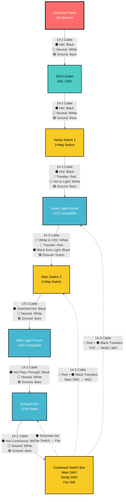
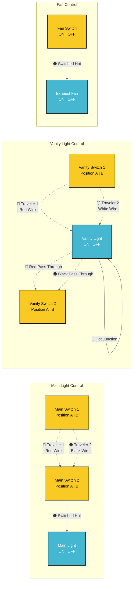
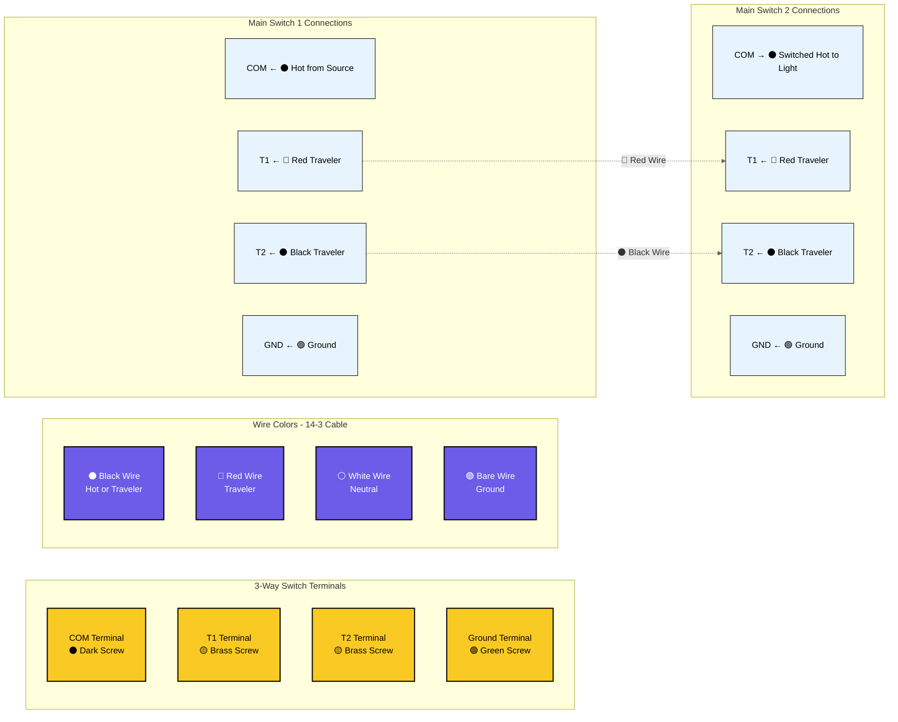
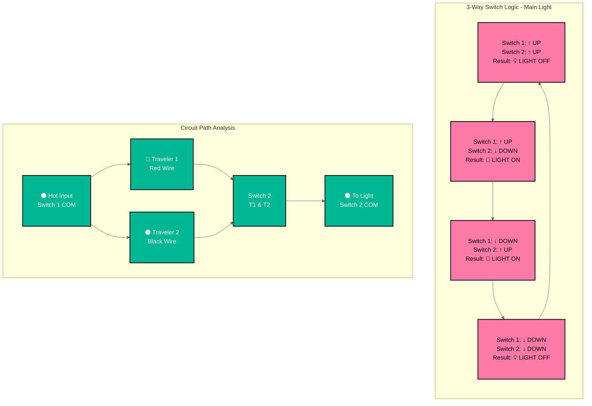
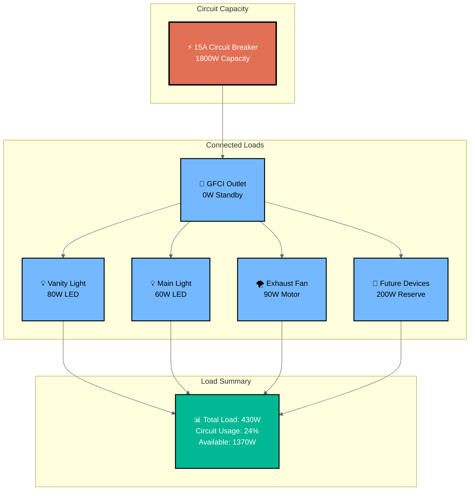
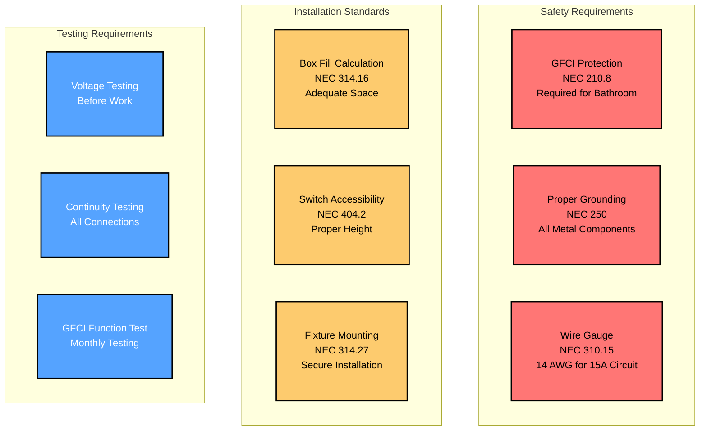

# Bathroom Electrical Wiring - Mermaid Diagram

This document provides a detailed Mermaid flowchart diagram of the bathroom electrical wiring system.

## Complete Circuit Flow Diagram



## Fan Control Power Flow Explanation

**Important Note**: The fan switch is located at the END of the circuit and controls the fan in the MIDDLE of the circuit. Here's how it works:

### Power Path to Fan Switch:
1. **Continuous Hot Wire**: Runs from GFCI → Vanity Switch 1 → Vanity Light → Main Switch 2 → Main Light → **Fan (passes through)** → Combined Switch Box (Fan Switch)
2. **Fan Switch Location**: Physical end of the circuit run  
3. **Fan Location**: Middle of the circuit (between main light and combined switch box)

### Fan Control Method:
- **⚫ Hot Wire**: Continues past the fan to reach the fan switch at the end
- **⚫ Switched Hot**: Fan switch sends control signal BACK to fan via separate wire
- **Result**: Fan switch can turn fan ON | OFF even though the switch is downstream

This is a common electrical configuration where the switch controlling a device is not physically adjacent to that device.

### Visual Flow:
```
Panel → GFCI → VS1 → Vanity Light → MS2 → Main Light → Fan → Combined Box (End)
                                                        ↑        ↓
                                                    Pass-Through  Control Wire
                                                        ↑        ↓  
                                                   Fan Switch ←──┘
```

## 3-Way Switch Control Logic Diagram



## Wire Routing and Box Connections

```mermaid
%%{init: {'theme':'default', 'flowchart': {'nodeSpacing': 60, 'rankSpacing': 80, 'padding': 20}, 'themeVariables': {'primaryColor': '#ffffff', 'primaryTextColor': '#000000', 'primaryBorderColor': '#000000', 'lineColor': '#666666', 'sectionBkgColor': '#ffffff', 'altSectionBkgColor': '#f9f9f9', 'gridColor': '#cccccc', 'c0': '#ffffff', 'c1': '#ffffff', 'c2': '#ffffff', 'c3': '#ffffff', 'c4': '#ffffff'}}}%%
flowchart TD
    subgraph "Electrical Panel"
        PANEL["15A Breaker<br/>⚫ Hot: Black<br/>⚪ Neutral: White<br/>🟢 Ground: Bare"]
    end
    
    subgraph "Box 1 - GFCI Outlet"
        GFCI_LINE[LINE Side<br/>⚫ From Panel Hot<br/>⚪ From Panel Neutral<br/>🟢 From Panel Ground]
        GFCI_LOAD[LOAD Side<br/>⚫ To Vanity Hot<br/>⚪ To Vanity Neutral<br/>🟢 To Vanity Ground]
        GFCI_LINE -->|Internal GFCI Protection| GFCI_LOAD
    end
    
    subgraph "Box 2 - Vanity Switch 1"
        VS1_SWITCH["Vanity Switch 1<br/>⚫ COM ← Hot from GFCI<br/>🔴 T1 → Red Traveler to Light<br/>⚪ T2 → White (Hot) to Light Fixture<br/>🟢 GND ← Ground"]
        VS1_NEUTRAL["⚪ Neutral Pass-Through<br/>Wire Nut Only"]
    end
    
    subgraph "Box 3 - Vanity Light"
        VL_FIXTURE["Vanity Light Fixture<br/>⚪ White from VS1 (Hot)<br/>⚫ Black to MS2 (Pass-Through)<br/>🟢 Green Ground"]
        VL_SPLICE["Wire Splices<br/>⚫ Black from VS1 COM → White to VS2 (via Combined Box)<br/>⚪ White from VS1 T2 → Light Fixture (Hot)<br/>🔴 Red: VS1→VS2 Pass-Through (via Combined Box)<br/>⚫ Black from Light → Continue to MS2<br/>🟢 Green: Continue to MS2"]
        VL_SPLICE -.-> VL_FIXTURE
    end
    
    subgraph "Box 4 - Main Switch 2"
        MS2_SWITCH["Main Switch 2<br/>⚫ COM → Switched Hot<br/>🔴 T1 ← Red from MS1 (via Combined Box)<br/>⚫ T2 ← Black from MS1 (via Combined Box)<br/>🟢 GND ← Ground"]
        MS2_NEUTRAL["⚪ Neutral Pass-Through<br/>Wire Nut Only"]
    end
    
    subgraph "Box 5 - Main Light"
        ML_FIXTURE[Main Light Fixture<br/>⚫ Switched Hot<br/>⚪ Neutral Return<br/>🟢 Ground]
        ML_SPLICE["Wire Splices<br/>⚫ Hot: Fixture + Pass-Through<br/>⚪ Neutral: Fixture + Pass-Through<br/>🟢 Ground: Fixture + Pass-Through"]
        ML_SPLICE -.-> ML_FIXTURE
    end
    
    subgraph "Box 6 - Exhaust Fan"
        FAN_MOTOR["Fan Motor<br/>⚫ From Switch Control (via Combined Box)<br/>⚪ Neutral Direct<br/>🟢 Ground to Case"]
        FAN_PASS[Pass-Through Wires<br/>⚫ Hot Continue to Combined Box<br/>⚪ Neutral Continue to Combined Box<br/>🟢 Ground Continue to Combined Box]
    end
    
    subgraph "Box 7 - Combined Switch Box (END OF RUN)"
        direction TB
        COMB_MAIN["Main Switch 1<br/>⚫ COM ← Hot from Fan Pass-Through<br/>🔴 T1 ↔ Red to MS2<br/>⚫ T2 ↔ Black to MS2<br/>🟢 GND ← Ground Pigtail"]
        COMB_VANITY["Vanity Switch 2<br/>⚪ COM ← White from Vanity Light (Hot)<br/>🔴 T1 ↔ Red to Vanity Light<br/>⚫ T2 ↔ Black to Vanity Light<br/>🟢 GND ← Ground Pigtail"]
        COMB_FAN["Fan Switch<br/>⚫ LINE ← Hot from Fan Pass-Through<br/>⚫ LOAD → Fan Control<br/>🟢 GND ← Ground Pigtail"]
        COMB_BUNDLES["Wire Bundles<br/>⚫ Hot Distribution<br/>⚪ Neutral Termination<br/>🟢 Ground Collection"]
        
        COMB_BUNDLES -.-> COMB_MAIN
        COMB_BUNDLES -.-> COMB_VANITY
        COMB_BUNDLES -.-> COMB_FAN
    end
    
    %% Cable Connections with Wire Colors and Travelers
    PANEL -->|"14-2 Cable<br/>⚫⚪🟢"| GFCI_LINE
    GFCI_LOAD -->|"14-2 Cable<br/>⚫⚪🟢"| VS1_SWITCH
    
    %% Vanity 3-Way Circuit - 14-3 Cable with Travelers
    VS1_SWITCH -->|"14-3 Cable Run #1<br/>⚫🔴⚪🟢<br/>🔴Red = Traveler 1<br/>⚪White = Hot to Light"| VL_FIXTURE
    VL_FIXTURE -->|"14-3 Cable Run #2<br/>⚫🔴⚪🟢<br/>🔴Red = Traveler to VS2<br/>⚫Black = Hot continues to MS2"| MS2_SWITCH
    
    %% Main 3-Way Circuit - 14-2 then 14-3 Cable
    MS2_SWITCH -->|"14-2 Cable<br/>⚫⚪🟢"| ML_SPLICE
    ML_SPLICE -->|"14-2 Cable<br/>⚫⚪🟢"| FAN_PASS
    FAN_PASS -->|"14-2 Cable<br/>⚫⚪🟢"| COMB_BUNDLES
    
    %% Control Wires back to devices
    COMB_FAN -.->|"⚫ Switched Hot"| FAN_MOTOR
    COMB_MAIN -.->|"14-3 Cable #3<br/>🔴Red + ⚫Black Travelers"| MS2_SWITCH
    COMB_VANITY -.->|"14-3 Cable #4<br/>🔴Red + ⚫Black Travelers"| VL_FIXTURE
    COMB_BUNDLES -.-> COMB_MAIN
    COMB_BUNDLES -.-> COMB_VANITY
    COMB_BUNDLES -.-> COMB_FAN
    
    classDef boxPadding padding:10px 15px
    classDef panelStyle fill:#ff6b6b,stroke:#000,stroke-width:3px,color:#fff
    classDef boxStyle fill:#e8f4fd,stroke:#000,stroke-width:2px,color:#000
    classDef deviceStyle fill:#fff3cd,stroke:#000,stroke-width:2px,color:#000
    classDef fixtureStyle fill:#45b7d1,stroke:#000,stroke-width:2px,color:#fff
    
    class PANEL,GFCI_LINE,GFCI_LOAD,VS1_SWITCH,VS1_NEUTRAL,VL_FIXTURE,COMB_MAIN,COMB_VANITY,COMB_FAN,COMB_BUNDLES,MS2_SWITCH,MS2_NEUTRAL,ML_FIXTURE,ML_SPLICE,FAN_MOTOR,FAN_PASS boxPadding
    class PANEL panelStyle
    class GFCI_LINE,GFCI_LOAD,VL_SPLICE,VS1_SWITCH,VS1_NEUTRAL,MS2_SWITCH,MS2_NEUTRAL,ML_SPLICE,FAN_PASS,COMB_BUNDLES boxStyle
    class COMB_MAIN,COMB_VANITY,COMB_FAN deviceStyle
    class VL_FIXTURE,ML_FIXTURE,FAN_MOTOR fixtureStyle
```



## Terminal Connection Diagram



## Switch Position Logic Table



## Circuit Load Analysis



## Safety and Code Compliance



## How to View These Diagrams

These Mermaid diagrams can be viewed in several ways:

1. **VS Code with Mermaid Preview Extension**
   - Install "Mermaid Preview" extension
   - Open this file and use the preview feature

2. **GitHub/GitLab**
   - These platforms natively render Mermaid diagrams

3. **Mermaid Live Editor**
   - Copy diagram code to https://mermaid.live/

4. **Documentation Platforms**
   - Most modern documentation platforms support Mermaid

## Diagram Features

- **Complete Circuit Flow**: Shows power routing from panel to each device
- **3-Way Switch Logic**: Illustrates how traveler wires control lights
- **Wire Specifications**: All diagrams show 14 AWG wire for 15A circuit
- **Terminal Connections**: Detailed switch terminal wiring
- **Load Analysis**: Circuit capacity and usage calculations
- **Safety Compliance**: Code requirements and testing procedures
- **High Contrast Styling**: Improved text readability with dark borders and contrasting colors

## Styling Notes

The diagrams use high-contrast color schemes for optimal readability:
- **Dark borders (#000)** on all elements for clear definition
- **White text on dark backgrounds** for critical components
- **Black text on light backgrounds** for detailed information
- **Bold stroke widths** to ensure visibility
- **Color-coded components** for easy identification while maintaining accessibility

These diagrams complement the ASCII art diagrams in the other documentation files and provide a more technical, structured view of the electrical system.

## Switch Box Configuration

**Important Configuration**: This bathroom wiring uses a combined switch box containing three switches:

1. **Vanity Switch 1**: Located in separate box near vanity light
2. **Combined Switch Box**: Contains three switches in one location:
   - Main Switch 1 (3-way for main light)
   - Vanity Switch 2 (3-way for vanity light)
   - Fan Switch (single pole for exhaust fan)
3. **Main Switch 2**: Located in separate box for main light control

### Benefits of Combined Switch Box:
- **Convenient Control**: All main switches in one location
- **Simplified Wiring**: Shared neutral and ground connections reduce wire nuts
- **Code Compliant**: Standard electrical practice for bathroom installations
- **Cost Effective**: Fewer boxes and less complex routing

## Detailed Wire Color Flow Diagram

```mermaid
%%{init: {'theme':'default', 'flowchart': {'nodeSpacing': 60, 'rankSpacing': 80, 'padding': 20}, 'themeVariables': {'primaryColor': '#ffffff', 'primaryTextColor': '#000000', 'primaryBorderColor': '#000000', 'lineColor': '#666666', 'sectionBkgColor': '#ffffff', 'altSectionBkgColor': '#f9f9f9', 'gridColor': '#cccccc', 'c0': '#ffffff', 'c1': '#ffffff', 'c2': '#ffffff', 'c3': '#ffffff', 'c4': '#ffffff'}}}%%
flowchart TD
    subgraph "Wire Color Legend"
        ⚫HOT["Hot | Switched Hot - Black Wire"]
        ⚪NEUT["Neutral - White Wire"]
        🟢GND["Ground - Bare | Green Wire"]
        🔴TRAV1["Traveler 1 - Red Wire"]
        ⚫TRAV2["Traveler 2 - Black Wire in 14-3"]
    end
    
    subgraph "Panel to GFCI (14-2)"
        P1["⚫ Panel Hot"] --> G1["⚫ GFCI LINE Hot"]
        P2["⚪ Panel Neutral"] --> G2["⚪ GFCI LINE Neutral"]
        P3["🟢 Panel Ground"] --> G3["🟢 GFCI Ground"]
    end
    
    subgraph "GFCI to Vanity Light (14-2)"
        G4["⚫ GFCI LOAD Hot"] --> V1["⚫ Vanity Fixture Hot + Switch Feed"]
        G5["⚪ GFCI LOAD Neutral"] --> V2["⚪ Vanity Fixture Neutral + Circuit"]
        G6["🟢 GFCI LOAD Ground"] --> V3["🟢 Vanity Fixture Ground + Circuit"]
    end
    
    subgraph "Vanity Switch 1 to Vanity Light (14-3)"
        S1["⚫ VS1 COM Terminal"] --> V4["⚫ Black to White VS2 Junction"]
        S2["🔴 VS1 T1 Terminal"] --> V5["🔴 Red Pass-Through to VS2"]
        S3["⚪ VS1 T2 Terminal"] --> V6["⚪ White to Light Fixture Hot"]
        S4["⚪ Neutral Pass-Through"] --> V7["⚪ Neutral Continue to VS2"]
        S5["🟢 VS1 Ground"] --> V8["🟢 Green Pass-Through to VS2"]
    end
    
    subgraph "Vanity Light to Combined Box (14-3)"
        V9["⚪ White from Black VS1 Junction"] --> C2["⚪ VS2 COM Terminal"]
        V10["🔴 Red Pass-Through"] --> C3["🔴 VS2 T1 Terminal"]
        V11["⚫ Black from Light Fixture"] --> C4["⚫ VS2 T2 Terminal"]
        V12["⚪ Neutral Continue"] --> C5["⚪ Neutral Bundle Wire Nut"]
        V13["🟢 Green Continue"] --> C6["🟢 Ground Bundle Wire Nut"]
    end
    
    subgraph "Combined Box Connections"
        H1["⚫ Hot Distribution Bundle"] --> C7["⚫ Main SW1 COM"]
        H1 --> C8["⚫ Fan Switch LINE"]
        C2 --> C9["⚪ Vanity SW2 COM from Light"]
        C10["🔴 Red MS1 T1"] --> C11["🔴 To Main SW2 T1"]
        C12["⚫ Black MS1 T2"] --> C13["⚫ To Main SW2 T2"]
        C14["⚫ Fan Switch LOAD"] --> C15["⚫ Control to Fan Motor"]
        C6 --> C16["🟢 All Switch Grounds"]
    end
    
    subgraph "Combined Box to Main Switch 2 (14-3)"
        C17["⚫ From Main SW1 COM"] --> M1["⚫ Main SW2 COM"]
        C11 --> M2["🔴 Main SW2 T1"]
        C13 --> M3["⚫ Main SW2 T2"]
        C5 --> M4["⚪ Neutral Pass-Through"]
        C6 --> M5["🟢 Main SW2 Ground"]
    end
    
    subgraph "Main Switch 2 to Main Light (14-2)"
        M6["⚫ Main SW2 COM Output"] --> L1["⚫ Main Light Fixture + Pass-Through"]
        M4 --> L2["⚪ Main Light Neutral + Pass-Through"]
        M5 --> L3["🟢 Main Light Ground + Pass-Through"]
    end
    
    subgraph "Main Light to Fan (14-2)"
        L4["⚫ Hot Pass-Through"] --> F1["⚫ Fan Box Pass-Through"]
        L2 --> F2["⚪ Fan Neutral to Motor"]
        L3 --> F3["🟢 Fan Ground to Motor + Case"]
    end
    
    subgraph "Fan Control from Combined Box"
        C15 --> F4["⚫ Fan Motor Hot from Switch"]
    end
    
    classDef boxPadding padding:10px 15px
    classDef hotStyle fill:#ff9999,stroke:#000,stroke-width:2px,color:#000
    classDef neutralStyle fill:#f0f0f0,stroke:#000,stroke-width:2px,color:#000
    classDef groundStyle fill:#90ee90,stroke:#000,stroke-width:2px,color:#000
    classDef travelerStyle fill:#ffd700,stroke:#000,stroke-width:2px,color:#000
    
    class ⚫HOT,⚪NEUT,🟢GND,🔴TRAV1,⚫TRAV2,P1,P2,P3,G1,G2,G3,G4,G5,G6,V1,V2,V3,V4,V5,V6,V7,V8,V9,V10,V11,V12,V13,S1,S2,S3,S4,S5,H1,C2,C3,C4,C5,C6,C7,C8,C9,C10,C11,C12,C13,C14,C15,C16,C17,M1,M2,M3,M4,M5,M6,L1,L2,L3,L4,F1,F2,F3,F4 boxPadding
    class P1,G1,G4,V1,V4,S1,H1,C7,C8,C17,M1,M6,L1,L4,F1,C14,C15,F4 hotStyle
    class P2,G2,G5,V2,V7,S4,C5,M4,L2,F2,V9,C2 neutralStyle
    class P3,G3,G6,V3,V8,S5,C6,C16,M5,L3,F3,V13 groundStyle
    class V5,S2,C3,C10,C11,M2,V6,S3,C4,C12,C13,M3,V10,V11 travelerStyle
```

## Pigtail Requirements

Pigtails are short lengths of wire used to connect devices to spliced wires. Here's where they're needed in this circuit:

### Required Pigtails by Location:

#### Box 2 - Vanity Switch 1:
- **Ground Pigtail**: Only if switch lacks ground screw (modern switches usually have screws)
- **Hot | Neutral**: Direct connections, no pigtails needed

#### Box 4 - Combined Switch Box (3 switches):
**Hot Distribution (2 pigtails required):**
- Pigtail 1: Hot bundle → Main Switch 1 COM
- Pigtail 2: Hot bundle → Fan Switch LINE

**Vanity Switch 2 Connection:**
- COM terminal: Direct connection to white wire from vanity light (carries hot)

**Ground Distribution (3 pigtails required):**
- Pigtail 1: Ground bundle → Main Switch 1 GND
- Pigtail 2: Ground bundle → Vanity Switch 2 GND
- Pigtail 3: Ground bundle → Fan Switch GND

**Neutral**: Pass-through only, no pigtails to switches

#### Box 5 - Main Switch 2:
- **Ground Pigtail**: Only if switch lacks ground screw
- **Hot | Neutral**: Direct connections, no pigtails needed

### Pigtail Wire Specifications:
- **Length**: 6 inches minimum
- **Gauge**: Same as circuit wire (14 AWG for this 15A circuit)
- **Color**: Match the wire color being extended
- **Connection**: Use wire nuts rated for the wire gauge

### Why Pigtails Are Important:
1. **Code Compliance**: NEC requires proper grounding of all switches
2. **Safety**: Ensures secure connections under switch screws
3. **Reliability**: Prevents loose connections from wire movement
4. **Future Service**: Allows switch replacement without re-splicing
