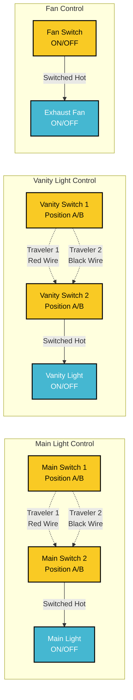
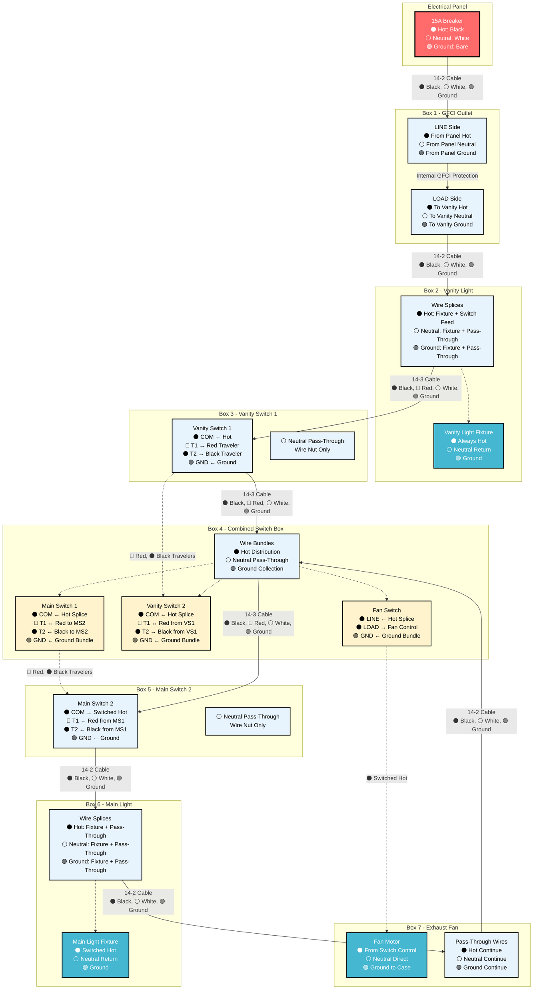
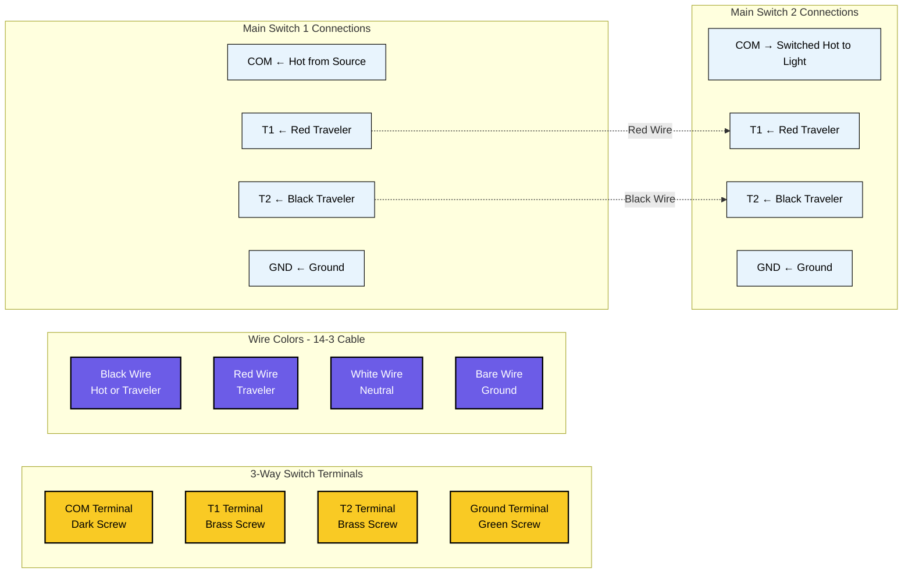
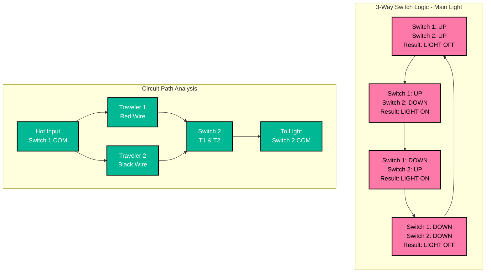
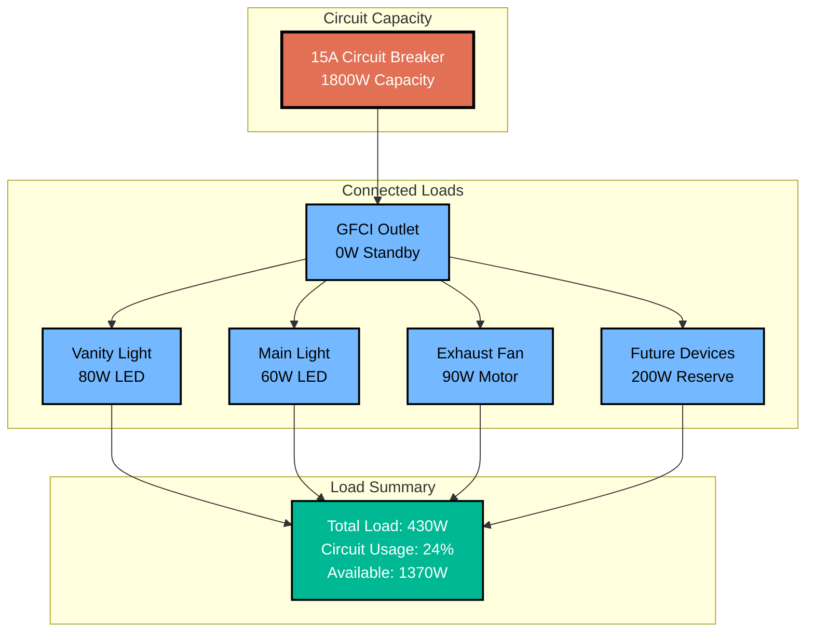
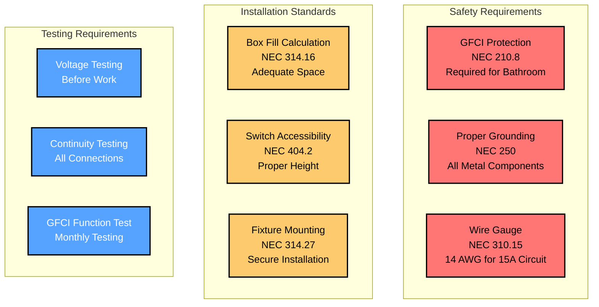

# Bathroom Electrical Wiring - Mermaid Diagram

This document provides a detailed Mermaid flowchart diagram of the bathroom electrical wiring system.

## Complete Circuit Flow Diagram

```mermaid
flowchart TD
    A[Electrical Panel<br/>15A Breaker] -->|14-2 Cable<br/>⚫ Hot: Black<br/>⚪ Neutral: White<br/>🟢 Ground: Bare| B[GFCI Outlet<br/>15A, 120V]
    
    B -->|14-2 Cable<br/>⚫ Hot: Black<br/>⚪ Neutral: White<br/>🟢 Ground: Bare| C[Vanity Light Fixture<br/>LED Compatible]
    
    C -->|14-3 Cable<br/>⚫ Hot: Black<br/>🔴 Traveler: Red<br/>⚪ Neutral: White<br/>🟢 Ground: Bare| D[Vanity Switch 1<br/>3-Way Switch]
    
    D -->|14-3 Cable<br/>⚫ Hot: Black → 3 switches<br/>🔴 Traveler: Red → VS2<br/>⚪ Neutral: White (pass-through)<br/>🟢 Ground: Bare (all switches)| E[Combined Switch Box<br/>Main SW1, Vanity SW2, Fan SW]
    
    E -->|14-3 Cable<br/>⚫ Switched Hot: Black (MS1)<br/>🔴 Traveler: Red (MS1-MS2)<br/>⚪ Neutral: White (pass-through)<br/>🟢 Ground: Bare| F[Main Switch 2<br/>3-Way Switch]
    
    F -->|14-2 Cable<br/>⚫ Switched Hot: Black<br/>⚪ Neutral: White<br/>🟢 Ground: Bare| G[Main Light Fixture<br/>LED Compatible]
    
    G -->|14-2 Cable<br/>⚫ Hot Pass-Through: Black<br/>⚪ Neutral: White<br/>🟢 Ground: Bare| H[Exhaust Fan<br/>CFM Rated]
    
    H -->|14-2 Cable<br/>⚫ Hot Continuous: Black<br/>⚪ Neutral: White<br/>🟢 Ground: Bare| E
    
    %% Fan Control Wire
    E -.->|⚫ Switched Hot Control<br/>Fan Switch LOAD → Fan Motor| H
    
    %% 3-Way Traveler Wires - 14-3 Cable Note
    D -.->|In 14-3 Cable:<br/>🔴 Red: VS1 T1 ↔ VS2 T1<br/>⚫ Black: VS1 T2 ↔ VS2 T2| E
    E -.->|In 14-3 Cable:<br/>🔴 Red: MS1 T1 ↔ MS2 T1<br/>⚫ Black: MS1 T2 ↔ MS2 T2| F
    
    %% Styling
    classDef panelStyle fill:#ff6b6b,stroke:#000,stroke-width:3px,color:#fff
    classDef gfciStyle fill:#4ecdc4,stroke:#000,stroke-width:2px,color:#000
    classDef fixtureStyle fill:#45b7d1,stroke:#000,stroke-width:2px,color:#fff
    classDef switchStyle fill:#f9ca24,stroke:#000,stroke-width:2px,color:#000
    classDef wireStyle stroke:#666,stroke-width:2px
    
    class A panelStyle
    class B gfciStyle
    class C,G,H fixtureStyle
    class D,E,F switchStyle
```

## Fan Control Power Flow Explanation

**Important Note**: The fan switch is located at the END of the circuit but controls the fan in the MIDDLE of the circuit. Here's how it works:

### Power Path to Fan Switch:
1. **Continuous Hot Wire**: Runs from GFCI → Vanity Light → Switch Box 1 → Main Light → **Fan (passes through)** → Switch Box 2 → Fan Switch
2. **Fan Switch Location**: Physical end of the circuit run
3. **Fan Location**: Middle of the circuit (between main light and switch box 2)

### Fan Control Method:
- **Hot Wire**: Continues past the fan to reach the fan switch
- **Switched Hot**: Fan switch sends control signal BACK to fan via separate wire
- **Result**: Fan switch can turn fan ON/OFF even though it's downstream

This is a common electrical configuration where the switch controlling a device is not physically adjacent to that device.

## 3-Way Switch Control Logic Diagram



## Wire Routing and Box Connections



## Terminal Connection Diagram



## Switch Position Logic Table



## Circuit Load Analysis



## Safety and Code Compliance



## How to View These Diagrams

These Mermaid diagrams can be viewed in several ways:

1. **VS Code with Mermaid Preview Extension**
   - Install "Mermaid Preview" extension
   - Open this file and use the preview feature

2. **GitHub/GitLab**
   - These platforms natively render Mermaid diagrams

3. **Mermaid Live Editor**
   - Copy diagram code to https://mermaid.live/

4. **Documentation Platforms**
   - Most modern documentation platforms support Mermaid

## Diagram Features

- **Complete Circuit Flow**: Shows power routing from panel to each device
- **3-Way Switch Logic**: Illustrates how traveler wires control lights
- **Wire Specifications**: All diagrams show 14 AWG wire for 15A circuit
- **Terminal Connections**: Detailed switch terminal wiring
- **Load Analysis**: Circuit capacity and usage calculations
- **Safety Compliance**: Code requirements and testing procedures
- **High Contrast Styling**: Improved text readability with dark borders and contrasting colors

## Styling Notes

The diagrams use high-contrast color schemes for optimal readability:
- **Dark borders (#000)** on all elements for clear definition
- **White text on dark backgrounds** for critical components
- **Black text on light backgrounds** for detailed information
- **Bold stroke widths** to ensure visibility
- **Color-coded components** for easy identification while maintaining accessibility

These diagrams complement the ASCII art diagrams in the other documentation files and provide a more technical, structured view of the electrical system.

## Switch Box Configuration

**Important Configuration**: This bathroom wiring uses a combined switch box containing three switches:

1. **Vanity Switch 1**: Located in separate box near vanity light
2. **Combined Switch Box**: Contains three switches in one location:
   - Main Switch 1 (3-way for main light)
   - Vanity Switch 2 (3-way for vanity light)
   - Fan Switch (single pole for exhaust fan)
3. **Main Switch 2**: Located in separate box for main light control

### Benefits of Combined Switch Box:
- **Convenient Control**: All main switches in one location
- **Simplified Wiring**: Shared neutral and ground connections reduce wire nuts
- **Code Compliant**: Standard electrical practice for bathroom installations
- **Cost Effective**: Fewer boxes and less complex routing

## Detailed Wire Color Flow Diagram

```mermaid
flowchart TD
    subgraph "Wire Color Legend"
        ⚫[⚫ Hot/Switched Hot - Black Wire]
        ⚪[⚪ Neutral - White Wire]
        🟢[🟢 Ground - Bare/Green Wire]
        🔴R[🔴 Traveler 1 - Red Wire]
        ⚫[⚫ Traveler 2 - Black Wire in 14-3]
    end
    
    subgraph "Panel to GFCI (14-2)"
        P1[🔴 Panel Hot] --> G1[🔴 GFCI LINE Hot]
        P2[⚪ Panel Neutral] --> G2[⚪ GFCI LINE Neutral]
        P3[🟢 Panel Ground] --> G3[🟢 GFCI Ground]
    end
    
    subgraph "GFCI to Vanity Light (14-2)"
        G4[🔴 GFCI LOAD Hot] --> V1[🔴 Vanity Fixture Hot + Switch Feed]
        G5[⚪ GFCI LOAD Neutral] --> V2[⚪ Vanity Fixture Neutral + Circuit]
        G6[🟢 GFCI LOAD Ground] --> V3[🟢 Vanity Fixture Ground + Circuit]
    end
    
    subgraph "Vanity Light to Switch 1 (14-3)"
        V4[🔴 Hot from Fixture] --> S1[🔴 VS1 COM Terminal]
        V5[🔴 Red Traveler] --> S2[🔴 VS1 T1 Terminal]
        V6[⚫ Black Traveler] --> S3[⚫ VS1 T2 Terminal]
        V7[⚪ Neutral Pass-Through] --> S4[⚪ Wire Nut Only]
        V8[🟢 Ground] --> S5[🟢 VS1 Ground + Wire Nut]
    end
    
    subgraph "Switch 1 to Combined Box (14-3)"
        S6[🔴 Hot Continuation] --> C1[🔴 Hot Distribution to 3 Switches]
        S7[🔴 Red from VS1 T1] --> C2[🔴 VS2 T1 Terminal]
        S8[⚫ Black from VS1 T2] --> C3[⚫ VS2 T2 Terminal]
        S9[⚪ Neutral Pass-Through] --> C4[⚪ Neutral Bundle Wire Nut]
        S10[🟢 Ground] --> C5[🟢 Ground Bundle Wire Nut]
    end
    
    subgraph "Combined Box Connections"
        C1 --> C6[🔴 Main SW1 COM]
        C1 --> C7[🔴 Vanity SW2 COM]
        C1 --> C8[🔴 Fan Switch LINE]
        C9[🔴 Red MS1 T1] --> C10[🔴 To Main SW2 T1]
        C11[⚫ Black MS1 T2] --> C12[⚫ To Main SW2 T2]
        C13[🔴 Fan Switch LOAD] --> C14[🔴 Control to Fan Motor]
        C5 --> C15[🟢 All Switch Grounds]
    end
    
    subgraph "Combined Box to Main Switch 2 (14-3)"
        C16[🔴 From Main SW1 COM] --> M1[🔴 Main SW2 COM]
        C10 --> M2[🔴 Main SW2 T1]
        C12 --> M3[⚫ Main SW2 T2]
        C4 --> M4[⚪ Neutral Pass-Through]
        C5 --> M5[🟢 Main SW2 Ground]
    end
    
    subgraph "Main Switch 2 to Main Light (14-2)"
        M6[🔴 Main SW2 COM Output] --> L1[🔴 Main Light Fixture + Pass-Through]
        M4 --> L2[⚪ Main Light Neutral + Pass-Through]
        M5 --> L3[🟢 Main Light Ground + Pass-Through]
    end
    
    subgraph "Main Light to Fan (14-2)"
        L4[🔴 Hot Pass-Through] --> F1[🔴 Fan Box Pass-Through]
        L2 --> F2[⚪ Fan Neutral to Motor]
        L3 --> F3[🟢 Fan Ground to Motor + Case]
    end
    
    subgraph "Fan Control from Combined Box"
        C14 --> F4[🔴 Fan Motor Hot from Switch]
    end
    
    classDef hotStyle fill:#ff9999,stroke:#000,stroke-width:2px,color:#000
    classDef neutralStyle fill:#f0f0f0,stroke:#000,stroke-width:2px,color:#000
    classDef groundStyle fill:#90ee90,stroke:#000,stroke-width:2px,color:#000
    classDef travelerStyle fill:#ffd700,stroke:#000,stroke-width:2px,color:#000
    
    class P1,G1,G4,V1,V4,S1,S6,C1,C6,C7,C8,C16,M1,M6,L1,L4,F1,C13,C14,F4 hotStyle
    class P2,G2,G5,V2,V7,S4,S9,C4,M4,L2,F2 neutralStyle
    class P3,G3,G6,V3,V8,S5,S10,C5,C15,M5,L3,F3 groundStyle
    class V5,S2,S7,C2,C9,C10,M2,V6,S3,S8,C3,C11,C12,M3 travelerStyle
```

## Switch Terminal Wire Color Connections

```mermaid
flowchart TB
    subgraph "Vanity Switch 1 Box"
        direction TB
        VS1[Vanity Switch 1]
        VS1_COM[🔴 COM ← Black Hot from Fixture]
        VS1_T1[🔴 T1 ← Red Traveler to VS2]
        VS1_T2[⚫ T2 ← Black Traveler to VS2]
        VS1_GND[🟢 GND ← Bare Ground]
        VS1_NEUTRAL[⚪ Neutral Bundle<br/>White Pass-Through Only]
        
        VS1 --- VS1_COM
        VS1 --- VS1_T1
        VS1 --- VS1_T2
        VS1 --- VS1_GND
    end
    
    subgraph "Combined Switch Box"
        direction TB
        
        subgraph "Main Switch 1"
            MS1[Main Switch 1]
            MS1_COM[🔴 COM ← Black Hot (spliced)]
            MS1_T1[🔴 T1 ← Red Traveler to MS2]
            MS1_T2[⚫ T2 ← Black Traveler to MS2]
            MS1_GND[🟢 GND ← Ground Bundle]
            
            MS1 --- MS1_COM
            MS1 --- MS1_T1
            MS1 --- MS1_T2
            MS1 --- MS1_GND
        end
        
        subgraph "Vanity Switch 2"
            VS2[Vanity Switch 2]
            VS2_COM[🔴 COM ← Black Hot (spliced)]
            VS2_T1[🔴 T1 ← Red Traveler from VS1]
            VS2_T2[⚫ T2 ← Black Traveler from VS1]
            VS2_GND[🟢 GND ← Ground Bundle]
            
            VS2 --- VS2_COM
            VS2 --- VS2_T1
            VS2 --- VS2_T2
            VS2 --- VS2_GND
        end
        
        subgraph "Fan Switch"
            FS[Fan Switch]
            FS_LINE[🔴 LINE ← Black Hot (spliced)]
            FS_LOAD[🔴 LOAD → Black to Fan Motor]
            FS_GND[🟢 GND ← Ground Bundle]
            
            FS --- FS_LINE
            FS --- FS_LOAD
            FS --- FS_GND
        end
        
        subgraph "Wire Bundles in Combined Box"
            HOT_BUNDLE[🔴 Hot Distribution<br/>From VS1 → MS1, VS2, FS]
            NEUTRAL_BUNDLE[⚪ Neutral Bundle<br/>Pass-Through Only]
            GROUND_BUNDLE[🟢 Ground Bundle<br/>All Switches + Circuits]
        end
        
        HOT_BUNDLE -.-> MS1_COM
        HOT_BUNDLE -.-> VS2_COM
        HOT_BUNDLE -.-> FS_LINE
        GROUND_BUNDLE -.-> MS1_GND
        GROUND_BUNDLE -.-> VS2_GND
        GROUND_BUNDLE -.-> FS_GND
    end
    
    subgraph "Main Switch 2 Box"
        direction TB
        MS2[Main Switch 2]
        MS2_COM[🔴 COM → Black Switched Hot to Light]
        MS2_T1[🔴 T1 ← Red Traveler from MS1]
        MS2_T2[⚫ T2 ← Black Traveler from MS1]
        MS2_GND[🟢 GND ← Bare Ground]
        MS2_NEUTRAL[⚪ Neutral Bundle<br/>White Pass-Through Only]
        
        MS2 --- MS2_COM
        MS2 --- MS2_T1
        MS2 --- MS2_T2
        MS2 --- MS2_GND
    end
    
    %% Traveler Wire Connections
    VS1_T1 -.->|🔴 Red Wire in 14-3 Cable| VS2_T1
    VS1_T2 -.->|⚫ Black Wire in 14-3 Cable| VS2_T2
    MS1_T1 -.->|🔴 Red Wire in 14-3 Cable| MS2_T1
    MS1_T2 -.->|⚫ Black Wire in 14-3 Cable| MS2_T2
    
    %% Hot Feed Connections
    VS1_COM -.->|🔴 Black Wire Continuation| HOT_BUNDLE
    MS2_COM -.->|🔴 Black Switched Hot| MainLight[🔴 Main Light Fixture]
    FS_LOAD -.->|🔴 Black Control Wire| FanMotor[🔴 Fan Motor]
    
    classDef switchStyle fill:#f9ca24,stroke:#000,stroke-width:2px,color:#000
    classDef terminalStyle fill:#fff,stroke:#000,stroke-width:1px,color:#000
    classDef bundleStyle fill:#e8f4fd,stroke:#000,stroke-width:2px,color:#000
    classDef deviceStyle fill:#45b7d1,stroke:#000,stroke-width:2px,color:#fff
    
    class VS1,MS1,VS2,FS,MS2 switchStyle
    class VS1_COM,VS1_T1,VS1_T2,VS1_GND,VS1_NEUTRAL,MS1_COM,MS1_T1,MS1_T2,MS1_GND,VS2_COM,VS2_T1,VS2_T2,VS2_GND,FS_LINE,FS_LOAD,FS_GND,MS2_COM,MS2_T1,MS2_T2,MS2_GND,MS2_NEUTRAL terminalStyle
    class HOT_BUNDLE,NEUTRAL_BUNDLE,GROUND_BUNDLE bundleStyle
    class MainLight,FanMotor deviceStyle
```

## Fixture and Device Wire Connections

```mermaid
flowchart TD
    subgraph "GFCI Outlet Wiring"
        direction TB
        GFCI[GFCI Outlet]
        
        subgraph "LINE Side (From Panel)"
            LINE_H[🔴 LINE Hot ← Black from Panel]
            LINE_N[⚪ LINE Neutral ← White from Panel]
            LINE_G[🟢 LINE Ground ← Bare from Panel]
        end
        
        subgraph "LOAD Side (To Downstream)"
            LOAD_H[🔴 LOAD Hot → Black to Vanity]
            LOAD_N[⚪ LOAD Neutral → White to Vanity]
            LOAD_G[🟢 LOAD Ground → Bare to Vanity]
        end
        
        GFCI --- LINE_H
        GFCI --- LINE_N
        GFCI --- LINE_G
        GFCI --- LOAD_H
        GFCI --- LOAD_N
        GFCI --- LOAD_G
    end
    
    subgraph "Vanity Light Fixture Wiring"
        direction TB
        VF[Vanity Light Fixture]
        
        subgraph "Power Input (From GFCI)"
            VF_H_IN[🔴 Hot Input ← Black from GFCI]
            VF_N_IN[⚪ Neutral Input ← White from GFCI]
            VF_G_IN[🟢 Ground Input ← Bare from GFCI]
        end
        
        subgraph "Fixture Connections"
            VF_H_FIX[🔴 Fixture Hot ← Black Wire]
            VF_N_FIX[⚪ Fixture Neutral ← White Wire]
            VF_G_FIX[🟢 Fixture Ground ← Green Wire]
        end
        
        subgraph "Switch Feed (To Controls)"
            VF_H_SW[🔴 Hot to Switches ← Black (spliced)]
            VF_N_SW[⚪ Neutral Pass-Through ← White (spliced)]
            VF_G_SW[🟢 Ground Continue ← Bare (spliced)]
        end
        
        VF_H_IN -.-> VF_H_FIX
        VF_H_IN -.-> VF_H_SW
        VF_N_IN -.-> VF_N_FIX
        VF_N_IN -.-> VF_N_SW
        VF_G_IN -.-> VF_G_FIX
        VF_G_IN -.-> VF_G_SW
        
        VF --- VF_H_FIX
        VF --- VF_N_FIX
        VF --- VF_G_FIX
    end
    
    subgraph "Main Light Fixture Wiring"
        direction TB
        ML[Main Light Fixture]
        
        subgraph "Power Input (From Main Switch 2)"
            ML_H_IN[🔴 Switched Hot ← Black from MS2]
            ML_N_IN[⚪ Neutral Input ← White from Circuit]
            ML_G_IN[🟢 Ground Input ← Bare from Circuit]
        end
        
        subgraph "Fixture Connections"
            ML_H_FIX[🔴 Fixture Hot ← Black Wire]
            ML_N_FIX[⚪ Fixture Neutral ← White Wire]
            ML_G_FIX[🟢 Fixture Ground ← Green Wire]
        end
        
        subgraph "Pass-Through (To Fan)"
            ML_H_PASS[🔴 Hot Pass-Through → Black to Fan Box]
            ML_N_PASS[⚪ Neutral Continue → White to Fan]
            ML_G_PASS[🟢 Ground Continue → Bare to Fan]
        end
        
        ML_H_IN -.-> ML_H_FIX
        ML_H_IN -.-> ML_H_PASS
        ML_N_IN -.-> ML_N_FIX
        ML_N_IN -.-> ML_N_PASS
        ML_G_IN -.-> ML_G_FIX
        ML_G_IN -.-> ML_G_PASS
        
        ML --- ML_H_FIX
        ML --- ML_N_FIX
        ML --- ML_G_FIX
    end
    
    subgraph "Exhaust Fan Wiring"
        direction TB
        FAN[Exhaust Fan Motor]
        
        subgraph "Pass-Through Wires (No Connection to Fan)"
            FAN_H_PASS[🔴 Hot Pass-Through → To Combined Box]
            FAN_N_PASS[⚪ Neutral Pass-Through → To Combined Box]
            FAN_G_PASS[🟢 Ground Pass-Through → To Combined Box]
        end
        
        subgraph "Fan Motor Connections"
            FAN_H_MOTOR[🔴 Motor Hot ← Black from Fan Switch]
            FAN_N_MOTOR[⚪ Motor Neutral ← White from Circuit]
            FAN_G_MOTOR[🟢 Motor Ground ← Bare/Green to Case]
        end
        
        subgraph "Control Wire (From Fan Switch)"
            FAN_CONTROL[🔴 Switch Control ← Black from FS LOAD]
        end
        
        FAN_CONTROL -.-> FAN_H_MOTOR
        
        FAN --- FAN_H_MOTOR
        FAN --- FAN_N_MOTOR
        FAN --- FAN_G_MOTOR
    end
    
    %% Wire Flow Connections
    LOAD_H -.->|14-2 Cable| VF_H_IN
    LOAD_N -.->|14-2 Cable| VF_N_IN
    LOAD_G -.->|14-2 Cable| VF_G_IN
    
    VF_H_SW -.->|14-3 Cable| VS1_HOT[🔴 Vanity Switch 1]
    VF_N_SW -.->|14-3 Cable| VS1_NEUTRAL[⚪ VS1 Pass-Through]
    VF_G_SW -.->|14-3 Cable| VS1_GROUND[🟢 VS1 Ground]
    
    ML_H_PASS -.->|14-2 Cable| FAN_H_PASS
    ML_N_PASS -.->|14-2 Cable| FAN_N_PASS
    ML_G_PASS -.->|14-2 Cable| FAN_G_PASS
    
    FAN_H_PASS -.->|14-2 Cable| CB_HOT[🔴 Combined Box Hot]
    FAN_N_PASS -.->|14-2 Cable| CB_NEUTRAL[⚪ Combined Box Neutral]
    FAN_G_PASS -.->|14-2 Cable| CB_GROUND[🟢 Combined Box Ground]
    
    classDef deviceStyle fill:#45b7d1,stroke:#000,stroke-width:2px,color:#fff
    classDef wireStyle fill:#fff,stroke:#000,stroke-width:1px,color:#000
    classDef connectionStyle fill:#e8f4fd,stroke:#000,stroke-width:1px,color:#000
    
    class GFCI,VF,ML,FAN deviceStyle
    class LINE_H,LINE_N,LINE_G,LOAD_H,LOAD_N,LOAD_G,VF_H_IN,VF_N_IN,VF_G_IN,VF_H_FIX,VF_N_FIX,VF_G_FIX,VF_H_SW,VF_N_SW,VF_G_SW wireStyle
    class ML_H_IN,ML_N_IN,ML_G_IN,ML_H_FIX,ML_N_FIX,ML_G_FIX,ML_H_PASS,ML_N_PASS,ML_G_PASS wireStyle
    class FAN_H_PASS,FAN_N_PASS,FAN_G_PASS,FAN_H_MOTOR,FAN_N_MOTOR,FAN_G_MOTOR,FAN_CONTROL wireStyle
    class VS1_HOT,VS1_NEUTRAL,VS1_GROUND,CB_HOT,CB_NEUTRAL,CB_GROUND connectionStyle
```
