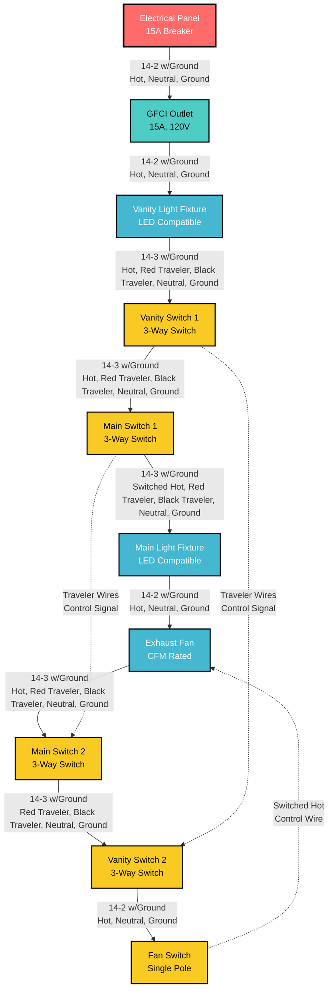
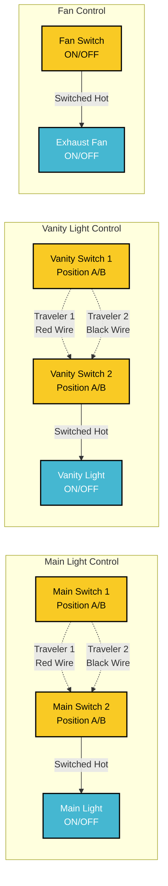
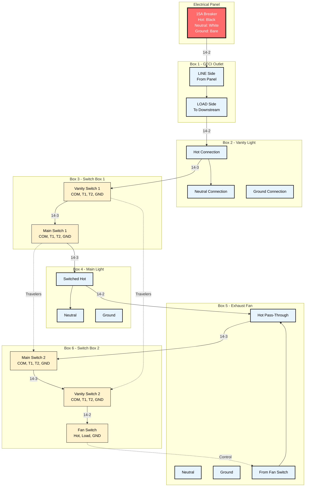
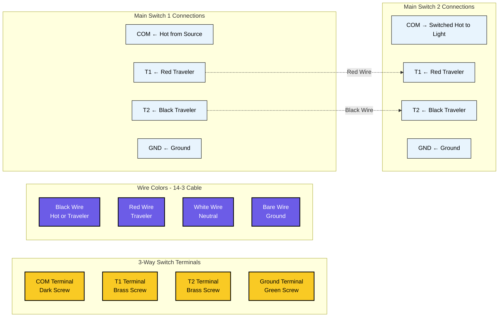
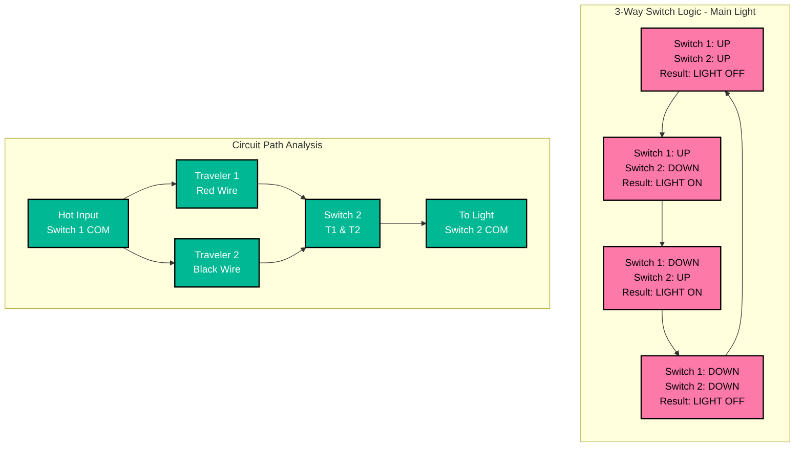
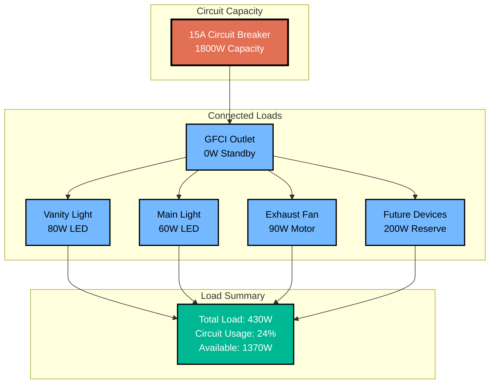
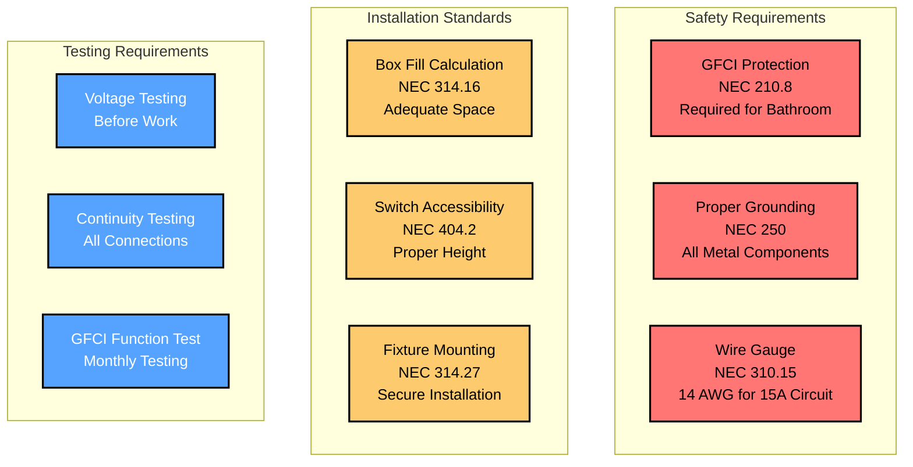

# Bathroom Electrical Wiring - Mermaid Diagram

This document provides a detailed Mermaid flowchart diagram of the bathroom electrical wiring system.

## Complete Circuit Flow Diagram

## 3-Way Switch Control Logic Diagram

## Wire Routing and Box Connections

## Terminal Connection Diagram

## Switch Position Logic Table

## Circuit Load Analysis

## Safety and Code Compliance

## How to View These Diagrams

These Mermaid diagrams can be viewed in several ways:

1. **VS Code with Mermaid Preview Extension**
   - Install "Mermaid Preview" extension
   - Open this file and use the preview feature

2. **GitHub/GitLab**
   - These platforms natively render Mermaid diagrams

3. **Mermaid Live Editor**
   - Copy diagram code to https://mermaid.live/

4. **Documentation Platforms**
   - Most modern documentation platforms support Mermaid

## Diagram Features

- **Complete Circuit Flow**: Shows power routing from panel to each device
- **3-Way Switch Logic**: Illustrates how traveler wires control lights
- **Wire Specifications**: All diagrams show 14 AWG wire for 15A circuit
- **Terminal Connections**: Detailed switch terminal wiring
- **Load Analysis**: Circuit capacity and usage calculations
- **Safety Compliance**: Code requirements and testing procedures
- **High Contrast Styling**: Improved text readability with dark borders and contrasting colors

## Styling Notes

The diagrams use high-contrast color schemes for optimal readability:
- **Dark borders (#000)** on all elements for clear definition
- **White text on dark backgrounds** for critical components
- **Black text on light backgrounds** for detailed information
- **Bold stroke widths** to ensure visibility
- **Color-coded components** for easy identification while maintaining accessibility

These diagrams complement the ASCII art diagrams in the other documentation files and provide a more technical, structured view of the electrical system.
