# Bathroom Electrical Wiring - Mermaid Diagram

This document provides a detailed Mermaid flowchart diagram of the bathroom electrical wiring system.

## Complete Circuit Flow Diagram

```mermaid
flowchart TD
    A[Electrical Panel<br/>15A Breaker] -->|14-2 Cable<br/>⚫ Hot: Black<br/>⚪ Neutral: White<br/>🟢 Ground: Bare| B[GFCI Outlet<br/>15A, 120V]
    
    B -->|14-2 Cable<br/>⚫ Hot: Black<br/>⚪ Neutral: White<br/>🟢 Ground: Bare| D[Vanity Switch 1<br/>3-Way Switch]
    
    D -->|14-2 Cable<br/>⚫ Switched Hot: Black<br/>⚪ Neutral: White<br/>🟢 Ground: Bare| C[Vanity Light Fixture<br/>LED Compatible]
    
    D -->|14-3 Cable<br/>⚫ Hot: Black<br/>🔴 Traveler: Red<br/>⚪ Neutral: White<br/>🟢 Ground: Bare| E[Combined Switch Box<br/>Main SW1<br/>Vanity SW2<br/>Fan SW]
    
    E -->|14-3 Cable<br/>⚫ Switched Hot: Black<br/>🔴 Traveler: Red<br/>⚪ Neutral: White<br/>🟢 Ground: Bare| F[Main Switch 2<br/>3-Way Switch]
    
    F -->|14-2 Cable<br/>⚫ Switched Hot: Black<br/>⚪ Neutral: White<br/>🟢 Ground: Bare| G[Main Light Fixture<br/>LED Compatible]
    
    G -->|14-2 Cable<br/>⚫ Hot Pass-Through: Black<br/>⚪ Neutral: White<br/>🟢 Ground: Bare| H[Exhaust Fan<br/>CFM Rated]
    
    H -->|14-2 Cable<br/>⚫ Hot Continuous: Black<br/>⚪ Neutral: White<br/>🟢 Ground: Bare| E
    
    %% Fan Control Wire
    E -.->|⚫ Switched Hot<br/>Fan Switch → Fan| H
    
    %% 3-Way Traveler Wires - 14-3 Cable Note
    D -.->|14-3 Cable:<br/>🔴 Red: VS1↔VS2<br/>⚫ Black: VS1↔VS2| E
    E -.->|14-3 Cable:<br/>🔴 Red: MS1↔MS2<br/>⚫ Black: MS1↔MS2| F
    
    %% Styling
    classDef panelStyle fill:#ff6b6b,stroke:#000,stroke-width:3px,color:#fff
    classDef gfciStyle fill:#4ecdc4,stroke:#000,stroke-width:2px,color:#000
    classDef fixtureStyle fill:#45b7d1,stroke:#000,stroke-width:2px,color:#fff
    classDef switchStyle fill:#f9ca24,stroke:#000,stroke-width:2px,color:#000
    classDef wireStyle stroke:#666,stroke-width:2px
    
    class A panelStyle
    class B gfciStyle
    class C,G,H fixtureStyle
    class D,E,F switchStyle
```



## Fan Control Power Flow Explanation

**Important Note**: The fan switch is located at the END of the circuit but controls the fan in the MIDDLE of the circuit. Here's how it works:

### Power Path to Fan Switch:
1. **Continuous Hot Wire**: Runs from GFCI → Vanity Light → Switch Box 1 → Main Light → **Fan (passes through)** → Switch Box 2 → Fan Switch
2. **Fan Switch Location**: Physical end of the circuit run  
3. **Fan Location**: Middle of the circuit (between main light and switch box 2)

### Fan Control Method:
- **⚫ Hot Wire**: Continues past the fan to reach the fan switch
- **⚫ Switched Hot**: Fan switch sends control signal BACK to fan via separate wire
- **Result**: Fan switch can turn fan ON/OFF even though it's downstream

This is a common electrical configuration where the switch controlling a device is not physically adjacent to that device.

### Visual Flow:
```
Panel → GFCI → VS1 → Vanity Light → Combined Box → MS2 → Main Light → Fan → Combined Box
                                                                      ↑        ↓
                                                                  Pass-Through  Control Wire
                                                                      ↑        ↓  
                                                                 Fan Switch ←──┘
```

## 3-Way Switch Control Logic Diagram

```mermaid
flowchart LR
    subgraph "Main Light Control"
        MS1[Main Switch 1<br/>Position A/B] 
        MS2[Main Switch 2<br/>Position A/B]
        ML[Main Light<br/>ON/OFF]
        
        MS1 -.->|🔴 Traveler 1<br/>Red Wire| MS2
        MS1 -.->|⚫ Traveler 2<br/>Black Wire| MS2
        MS2 -->|⚫ Switched Hot| ML
    end
    
    subgraph "Vanity Light Control"
        VS1[Vanity Switch 1<br/>Position A/B]
        VS2[Vanity Switch 2<br/>Position A/B]
        VL[Vanity Light<br/>ON/OFF]
        
        VS1 -.->|🔴 Traveler 1<br/>Red Wire| VS2
        VS1 -.->|⚫ Traveler 2<br/>Black Wire| VS2
        VS2 -->|⚫ Switched Hot| VL
    end
    
    subgraph "Fan Control"
        FS[Fan Switch<br/>ON/OFF]
        FAN[Exhaust Fan<br/>ON/OFF]
        
        FS -->|⚫ Switched Hot| FAN
    end
    
    classDef switchStyle fill:#f9ca24,stroke:#000,stroke-width:2px,color:#000
    classDef deviceStyle fill:#45b7d1,stroke:#000,stroke-width:2px,color:#fff
    
    class MS1,MS2,VS1,VS2,FS switchStyle
    class ML,VL,FAN deviceStyle
```



## Wire Routing and Box Connections

```mermaid
flowchart TD
    subgraph "Electrical Panel"
        PANEL[15A Breaker<br/>⚫ Hot: Black<br/>⚪ Neutral: White<br/>🟢 Ground: Bare]
    end
    
    subgraph "Box 1 - GFCI Outlet"
        GFCI_LINE[LINE Side<br/>⚫ From Panel Hot<br/>⚪ From Panel Neutral<br/>🟢 From Panel Ground]
        GFCI_LOAD[LOAD Side<br/>⚫ To Vanity Hot<br/>⚪ To Vanity Neutral<br/>🟢 To Vanity Ground]
        GFCI_LINE -->|Internal GFCI Protection| GFCI_LOAD
    end
    
    subgraph "Box 2 - Vanity Switch 1"
        VS1_SWITCH[Vanity Switch 1<br/>⚫ COM ← Hot from GFCI<br/>🔴 T1 → Red Traveler<br/>⚫ T2 → Black Traveler<br/>🟢 GND ← Ground]
        VS1_NEUTRAL[⚪ Neutral Pass-Through<br/>Wire Nut Only]
    end
    
    subgraph "Box 3 - Vanity Light"
        VL_FIXTURE[Vanity Light Fixture<br/>⚫ Switched Hot from VS1<br/>⚪ Neutral Return<br/>🟢 Ground]
    end
    
    subgraph "Box 4 - Combined Switch Box"
        direction TB
        COMB_MAIN[Main Switch 1<br/>⚫ COM ← Hot Pigtail<br/>🔴 T1 ↔ Red to MS2<br/>⚫ T2 ↔ Black to MS2<br/>🟢 GND ← Ground Pigtail]
        COMB_VANITY[Vanity Switch 2<br/>⚫ COM ← Hot Pigtail<br/>🔴 T1 ↔ Red from VS1<br/>⚫ T2 ↔ Black from VS1<br/>🟢 GND ← Ground Pigtail]
        COMB_FAN[Fan Switch<br/>⚫ LINE ← Hot Pigtail<br/>⚫ LOAD → Fan Control<br/>🟢 GND ← Ground Pigtail]
        COMB_BUNDLES[Wire Bundles<br/>⚫ Hot Distribution<br/>⚪ Neutral Pass-Through<br/>🟢 Ground Collection]
        
        COMB_BUNDLES -.-> COMB_MAIN
        COMB_BUNDLES -.-> COMB_VANITY
        COMB_BUNDLES -.-> COMB_FAN
    end
    
    subgraph "Box 5 - Main Switch 2"
        MS2_SWITCH[Main Switch 2<br/>⚫ COM → Switched Hot<br/>🔴 T1 ← Red from MS1<br/>⚫ T2 ← Black from MS1<br/>🟢 GND ← Ground]
        MS2_NEUTRAL[⚪ Neutral Pass-Through<br/>Wire Nut Only]
    end
    
    subgraph "Box 6 - Main Light"
        ML_FIXTURE[Main Light Fixture<br/>⚫ Switched Hot<br/>⚪ Neutral Return<br/>🟢 Ground]
        ML_SPLICE[Wire Splices<br/>⚫ Hot: Fixture + Pass-Through<br/>⚪ Neutral: Fixture + Pass-Through<br/>🟢 Ground: Fixture + Pass-Through]
        ML_SPLICE -.-> ML_FIXTURE
    end
    
    subgraph "Box 7 - Exhaust Fan"
        FAN_MOTOR[Fan Motor<br/>⚫ From Switch Control<br/>⚪ Neutral Direct<br/>🟢 Ground to Case]
        FAN_PASS[Pass-Through Wires<br/>⚫ Hot Continue<br/>⚪ Neutral Continue<br/>🟢 Ground Continue]
    end
    
    %% Cable Connections with Wire Colors
    PANEL -->|14-2 Cable<br/>⚫⚪🟢| GFCI_LINE
    GFCI_LOAD -->|14-2 Cable<br/>⚫⚪🟢| VS1_SWITCH
    VS1_SWITCH -->|14-2 Cable<br/>⚫⚪🟢| VL_FIXTURE
    VS1_SWITCH -->|14-3 Cable<br/>⚫🔴⚪🟢| COMB_BUNDLES
    COMB_BUNDLES -->|14-3 Cable<br/>⚫🔴⚪🟢| MS2_SWITCH
    MS2_SWITCH -->|14-2 Cable<br/>⚫⚪🟢| ML_SPLICE
    ML_SPLICE -->|14-2 Cable<br/>⚫⚪🟢| FAN_PASS
    FAN_PASS -->|14-2 Cable<br/>⚫⚪🟢| COMB_BUNDLES
    
    %% Control Wires
    COMB_FAN -.->|⚫ Switched Hot| FAN_MOTOR
    
    %% Traveler Connections
    VS1_SWITCH -.->|🔴⚫ Travelers| COMB_VANITY
    COMB_MAIN -.->|🔴⚫ Travelers| MS2_SWITCH
    
    classDef panelStyle fill:#ff6b6b,stroke:#000,stroke-width:3px,color:#fff
    classDef boxStyle fill:#e8f4fd,stroke:#000,stroke-width:2px,color:#000
    classDef deviceStyle fill:#fff3cd,stroke:#000,stroke-width:2px,color:#000
    classDef fixtureStyle fill:#45b7d1,stroke:#000,stroke-width:2px,color:#fff
    
    class PANEL panelStyle
    class GFCI_LINE,GFCI_LOAD,VL_SPLICE,VS1_SWITCH,VS1_NEUTRAL,COMB_BUNDLES,MS2_SWITCH,MS2_NEUTRAL,ML_SPLICE,FAN_PASS boxStyle
    class COMB_MAIN,COMB_VANITY,COMB_FAN deviceStyle
    class VL_FIXTURE,ML_FIXTURE,FAN_MOTOR fixtureStyle
```



## Terminal Connection Diagram

```mermaid
flowchart LR
    subgraph "3-Way Switch Terminals"
        direction TB
        COM[COM Terminal<br/>⚫ Dark Screw]
        T1[T1 Terminal<br/>🟡 Brass Screw]
        T2[T2 Terminal<br/>🟡 Brass Screw]
        GND[Ground Terminal<br/>🟢 Green Screw]
    end
    
    subgraph "Wire Colors - 14-3 Cable"
        BLACK[⚫ Black Wire<br/>Hot or Traveler]
        RED[🔴 Red Wire<br/>Traveler]
        WHITE[⚪ White Wire<br/>Neutral]
        BARE[🟢 Bare Wire<br/>Ground]
    end
    
    subgraph "Main Switch 1 Connections"
        MS1_COM[COM ← ⚫ Hot from Source]
        MS1_T1[T1 ← 🔴 Red Traveler]
        MS1_T2[T2 ← ⚫ Black Traveler]
        MS1_GND[GND ← 🟢 Ground]
    end
    
    subgraph "Main Switch 2 Connections"
        MS2_COM[COM → ⚫ Switched Hot to Light]
        MS2_T1[T1 ← 🔴 Red Traveler]
        MS2_T2[T2 ← ⚫ Black Traveler]
        MS2_GND[GND ← 🟢 Ground]
    end
    
    %% Traveler Connections
    MS1_T1 -.->|🔴 Red Wire| MS2_T1
    MS1_T2 -.->|⚫ Black Wire| MS2_T2
    
    classDef terminalStyle fill:#f9ca24,stroke:#000,stroke-width:2px,color:#000
    classDef wireStyle fill:#6c5ce7,stroke:#000,stroke-width:2px,color:#fff
    classDef connectionStyle fill:#e8f4fd,stroke:#000,stroke-width:1px,color:#000
    
    class COM,T1,T2,GND terminalStyle
    class BLACK,RED,WHITE,BARE wireStyle
    class MS1_COM,MS1_T1,MS1_T2,MS1_GND,MS2_COM,MS2_T1,MS2_T2,MS2_GND connectionStyle
```



## Switch Position Logic Table

```mermaid
flowchart TD
    subgraph "3-Way Switch Logic - Main Light"
        direction TB
        
        STATE1[Switch 1: ↑ UP<br/>Switch 2: ↑ UP<br/>Result: 💡 LIGHT OFF]
        STATE2[Switch 1: ↑ UP<br/>Switch 2: ↓ DOWN<br/>Result: 🔆 LIGHT ON]
        STATE3[Switch 1: ↓ DOWN<br/>Switch 2: ↑ UP<br/>Result: 🔆 LIGHT ON]
        STATE4[Switch 1: ↓ DOWN<br/>Switch 2: ↓ DOWN<br/>Result: 💡 LIGHT OFF]
        
        STATE1 --> STATE2
        STATE2 --> STATE3
        STATE3 --> STATE4
        STATE4 --> STATE1
    end
    
    subgraph "Circuit Path Analysis"
        direction LR
        
        HOT_IN[⚫ Hot Input<br/>Switch 1 COM]
        TRAV1[🔴 Traveler 1<br/>Red Wire]
        TRAV2[⚫ Traveler 2<br/>Black Wire]
        SWITCH2[Switch 2<br/>T1 & T2]
        LIGHT_OUT[⚫ To Light<br/>Switch 2 COM]
        
        HOT_IN --> TRAV1
        HOT_IN --> TRAV2
        TRAV1 --> SWITCH2
        TRAV2 --> SWITCH2
        SWITCH2 --> LIGHT_OUT
    end
    
    classDef stateStyle fill:#fd79a8,stroke:#000,stroke-width:2px,color:#000
    classDef pathStyle fill:#00b894,stroke:#000,stroke-width:2px,color:#fff
    
    class STATE1,STATE2,STATE3,STATE4 stateStyle
    class HOT_IN,TRAV1,TRAV2,SWITCH2,LIGHT_OUT pathStyle
```



## Circuit Load Analysis

```mermaid
flowchart TD
    subgraph "Circuit Capacity"
        BREAKER[⚡ 15A Circuit Breaker<br/>1800W Capacity]
    end
    
    subgraph "Connected Loads"
        GFCI[🔌 GFCI Outlet<br/>0W Standby]
        VL[💡 Vanity Light<br/>80W LED]
        ML[💡 Main Light<br/>60W LED]
        FAN[🌪️ Exhaust Fan<br/>90W Motor]
        FUTURE[🔌 Future Devices<br/>200W Reserve]
    end
    
    subgraph "Load Summary"
        TOTAL[📊 Total Load: 430W<br/>Circuit Usage: 24%<br/>Available: 1370W]
    end
    
    BREAKER --> GFCI
    GFCI --> VL
    GFCI --> ML
    GFCI --> FAN
    GFCI --> FUTURE
    
    VL --> TOTAL
    ML --> TOTAL
    FAN --> TOTAL
    FUTURE --> TOTAL
    
    classDef capacityStyle fill:#e17055,stroke:#000,stroke-width:3px,color:#fff
    classDef loadStyle fill:#74b9ff,stroke:#000,stroke-width:2px,color:#000
    classDef summaryStyle fill:#00b894,stroke:#000,stroke-width:2px,color:#fff
    
    class BREAKER capacityStyle
    class GFCI,VL,ML,FAN,FUTURE loadStyle
    class TOTAL summaryStyle
```



## Safety and Code Compliance


## How to View These Diagrams

These Mermaid diagrams can be viewed in several ways:

1. **VS Code with Mermaid Preview Extension**
   - Install "Mermaid Preview" extension
   - Open this file and use the preview feature

2. **GitHub/GitLab**
   - These platforms natively render Mermaid diagrams

3. **Mermaid Live Editor**
   - Copy diagram code to https://mermaid.live/

4. **Documentation Platforms**
   - Most modern documentation platforms support Mermaid

## Diagram Features

- **Complete Circuit Flow**: Shows power routing from panel to each device
- **3-Way Switch Logic**: Illustrates how traveler wires control lights
- **Wire Specifications**: All diagrams show 14 AWG wire for 15A circuit
- **Terminal Connections**: Detailed switch terminal wiring
- **Load Analysis**: Circuit capacity and usage calculations
- **Safety Compliance**: Code requirements and testing procedures
- **High Contrast Styling**: Improved text readability with dark borders and contrasting colors

## Styling Notes

The diagrams use high-contrast color schemes for optimal readability:
- **Dark borders (#000)** on all elements for clear definition
- **White text on dark backgrounds** for critical components
- **Black text on light backgrounds** for detailed information
- **Bold stroke widths** to ensure visibility
- **Color-coded components** for easy identification while maintaining accessibility

These diagrams complement the ASCII art diagrams in the other documentation files and provide a more technical, structured view of the electrical system.

## Switch Box Configuration

**Important Configuration**: This bathroom wiring uses a combined switch box containing three switches:

1. **Vanity Switch 1**: Located in separate box near vanity light
2. **Combined Switch Box**: Contains three switches in one location:
   - Main Switch 1 (3-way for main light)
   - Vanity Switch 2 (3-way for vanity light)
   - Fan Switch (single pole for exhaust fan)
3. **Main Switch 2**: Located in separate box for main light control

### Benefits of Combined Switch Box:
- **Convenient Control**: All main switches in one location
- **Simplified Wiring**: Shared neutral and ground connections reduce wire nuts
- **Code Compliant**: Standard electrical practice for bathroom installations
- **Cost Effective**: Fewer boxes and less complex routing

## Detailed Wire Color Flow Diagram

```mermaid
flowchart TD
    subgraph "Wire Color Legend"
        ⚫HOT[⚫ Hot/Switched Hot - Black Wire]
        ⚪NEUT[⚪ Neutral - White Wire]
        🟢GND[🟢 Ground - Bare/Green Wire]
        🔴TRAV1[🔴 Traveler 1 - Red Wire]
        ⚫TRAV2[⚫ Traveler 2 - Black Wire in 14-3]
    end
    
    subgraph "Panel to GFCI (14-2)"
        P1[⚫ Panel Hot] --> G1[⚫ GFCI LINE Hot]
        P2[⚪ Panel Neutral] --> G2[⚪ GFCI LINE Neutral]
        P3[🟢 Panel Ground] --> G3[🟢 GFCI Ground]
    end
    
    subgraph "GFCI to Vanity Light (14-2)"
        G4[⚫ GFCI LOAD Hot] --> V1[⚫ Vanity Fixture Hot + Switch Feed]
        G5[⚪ GFCI LOAD Neutral] --> V2[⚪ Vanity Fixture Neutral + Circuit]
        G6[🟢 GFCI LOAD Ground] --> V3[🟢 Vanity Fixture Ground + Circuit]
    end
    
    subgraph "Vanity Light to Switch 1 (14-3)"
        V4[⚫ Hot from Fixture] --> S1[⚫ VS1 COM Terminal]
        V5[🔴 Red Traveler] --> S2[🔴 VS1 T1 Terminal]
        V6[⚫ Black Traveler] --> S3[⚫ VS1 T2 Terminal]
        V7[⚪ Neutral Pass-Through] --> S4[⚪ Wire Nut Only]
        V8[🟢 Ground] --> S5[🟢 VS1 Ground + Wire Nut]
    end
    
    subgraph "Switch 1 to Combined Box (14-3)"
        S6[⚫ Hot Continuation] --> C1[⚫ Hot Distribution to 3 Switches]
        S7[🔴 Red from VS1 T1] --> C2[🔴 VS2 T1 Terminal]
        S8[⚫ Black from VS1 T2] --> C3[⚫ VS2 T2 Terminal]
        S9[⚪ Neutral Pass-Through] --> C4[⚪ Neutral Bundle Wire Nut]
        S10[🟢 Ground] --> C5[🟢 Ground Bundle Wire Nut]
    end
    
    subgraph "Combined Box Connections"
        C1 --> C6[⚫ Main SW1 COM]
        C1 --> C7[⚫ Vanity SW2 COM]
        C1 --> C8[⚫ Fan Switch LINE]
        C9[🔴 Red MS1 T1] --> C10[🔴 To Main SW2 T1]
        C11[⚫ Black MS1 T2] --> C12[⚫ To Main SW2 T2]
        C13[⚫ Fan Switch LOAD] --> C14[⚫ Control to Fan Motor]
        C5 --> C15[🟢 All Switch Grounds]
    end
    
    subgraph "Combined Box to Main Switch 2 (14-3)"
        C16[⚫ From Main SW1 COM] --> M1[⚫ Main SW2 COM]
        C10 --> M2[🔴 Main SW2 T1]
        C12 --> M3[⚫ Main SW2 T2]
        C4 --> M4[⚪ Neutral Pass-Through]
        C5 --> M5[🟢 Main SW2 Ground]
    end
    
    subgraph "Main Switch 2 to Main Light (14-2)"
        M6[⚫ Main SW2 COM Output] --> L1[⚫ Main Light Fixture + Pass-Through]
        M4 --> L2[⚪ Main Light Neutral + Pass-Through]
        M5 --> L3[🟢 Main Light Ground + Pass-Through]
    end
    
    subgraph "Main Light to Fan (14-2)"
        L4[⚫ Hot Pass-Through] --> F1[⚫ Fan Box Pass-Through]
        L2 --> F2[⚪ Fan Neutral to Motor]
        L3 --> F3[🟢 Fan Ground to Motor + Case]
    end
    
    subgraph "Fan Control from Combined Box"
        C14 --> F4[⚫ Fan Motor Hot from Switch]
    end
    
    classDef hotStyle fill:#ff9999,stroke:#000,stroke-width:2px,color:#000
    classDef neutralStyle fill:#f0f0f0,stroke:#000,stroke-width:2px,color:#000
    classDef groundStyle fill:#90ee90,stroke:#000,stroke-width:2px,color:#000
    classDef travelerStyle fill:#ffd700,stroke:#000,stroke-width:2px,color:#000
    
    class P1,G1,G4,V1,V4,S1,S6,C1,C6,C7,C8,C16,M1,M6,L1,L4,F1,C13,C14,F4 hotStyle
    class P2,G2,G5,V2,V7,S4,S9,C4,M4,L2,F2 neutralStyle
    class P3,G3,G6,V3,V8,S5,S10,C5,C15,M5,L3,F3 groundStyle
    class V5,S2,S7,C2,C9,C10,M2,V6,S3,S8,C3,C11,C12,M3 travelerStyle
```

## Pigtail Requirements

Pigtails are short lengths of wire used to connect devices to spliced wires. Here's where they're needed in this circuit:

### Required Pigtails by Location:

#### Box 2 - Vanity Switch 1:
- **Ground Pigtail**: Only if switch lacks ground screw (modern switches usually have screws)
- **Hot/Neutral**: Direct connections, no pigtails needed

#### Box 4 - Combined Switch Box (3 switches):
**Hot Distribution (3 pigtails required):**
- Pigtail 1: Hot bundle → Main Switch 1 COM
- Pigtail 2: Hot bundle → Vanity Switch 2 COM  
- Pigtail 3: Hot bundle → Fan Switch LINE

**Ground Distribution (3 pigtails required):**
- Pigtail 1: Ground bundle → Main Switch 1 GND
- Pigtail 2: Ground bundle → Vanity Switch 2 GND
- Pigtail 3: Ground bundle → Fan Switch GND

**Neutral**: Pass-through only, no pigtails to switches

#### Box 5 - Main Switch 2:
- **Ground Pigtail**: Only if switch lacks ground screw
- **Hot/Neutral**: Direct connections, no pigtails needed

### Pigtail Wire Specifications:
- **Length**: 6 inches minimum
- **Gauge**: Same as circuit wire (14 AWG for this 15A circuit)
- **Color**: Match the wire color being extended
- **Connection**: Use wire nuts rated for the wire gauge

### Why Pigtails Are Important:
1. **Code Compliance**: NEC requires proper grounding of all switches
2. **Safety**: Ensures secure connections under switch screws
3. **Reliability**: Prevents loose connections from wire movement
4. **Future Service**: Allows switch replacement without re-splicing
