# Bathroom Electrical Wiring - Mermaid Diagram

This document provides a detailed Mermaid flowchart diagram of the bathroom electrical wiring system.

## Complete Circuit Flow Diagram

```mermaid
%%{init: {'theme':'default', 'flowchart': {'nodeSpacing': 60, 'rankSpacing': 80, 'padding': 20}, 'themeVariables': {'primaryColor': '#ffffff', 'primaryTextColor': '#000000', 'primaryBorderColor': '#000000', 'lineColor': '#666666', 'sectionBkgColor': '#ffffff', 'altSectionBkgColor': '#f9f9f9', 'gridColor': '#cccccc', 'c0': '#ffffff', 'c1': '#ffffff', 'c2': '#ffffff', 'c3': '#ffffff', 'c4': '#ffffff'}}}%%
flowchart TD
    A["Electrical Panel<br/>15A Breaker"] -->|"14-2 Cable<br/>⚫ Hot: Black<br/>⚪ Neutral: White<br/>🟢 Ground: Bare"| B["GFCI Outlet<br/>15A, 120V"]
     B -->|"14-2 Cable<br/>⚫ Hot: Black<br/>⚪ Neutral: White<br/>🟢 Ground: Bare"| D["Vanity Switch 1<br/>3-Way Switch"]

    D -->|"14-3 Cable<br/>⚫ Hot: Black<br/>🔴 Traveler: Red<br/>⚪ Hot to Light: White<br/>🟢 Ground: Bare"| C["Vanity Light Fixture<br/>LED Compatible"]

    C -->|"14-3 Cable<br/>⚪ White to VS2: White<br/>🔴 Traveler: Red<br/>⚫ Black from Light: Black<br/>🟢 Ground: Green"| F["Main Switch 2<br/>3-Way Switch"]

    F -->|"14-3 Cable A (Vanity)<br/>⚪ White Hot to VS2: White<br/>🔴 Vanity Traveler: Red<br/>⚫ Neutral: Black<br/>🟢 Ground: Bare"| E["Combined Switch Box<br/>Main SW1<br/>Vanity SW2<br/>Fan SW"]

    F -->|"14-3 Cable B (Main Light)<br/>🔴 Main Traveler: Red<br/>⚫ Main Traveler: Black<br/>⚪ Neutral Feed: White<br/>🟢 Ground: Bare"| E

    E -->|"14-2 Cable<br/>⚫ Switched Hot: Black<br/>⚪ Neutral: White<br/>🟢 Ground: Bare"| G["Main Light Fixture<br/>LED Compatible"]

    G -->|"14-2 Cable<br/>⚫ Hot Pass-Through: Black<br/>⚪ Neutral: White<br/>🟢 Ground: Bare"| H["Exhaust Fan<br/>CFM Rated"]
    
    %% Fan Control from Combined Box
    E -.->|"⚫ Switched Hot<br/>Fan Switch → Fan"| H
    
    %% Styling
    classDef boxPadding padding:10px 25px
    classDef panelStyle fill:#ff6b6b,stroke:#000,stroke-width:3px,color:#fff
    classDef gfciStyle fill:#4ecdc4,stroke:#000,stroke-width:2px,color:#000
    classDef fixtureStyle fill:#45b7d1,stroke:#000,stroke-width:2px,color:#fff
    classDef switchStyle fill:#f9ca24,stroke:#000,stroke-width:2px,color:#000
    classDef wireStyle stroke:#666,stroke-width:2px
    
    class A,B,C,D,E,F,G,H boxPadding
    class A panelStyle
    class B gfciStyle
    class C,G,H fixtureStyle
    class D,E,F switchStyle
```



## Circuit Control Power Flow Explanation

### ⚡ MAIN LIGHT CIRCUIT (3-Way Control)
**Primary Controller**: Main Switch 1 (Combined Box) - **SOURCES SWITCHED HOT**
**Secondary Controller**: Main Switch 2 (Separate Box) - **RECEIVES TRAVELERS**

**Power Flow**: Hot from vanity circuit → Main Switch 2 (pass-through via travelers) → Main Switch 1 (Combined Box) → **SWITCHED HOT OUTPUT** → Main Light

### ⚡ VANITY LIGHT CIRCUIT (3-Way Control)  
**Primary Controller**: Vanity Switch 1 (Separate Box) - **SOURCES HOT TO LIGHT**
**Secondary Controller**: Vanity Switch 2 (Combined Box) - **COMPLETES CIRCUIT**

**Power Flow**: GFCI → Vanity Switch 1 → **SWITCHED HOT TO VANITY LIGHT** → return via Vanity Switch 2

### ⚡ FAN CIRCUIT (Single-Pole Control)
**Controller**: Fan Switch (Combined Box)
**Power Flow**: Hot from main circuit → Fan Switch → **SWITCHED HOT TO FAN**

**Important Note**: The fan switch is located at the END of the circuit and controls the fan in the MIDDLE of the circuit. Here's how it works:

## Wire Identification Requirements (NEC 200.7)

**⚠️ CRITICAL: White Wires Used as Hot**
In 3-way switch circuits, white wires from switch loops carry hot (not neutral). These MUST be re-identified:
- **Mark with black electrical tape** at both ends (switch and fixture)
- **Required locations**: 
  - White wire at vanity light fixture (switched hot from Vanity Switch 2)
  - White wire at Main Switch 2 (carries hot to Combined Box)
- **Why**: Prevents dangerous confusion between true neutrals and hot wires

### Power Path to Fan Switch:
1. **Continuous Hot Wire**: Runs from GFCI → Vanity Switch 1 → Vanity Light → Main Switch 2 → **Combined Switch Box (Fan Switch)** 
2. **Fan Switch Location**: Physical end of the circuit run in Combined Switch Box
3. **Fan Location**: Between main light and combined switch box (receives power via main light circuit)

### Circuit Control Method:
- **⚫ Main Light Control**: Main Switch 1 (Combined Box) sends switched hot to Main Light via travelers from Main Switch 2
- **⚫ Vanity Light Control**: Vanity Switch 1 sends switched hot directly to Vanity Light, completed by Vanity Switch 2
- **⚫ Fan Control**: Fan switch in Combined Box sends switched hot to fan via main light pass-through
- **Result**: Each circuit controlled independently by its respective 3-way or single-pole switches

This configuration allows centralized control with the fan switch grouped with other switches.

### Visual Power Flow:
```
VANITY CIRCUIT:
Panel → GFCI → VS1 → Vanity Light ← VS2 (Combined Box)

MAIN LIGHT CIRCUIT:  
Panel → GFCI → VS1 → Vanity Light → MS2 ← Travelers → MS1 (Combined Box) → Main Light

FAN CIRCUIT:
Main Light → Fan ← Fan Switch (Combined Box)
```

## 3-Way Switch Control Logic Diagram

```mermaid
%%{init: {'theme':'default', 'flowchart': {'nodeSpacing': 60, 'rankSpacing': 80, 'padding': 20}, 'themeVariables': {'primaryColor': '#ffffff', 'primaryTextColor': '#000000', 'primaryBorderColor': '#000000', 'lineColor': '#666666', 'sectionBkgColor': '#ffffff', 'altSectionBkgColor': '#f9f9f9', 'gridColor': '#cccccc', 'c0': '#ffffff', 'c1': '#ffffff', 'c2': '#ffffff', 'c3': '#ffffff', 'c4': '#ffffff'}}}%%
flowchart LR
    subgraph "Main Light Control"
        MS1["Main Switch 1<br/>(Combined Box)<br/>Position A | B"] 
        MS2["Main Switch 2<br/>(Separate Box)<br/>Position A | B"]
        ML["Main Light<br/>ON | OFF"]
        
        MS1 -.->|"🔴 Traveler 1<br/>Red Wire"| MS2
        MS1 -.->|"⚫ Traveler 2<br/>Black Wire"| MS2
        MS1 -->|"⚫ Switched Hot<br/>to Main Light"| ML
    end
    
    subgraph "Vanity Light Control"
        VS1["Vanity Switch 1<br/>Position A | B"]
        VS2["Vanity Switch 2<br/>Position A | B"]
        VL["Vanity Light<br/>ON | OFF"]
        
        VS1 -.->|"🔴 Traveler 1<br/>Red Wire"| VL
        VS1 -.->|"⚪ Traveler 2<br/>White Wire"| VL
        VL -.->|"🔴 Red Pass-Through"| VS2
        VL -.->|"⚫ Black Pass-Through"| VS2
        VL -->|"🔄 Hot Junction"| VL
    end
    
    subgraph "Fan Control"
        FS["Fan Switch<br/>ON | OFF"]
        FAN["Exhaust Fan<br/>ON | OFF"]
        
        FS -->|"⚫ Switched Hot"| FAN
    end
    
    classDef boxPadding padding:10px 15px
    classDef switchStyle fill:#f9ca24,stroke:#000,stroke-width:2px,color:#000
    classDef deviceStyle fill:#45b7d1,stroke:#000,stroke-width:2px,color:#fff
    
    class MS1,MS2,VS1,VS2,FS,ML,VL,FAN boxPadding
    class MS1,MS2,VS1,VS2,FS switchStyle
    class ML,VL,FAN deviceStyle
```



## Wire Routing and Box Connections

```mermaid
%%{init: {'theme':'default', 'flowchart': {'nodeSpacing': 60, 'rankSpacing': 80, 'padding': 20}, 'themeVariables': {'primaryColor': '#ffffff', 'primaryTextColor': '#000000', 'primaryBorderColor': '#000000', 'lineColor': '#666666', 'sectionBkgColor': '#ffffff', 'altSectionBkgColor': '#f9f9f9', 'gridColor': '#cccccc', 'c0': '#ffffff', 'c1': '#ffffff', 'c2': '#ffffff', 'c3': '#ffffff', 'c4': '#ffffff'}}}%%
flowchart TD
    subgraph "Electrical Panel"
        PANEL["15A Breaker<br/>⚫ Hot: Black<br/>⚪ Neutral: White<br/>🟢 Ground: Bare"]
    end
    
    subgraph "Box 1 - GFCI Outlet"
        GFCI_LINE[LINE Side<br/>⚫ From Panel Hot<br/>⚪ From Panel Neutral<br/>🟢 From Panel Ground]
        GFCI_LOAD[LOAD Side<br/>⚫ To Vanity Hot<br/>⚪ To Vanity Neutral<br/>🟢 To Vanity Ground]
        GFCI_LINE -->|"Internal GFCI Protection"| GFCI_LOAD
    end
    
    subgraph "Box 2 - Vanity Switch 1"
        VS1_SWITCH["Vanity Switch 1<br/>⚫ COM ← Hot from GFCI<br/>🔴 T1 → Red Traveler to Light<br/>⚪ T2 → White (Hot) to Light Fixture<br/>🟢 GND ← Ground"]
        VS1_NEUTRAL["⚪ Neutral Pass-Through<br/>Wire Nut Only"]
    end
    
    subgraph "Box 3 - Vanity Light"
        VL_FIXTURE["Vanity Light Fixture<br/>⚪ White from VS1 (Hot)<br/>⚫ Black to MS2 (Pass-Through)<br/>🟢 Green Ground"]
        VL_SPLICE["Wire Splices<br/>⚫ Black from VS1 COM → White to VS2 (via MS2 → Combined Box)<br/>⚪ White from VS1 T2 → Light Fixture (Hot)<br/>🔴 Red: VS1→VS2 Pass-Through (via MS2 → Combined Box)<br/>⚫ Black from Light → Continue to MS2<br/>🟢 Green: Continue to MS2"]
        VL_SPLICE -.-> VL_FIXTURE
    end
    
    subgraph "Box 4 - Main Switch 2"
        MS2_SWITCH["Main Switch 2<br/>⚫ COM INPUT ← Black Hot from Vanity Circuit<br/>🔴 T1 ↔ Red Traveler to/from MS1<br/>⚫ T2 ↔ Black Traveler to/from MS1<br/>🟢 GND ← Ground"]
        MS2_NEUTRAL["⚪ TRUE Neutral Pass-Through<br/>(To/From Combined Box and Main Light)"]
        MS2_HOT["⚪ WHITE HOT from Vanity Light<br/>(Switched Hot Return - NOT Neutral)<br/>**MARK WITH BLACK TAPE**<br/>Continues to Combined Box"]
        MS2_CONTROL["⚡ 3-Way Control Logic<br/>Works with Main Switch 1 to control Main Light<br/>via Traveler Wires (Red & Black)"]
    end
    
    subgraph "Box 5 - Main Light"
        ML_FIXTURE[Main Light Fixture<br/>⚫ Switched Hot<br/>⚪ Neutral Return<br/>🟢 Ground]
        ML_SPLICE["Wire Splices<br/>⚫ Hot: Fixture + Pass-Through<br/>⚪ Neutral: Fixture + Pass-Through<br/>🟢 Ground: Fixture + Pass-Through"]
        ML_SPLICE -.-> ML_FIXTURE
    end
    
    subgraph "Box 6 - Exhaust Fan"
        FAN_MOTOR["Fan Motor<br/>⚫ From Switch Control (via Combined Box)<br/>⚪ Neutral Direct<br/>🟢 Ground to Case"]
        FAN_PASS[Pass-Through Wires<br/>⚫ Hot Continue to Combined Box<br/>⚪ Neutral Continue to Combined Box<br/>🟢 Ground Continue to Combined Box]
    end
    
    subgraph "Box 7 - Combined Switch Box (END OF RUN)"
        direction TB
        COMB_MAIN["Main Switch 1<br/>⚫ COM → Switched Hot to Main Light<br/>🔴 T1 ↔ Red to MS2<br/>⚫ T2 ↔ Black to MS2<br/>🟢 GND ← Ground Pigtail"]
        COMB_VANITY["Vanity Switch 2<br/>⚪ COM ← White from Vanity Light (Hot)<br/>🔴 T1 ↔ Red to Vanity Light<br/>⚫ T2 → Neutral (black wire in Cable A)<br/>🟢 GND ← Ground Pigtail"]
        COMB_FAN["Fan Switch<br/>⚫ LINE ← Hot from Main Circuit<br/>⚫ LOAD → Fan Control<br/>🟢 GND ← Ground Pigtail"]
        COMB_BUNDLES["Wire Bundles<br/>⚫ Hot Distribution<br/>⚪ Neutral Termination<br/>🟢 Ground Collection"]
        
        COMB_BUNDLES -.-> COMB_MAIN
        COMB_BUNDLES -.-> COMB_VANITY
        COMB_BUNDLES -.-> COMB_FAN
    end
    
    %% Cable Connections with Wire Colors and Travelers
    PANEL -->|"14-2 Cable<br/>⚫⚪🟢"| GFCI_LINE
    GFCI_LOAD -->|"14-2 Cable<br/>⚫⚪🟢"| VS1_SWITCH
    
    %% Vanity 3-Way Circuit - 14-3 Cable with Travelers
    VS1_SWITCH -->|"14-3 Cable Run #1<br/>⚫🔴⚪🟢<br/>🔴Red = Traveler 1<br/>⚪White = Hot to Light"| VL_FIXTURE
    VL_FIXTURE -->|"14-3 Cable Run #2<br/>⚫🔴⚪🟢<br/>🔴Red = Traveler to VS2<br/>⚫Black = Hot continues to MS2"| MS2_SWITCH
    
    %% Two 14-3 Cables from MS2 to Combined Box
    MS2_SWITCH -->|"14-3 Cable A (Vanity)<br/>⚪⚫🔴🟢<br/>⚪White = Hot (marked)<br/>🔴Red = Traveler<br/>⚫Black = Neutral"| COMB_BUNDLES
    MS2_SWITCH -->|"14-3 Cable B (Main Light)<br/>🔴⚫⚪🟢<br/>🔴Red = Traveler 1<br/>⚫Black = Traveler 2<br/>⚪White = Neutral"| COMB_BUNDLES
    
    %% Main Circuit - Combined Box to Main Light to Fan  
    COMB_MAIN -->|"14-2 Cable<br/>⚫⚪🟢<br/>⚫ Switched Hot"| ML_SPLICE
    ML_SPLICE -->|"14-2 Cable<br/>⚫⚪🟢"| FAN_PASS
    
    %% Fan Control Wire
    COMB_FAN -.->|"⚫ Switched Hot"| FAN_MOTOR
    COMB_BUNDLES -.-> COMB_MAIN
    COMB_BUNDLES -.-> COMB_VANITY
    COMB_BUNDLES -.-> COMB_FAN
    
    classDef boxPadding padding:10px 15px
    classDef panelStyle fill:#ff6b6b,stroke:#000,stroke-width:3px,color:#fff
    classDef boxStyle fill:#e8f4fd,stroke:#000,stroke-width:2px,color:#000
    classDef deviceStyle fill:#fff3cd,stroke:#000,stroke-width:2px,color:#000
    classDef fixtureStyle fill:#45b7d1,stroke:#000,stroke-width:2px,color:#fff
    
    class PANEL,GFCI_LINE,GFCI_LOAD,VS1_SWITCH,VS1_NEUTRAL,VL_FIXTURE,COMB_MAIN,COMB_VANITY,COMB_FAN,COMB_BUNDLES,MS2_SWITCH,MS2_NEUTRAL,ML_FIXTURE,ML_SPLICE,FAN_MOTOR,FAN_PASS boxPadding
    class PANEL panelStyle
    class GFCI_LINE,GFCI_LOAD,VL_SPLICE,VS1_SWITCH,VS1_NEUTRAL,MS2_SWITCH,MS2_NEUTRAL,ML_SPLICE,FAN_PASS,COMB_BUNDLES boxStyle
    class COMB_MAIN,COMB_VANITY,COMB_FAN deviceStyle
    class VL_FIXTURE,ML_FIXTURE,FAN_MOTOR fixtureStyle
```



## Terminal Connection Diagram


## Switch Position Logic Table

```mermaid
%%{init: {'theme':'default', 'flowchart': {'nodeSpacing': 60, 'rankSpacing': 80, 'padding': 20}, 'themeVariables': {'primaryColor': '#ffffff', 'primaryTextColor': '#000000', 'primaryBorderColor': '#000000', 'lineColor': '#666666', 'sectionBkgColor': '#ffffff', 'altSectionBkgColor': '#f9f9f9', 'gridColor': '#cccccc', 'c0': '#ffffff', 'c1': '#ffffff', 'c2': '#ffffff', 'c3': '#ffffff', 'c4': '#ffffff'}}}%%
flowchart TD
    subgraph "3-Way Switch Logic - Main Light"
        direction TB
        
        STATE1["Switch 1: ↑ UP<br/>Switch 2: ↑ UP<br/>Result: 💡 LIGHT OFF"]
        STATE2["Switch 1: ↑ UP<br/>Switch 2: ↓ DOWN<br/>Result: 🔆 LIGHT ON"]
        STATE3["Switch 1: ↓ DOWN<br/>Switch 2: ↑ UP<br/>Result: 🔆 LIGHT ON"]
        STATE4["Switch 1: ↓ DOWN<br/>Switch 2: ↓ DOWN<br/>Result: 💡 LIGHT OFF"]
        
        STATE1 --> STATE2
        STATE2 --> STATE3
        STATE3 --> STATE4
        STATE4 --> STATE1
    end
    
    subgraph "Circuit Path Analysis"
        direction LR
        
        HOT_IN["⚫ Hot Input<br/>Switch 1 COM"]
        TRAV1["🔴 Traveler 1<br/>Red Wire"]
        TRAV2["⚫ Traveler 2<br/>Black Wire"]
        SWITCH2["Switch 2<br/>T1 & T2"]
        LIGHT_OUT["⚫ To Light<br/>Switch 2 COM"]
        
        HOT_IN --> TRAV1
        HOT_IN --> TRAV2
        TRAV1 --> SWITCH2
        TRAV2 --> SWITCH2
        SWITCH2 --> LIGHT_OUT
    end
    
    classDef boxPadding padding:10px 15px
    classDef stateStyle fill:#fd79a8,stroke:#000,stroke-width:2px,color:#000
    classDef pathStyle fill:#00b894,stroke:#000,stroke-width:2px,color:#fff
    
    class STATE1,STATE2,STATE3,STATE4,HOT_IN,TRAV1,TRAV2,SWITCH2,LIGHT_OUT boxPadding
    class STATE1,STATE2,STATE3,STATE4 stateStyle
    class HOT_IN,TRAV1,TRAV2,SWITCH2,LIGHT_OUT pathStyle
```



## Circuit Load Analysis


## Safety and Code Compliance


## How to View These Diagrams

These Mermaid diagrams can be viewed in several ways:

1. **VS Code with Mermaid Preview Extension**
   - Install "Mermaid Preview" extension
   - Open this file and use the preview feature

2. **GitHub/GitLab**
   - These platforms natively render Mermaid diagrams

3. **Mermaid Live Editor**
   - Copy diagram code to https://mermaid.live/

4. **Documentation Platforms**
   - Most modern documentation platforms support Mermaid

## Diagram Features

- **Complete Circuit Flow**: Shows power routing from panel to each device
- **3-Way Switch Logic**: Illustrates how traveler wires control lights
- **Wire Specifications**: All diagrams show 14 AWG wire for 15A circuit
- **Terminal Connections**: Detailed switch terminal wiring
- **Load Analysis**: Circuit capacity and usage calculations
- **Safety Compliance**: Code requirements and testing procedures
- **High Contrast Styling**: Improved text readability with dark borders and contrasting colors

## Styling Notes

The diagrams use high-contrast color schemes for optimal readability:
- **Dark borders (#000)** on all elements for clear definition
- **White text on dark backgrounds** for critical components
- **Black text on light backgrounds** for detailed information
- **Bold stroke widths** to ensure visibility
- **Color-coded components** for easy identification while maintaining accessibility

These diagrams complement the ASCII art diagrams in the other documentation files and provide a more technical, structured view of the electrical system.

## Switch Box Configuration

**Important Configuration**: This bathroom wiring uses a combined switch box containing three switches:

1. **Vanity Switch 1**: Located in separate box near vanity light
2. **Combined Switch Box**: Contains three switches in one location:
   - Main Switch 1 (3-way for main light)
   - Vanity Switch 2 (3-way for vanity light)
   - Fan Switch (single pole for exhaust fan)
3. **Main Switch 2**: Located in separate box for main light control

### Benefits of Combined Switch Box:
- **Convenient Control**: All main switches in one location
- **Simplified Wiring**: Shared neutral and ground connections reduce wire nuts
- **Code Compliant**: Standard electrical practice for bathroom installations
- **Cost Effective**: Fewer boxes and less complex routing

## Detailed Wire Color Flow Diagram

```mermaid
%%{init: {'theme':'default', 'flowchart': {'nodeSpacing': 60, 'rankSpacing': 80, 'padding': 20}, 'themeVariables': {'primaryColor': '#ffffff', 'primaryTextColor': '#000000', 'primaryBorderColor': '#000000', 'lineColor': '#666666', 'sectionBkgColor': '#ffffff', 'altSectionBkgColor': '#f9f9f9', 'gridColor': '#cccccc', 'c0': '#ffffff', 'c1': '#ffffff', 'c2': '#ffffff', 'c3': '#ffffff', 'c4': '#ffffff'}}}%%
flowchart TD
    subgraph "Wire Color Legend"
        HOT["⚫ Hot | Switched Hot - Black Wire"]
        NEUT["⚪ Neutral - White Wire"]
        GND["🟢 Ground - Bare | Green Wire"]
        TRAV1["🔴 Traveler 1 - Red Wire"]
        TRAV2["⚫ Traveler 2 - Black Wire in 14-3"]
    end
    
    subgraph "Panel to GFCI (14-2)"
        P1["⚫ Panel Hot"] --> G1["⚫ GFCI LINE Hot"]
        P2["⚪ Panel Neutral"] --> G2["⚪ GFCI LINE Neutral"]
        P3["🟢 Panel Ground"] --> G3["🟢 GFCI Ground"]
    end
    
    subgraph "GFCI to Vanity Light (14-2)"
        G4["⚫ GFCI LOAD Hot"] --> V1["⚫ Vanity Fixture Hot + Switch Feed"]
        G5["⚪ GFCI LOAD Neutral"] --> V2["⚪ Vanity Fixture Neutral + Circuit"]
        G6["🟢 GFCI LOAD Ground"] --> V3["🟢 Vanity Fixture Ground + Circuit"]
    end
    
    subgraph "Vanity Switch 1 to Vanity Light (14-3)"
        S1["⚫ VS1 COM Terminal"] --> V4["⚫ Black to White VS2 Junction"]
        S2["🔴 VS1 T1 Terminal"] --> V5["🔴 Red Pass-Through to VS2"]
        S3["⚪ VS1 T2 Terminal"] --> V6["⚪ White to Light Fixture Hot"]
        S4["⚪ Neutral Pass-Through"] --> V7["⚪ Neutral Continue to VS2"]
        S5["🟢 VS1 Ground"] --> V8["🟢 Green Pass-Through to VS2"]
    end
    
    subgraph "Vanity Light to Main Switch 2 (14-3)"
        V9["⚪ White from Black VS1 Junction"] --> M_VS2_HOT["⚪ Hot continues to Combined Box"]
        V10["🔴 Red Pass-Through"] --> M_VS2_RED["🔴 Red continues to Combined Box"]
        V11["⚫ Black from Light Fixture"] --> M_VS2_BLACK["⚫ Black continues to Combined Box"]
        V12["⚪ Neutral Continue"] --> M_VS2_NEUT["⚪ Neutral continues to Combined Box"]
        V13["🟢 Green Continue"] --> M_VS2_GND["🟢 Ground continues to Combined Box"]
    end
    
    subgraph "Main Switch 2 to Combined Box (Two 14-3 Cables)"
        M_VS2_HOT --> C2_A["⚪ Cable A: VS2 COM Terminal"]
        M_VS2_RED --> C3_A["🔴 Cable A: VS2 T1 Terminal"] 
        M_VS2_BLACK --> C4_A["⚫ Cable A: Neutral to Bundle"]
        M_VS2_GND --> C6["🟢 Ground Bundle Wire Nut"]
        
        C7_B["⚫ Cable B: From Main SW1 COM"] --> M1["🔴 Main SW2 T1"]
        C11_B["🔴 Cable B: MS1 T1"] --> M2["⚫ Main SW2 T2"]
        C12_B["⚫ Cable B: MS1 T2"] --> M3["⚪ Main SW2 T2"]
        C5_B["⚪ Cable B: Neutral"] --> M4["⚪ Neutral Pass-Through"]
    end
    
    subgraph "Combined Box Connections"
        H1["⚫ Hot Distribution Bundle"] --> C7["⚫ Main SW1 COM → Main Light"]
        H1 --> C8["⚫ Fan Switch LINE"]
        C2_A --> C9["⚪ Vanity SW2 COM from Light"]
        C10["🔴 Red MS1 T1"] --> C11_B
        C12["⚫ Black MS1 T2"] --> C12_B
        C14["⚫ Fan Switch LOAD"] --> C15["⚫ Control to Fan Motor"]
        C6 --> C16["🟢 All Switch Grounds"]
        C6 --> M5["🟢 Main SW2 Ground"]
    end
    
    subgraph "Combined Box to Main Light (14-2)"
        C7 --> L1["⚫ Main Light Fixture + Pass-Through"]
        C5_B --> L2["⚪ Main Light Neutral + Pass-Through"]
        C6 --> L3["🟢 Main Light Ground + Pass-Through"]
    end
    
    subgraph "Main Light to Fan (14-2)"
        L1 --> F1["⚫ Fan Box Pass-Through"]
        L2 --> F2["⚪ Fan Neutral to Motor"]
        L3 --> F3["🟢 Fan Ground to Motor + Case"]
    end
    
    subgraph "Fan Control from Combined Box"
        C15 --> F4["⚫ Fan Motor Hot from Switch"]
    end
    
    classDef boxPadding padding:10px 25px
    classDef panelStyle fill:#ff6b6b,stroke:#000,stroke-width:3px,color:#fff
    classDef boxStyle fill:#e8f4fd,stroke:#000,stroke-width:2px,color:#000
    classDef deviceStyle fill:#fff3cd,stroke:#000,stroke-width:2px,color:#000
    classDef fixtureStyle fill:#45b7d1,stroke:#000,stroke-width:2px,color:#fff
    
    class PANEL,GFCI_LINE,GFCI_LOAD,VS1_SWITCH,VS1_NEUTRAL,VL_FIXTURE,COMB_MAIN,COMB_VANITY,COMB_FAN,COMB_BUNDLES,MS2_SWITCH,MS2_NEUTRAL,ML_FIXTURE,ML_SPLICE,FAN_MOTOR,FAN_PASS boxPadding
    class PANEL panelStyle
    class GFCI_LINE,GFCI_LOAD,VL_SPLICE,VS1_SWITCH,VS1_NEUTRAL,MS2_SWITCH,MS2_NEUTRAL,ML_SPLICE,FAN_PASS,COMB_BUNDLES boxStyle
    class COMB_MAIN,COMB_VANITY,COMB_FAN deviceStyle
    class VL_FIXTURE,ML_FIXTURE,FAN_MOTOR fixtureStyle
```



## Detailed Wire Nut Specifications

### 📦 DETAILED WIRE NUT SPECIFICATIONS BY BOX

#### Box 1 - GFCI Outlet

**Box Overview**: GFCI outlet with LINE and LOAD sides. Provides GFCI protection for entire bathroom circuit.

**Incoming Cables:**
- **Cable 1**: 14-2 from Electrical Panel (⚫⚪🟢)
- **Cable 2**: 14-2 to Vanity Switch 1 (⚫⚪🟢)

**Required Wire Nuts:**

**Direct GFCI Terminal Connections (No Wire Nuts Required):**
- **LINE Hot**: ⚫ Black from panel → GFCI LINE hot terminal
- **LINE Neutral**: ⚪ White from panel → GFCI LINE neutral terminal
- **LOAD Hot**: ⚫ Black to vanity circuit → GFCI LOAD hot terminal
- **LOAD Neutral**: ⚪ White to vanity circuit → GFCI LOAD neutral terminal

**🟢 GREEN WIRE NUT #1 - Ground Collection (3 wires)**
- **Wire 1**: 🟢 Bare ground from panel
- **Wire 2**: 🟢 Bare ground to vanity circuit
- **Wire 3**: 🟢 Green pigtail to GFCI GND terminal (6" long)
- **Purpose**: Collects and distributes grounding for GFCI protection
- **Wire Nut Size**: Green (3-6 x 14 AWG capacity)

**Box Fill**: Minimal - GFCI device + 1 wire nut

---

#### Box 2 - Vanity Switch 1

**Box Overview**: First 3-way switch for vanity light. Sources hot power to vanity light fixture.

**Incoming Cables:**
- **Cable 1**: 14-2 from GFCI (⚫⚪🟢)
- **Cable 2**: 14-3 to Vanity Light (⚫🔴⚪🟢)

**Required Wire Nuts:**

**🔘 GRAY WIRE NUT #1 - Neutral Pass-Through (2 wires)**
- **Wire 1**: ⚪ White from GFCI (**PASS-THROUGH**)
- **Wire 2**: ⚪ White to vanity light circuit (**PASS-THROUGH**)
- **Purpose**: Passes neutral through VS1 box (neutrals don't connect to 3-way switches)
- **Wire Nut Size**: Gray (2-3 x 14 AWG capacity)
- **🔄 PASS-THROUGH**: Neutral continues to vanity light and beyond

**🟢 GREEN WIRE NUT #2 - Ground Collection (3 wires)**
- **Wire 1**: 🟢 Bare ground from GFCI (**PASS-THROUGH**)
- **Wire 2**: 🟢 Bare ground to vanity light (**PASS-THROUGH**)
- **Wire 3**: 🟢 Green pigtail to VS1 GND terminal (6" long)
- **Purpose**: Collects and distributes grounding for switch safety
- **Wire Nut Size**: Green (3-6 x 14 AWG capacity)
- **🔄 PASS-THROUGH**: Ground continues to vanity light and beyond

**Switch Terminal Connections:**
- **VS1 COM**: ⚫ Black from GFCI (hot input)
- **VS1 T1**: 🔴 Red to vanity light (traveler 1)
- **VS1 T2**: ⚪ White to vanity light (**HOT** - mark with black tape)
- **VS1 GND**: 🟢 Green pigtail from Green Wire Nut #2

**Box Fill**: 2 cables (8 conductors) + 1 switch (2 equiv.) + 1 pigtail = 11 equiv.

---

#### Box 3 - Vanity Light Fixture

**Box Overview**: Vanity light fixture with pass-through wiring to continue circuit to Main Switch 2.

**Incoming Cables:**
- **Cable 1**: 14-3 from Vanity Switch 1 (⚫🔴⚪🟢)
- **Cable 2**: 14-3 to Main Switch 2 (⚫🔴⚪🟢)

**Required Wire Nuts:**

**🔴 RED WIRE NUT #1 - Vanity Light Hot Junction (2 wires)**
- **Wire 1**: ⚪ White from VS1 T2 (**HOT** - marked with black tape)
- **Wire 2**: ⚫ Black pigtail to vanity light fixture (6" long)
- **Purpose**: Provides switched hot power to vanity light fixture
- **Wire Nut Size**: Red (3-5 x 14 AWG capacity)
- **⚠️ CRITICAL**: White wire is HOT, not neutral - must be marked

**🔘 GRAY WIRE NUT #2 - Hot Pass-Through to MS2 (2 wires)**
- **Wire 1**: ⚫ Black from VS1 COM (**PASS-THROUGH**)
- **Wire 2**: ⚫ Black to Main Switch 2 (**PASS-THROUGH**)
- **Purpose**: Passes continuous hot power through to Main Switch 2
- **Wire Nut Size**: Gray (2-3 x 14 AWG capacity)
- **🔄 PASS-THROUGH**: Hot power continues to MS2 and Combined Box

**🔘 GRAY WIRE NUT #3 - Red Traveler Pass-Through (2 wires)**
- **Wire 1**: 🔴 Red from VS1 T1 (**PASS-THROUGH**)
- **Wire 2**: 🔴 Red to Main Switch 2 (**PASS-THROUGH**)
- **Purpose**: Passes vanity red traveler through to Combined Box
- **Wire Nut Size**: Gray (2-3 x 14 AWG capacity)
- **🔄 PASS-THROUGH**: Vanity traveler continues to VS2 in Combined Box

**🔘 GRAY WIRE NUT #4 - Hot to Combined Box (2 wires)**
- **Wire 1**: ⚫ Black from vanity light fixture
- **Wire 2**: ⚪ White to Main Switch 2 (**HOT** - mark with black tape)
- **Purpose**: Sends power from vanity circuit to Combined Box
- **Wire Nut Size**: Gray (2-3 x 14 AWG capacity)
- **⚠️ CRITICAL**: White wire carries HOT, not neutral - must be marked

**🔘 GRAY WIRE NUT #5 - Neutral Pass-Through (2 wires)**
- **Wire 1**: ⚪ White from VS1 (true neutral) (**PASS-THROUGH**)
- **Wire 2**: ⚪ White to Main Switch 2 (true neutral) (**PASS-THROUGH**)
- **Purpose**: Passes true neutral through to Main Switch 2 and beyond
- **Wire Nut Size**: Gray (2-3 x 14 AWG capacity)
- **🔄 PASS-THROUGH**: Neutral continues to Combined Box and main light

**🟢 GREEN WIRE NUT #6 - Ground Pass-Through (3 wires)**
- **Wire 1**: 🟢 Bare ground from VS1 (**PASS-THROUGH**)
- **Wire 2**: 🟢 Bare ground to Main Switch 2 (**PASS-THROUGH**)
- **Wire 3**: 🟢 Green pigtail to vanity light fixture (6" long)
- **Purpose**: Collects and distributes grounding for fixture safety
- **Wire Nut Size**: Green (3-6 x 14 AWG capacity)
- **🔄 PASS-THROUGH**: Ground continues to MS2 and Combined Box

**Fixture Connections:**
- **Fixture Hot**: ⚫ Black pigtail from Red Wire Nut #1
- **Fixture Neutral**: ⚪ White from true neutral circuit
- **Fixture Ground**: 🟢 Green pigtail from Green Wire Nut #6

**Box Fill**: 2 cables (8 conductors) + 1 fixture (2 equiv.) + 2 pigtails = 12 equiv.

---

#### Box 4 - Main Switch 2 (DETAILED BREAKDOWN)

**Box Overview**: Main Switch 2 is a critical junction point where the vanity circuit passes through and connects to the Combined Box via two 14-3 cables. This box handles both pass-through wiring and 3-way switch connections.

**Incoming Cables:**
- **Cable 1**: 14-3 from Vanity Light (⚫🔴⚪🟢)
- **Cable 2**: 14-3 Cable A to Combined Box - Vanity circuit (⚪🔴⚫🟢)  
- **Cable 3**: 14-3 Cable B to Combined Box - Main light travelers (🔴⚫⚪🟢)

**Required Wire Nuts:**

**🔴 RED WIRE NUT #1 - Hot Input Distribution (3 wires)**
- **Wire 1**: ⚫ Black hot from vanity light (incoming power)
- **Wire 2**: ⚫ Black to MS2 COM terminal (pigtail - 6" long)
- **Wire 3**: ⚫ Black to Combined Box Cable A (**PASS-THROUGH**)
- **Purpose**: Distributes continuous hot power from vanity circuit
- **Wire Nut Size**: Red (3-5 x 14 AWG capacity)
- **🔄 PASS-THROUGH**: Hot power continues to Combined Box

**🟡 YELLOW WIRE NUT #2 - Hot to Combined Box (2 wires)**
- **Wire 1**: ⚪ White hot from vanity light (**MARKED WITH BLACK TAPE**)
- **Wire 2**: ⚪ White to Combined Box Cable A (**MARKED WITH BLACK TAPE**) (**PASS-THROUGH**)
- **Purpose**: Passes vanity circuit hot to VS2 COM terminal in Combined Box
- **Wire Nut Size**: Yellow (2-4 x 14 AWG capacity)
- **⚠️ CRITICAL**: Both white wires MUST be marked as hot per NEC 200.7
- **🔄 PASS-THROUGH**: Vanity hot continues to Combined Box

**🔘 GRAY WIRE NUT #3 - Red Traveler Pass-Through (2 wires)**
- **Wire 1**: 🔴 Red from vanity light (**PASS-THROUGH**)
- **Wire 2**: 🔴 Red to Combined Box Cable A (**PASS-THROUGH**)
- **Purpose**: Passes vanity circuit red traveler through MS2 box
- **Wire Nut Size**: Gray (2-3 x 14 AWG capacity)
- **🔄 PASS-THROUGH**: Vanity traveler continues to VS2 in Combined Box

**🔘 GRAY WIRE NUT #4 - Main Light Red Traveler (2 wires)**
- **Wire 1**: 🔴 Red from Combined Box Cable B (MS1 T1 traveler)
- **Wire 2**: 🔴 Red to MS2 T1 terminal (pigtail - 6" long)
- **Purpose**: Connects MS1 T1 to MS2 T1 (3-way traveler)
- **Wire Nut Size**: Gray (2-3 x 14 AWG capacity)

**🔘 GRAY WIRE NUT #5 - Main Light Black Traveler (2 wires)**
- **Wire 1**: ⚫ Black from Combined Box Cable B (MS1 T2 traveler)
- **Wire 2**: ⚫ Black to MS2 T2 terminal (pigtail - 6" long)
- **Purpose**: Connects MS1 T2 to MS2 T2 (3-way traveler)
- **Wire Nut Size**: Gray (2-3 x 14 AWG capacity)

**🔘 GRAY WIRE NUT #6 - Neutral Pass-Through (3 wires)**
- **Wire 1**: ⚪ White neutral from vanity light (true neutral) (**PASS-THROUGH**)
- **Wire 2**: ⚪ White neutral to Combined Box Cable A (**PASS-THROUGH**)
- **Wire 3**: ⚪ White neutral from Combined Box Cable B (**PASS-THROUGH**)
- **Purpose**: Passes neutral through to Combined Box and main light circuit
- **Wire Nut Size**: Gray (2-3 x 14 AWG capacity)
- **🔄 PASS-THROUGH**: Neutral continues to Combined Box and main light

**🟢 GREEN WIRE NUT #7 - Ground Collection (4 wires)**
- **Wire 1**: 🟢 Bare ground from vanity light (**PASS-THROUGH**)
- **Wire 2**: 🟢 Bare ground to Combined Box Cable A (**PASS-THROUGH**)
- **Wire 3**: 🟢 Bare ground to Combined Box Cable B (**PASS-THROUGH**)
- **Wire 4**: 🟢 Green pigtail to MS2 GND terminal (6" long)
- **Purpose**: Collects and distributes grounding for safety
- **Wire Nut Size**: Green (3-6 x 14 AWG capacity)
- **🔄 PASS-THROUGH**: Ground continues to Combined Box

**Switch Terminal Connections:**
- **MS2 COM**: ⚫ Black pigtail from Red Wire Nut #1
- **MS2 T1**: 🔴 Red pigtail from Gray Wire Nut #4  
- **MS2 T2**: ⚫ Black pigtail from Gray Wire Nut #5
- **MS2 GND**: 🟢 Green pigtail from Green Wire Nut #7

**Box Fill**: 3 cables (12 conductors) + 1 switch (2 equiv.) + 4 pigtails = 18 equiv.
**Required Box Size**: 4" × 4" × 2-1/8" minimum (21 cubic inch capacity)

---

#### Box 5 - Main Light Fixture

**Box Overview**: Main light fixture with pass-through wiring to continue circuit to exhaust fan.

**Incoming Cables:**
- **Cable 1**: 14-2 from Combined Box (⚫⚪🟢)
- **Cable 2**: 14-2 to Exhaust Fan (⚫⚪🟢)

**Required Wire Nuts:**

**🔴 RED WIRE NUT #1 - Hot Distribution (3 wires)**
- **Wire 1**: ⚫ Black switched hot from Combined Box (MS1 COM output)
- **Wire 2**: ⚫ Black pigtail to main light fixture (6" long)
- **Wire 3**: ⚫ Black to exhaust fan (**PASS-THROUGH**)
- **Purpose**: Distributes switched hot to fixture and passes through to fan
- **Wire Nut Size**: Red (3-5 x 14 AWG capacity)
- **🔄 PASS-THROUGH**: Hot continues to fan (controlled by fan switch)

**🔘 GRAY WIRE NUT #2 - Neutral Pass-Through (3 wires)**
- **Wire 1**: ⚪ White neutral from Combined Box (**PASS-THROUGH**)
- **Wire 2**: ⚪ White pigtail to main light fixture (6" long)
- **Wire 3**: ⚪ White to exhaust fan (**PASS-THROUGH**)
- **Purpose**: Provides neutral to fixture and passes through to fan
- **Wire Nut Size**: Gray (2-3 x 14 AWG capacity)
- **🔄 PASS-THROUGH**: Neutral continues to fan

**🟢 GREEN WIRE NUT #3 - Ground Pass-Through (4 wires)**
- **Wire 1**: 🟢 Bare ground from Combined Box (**PASS-THROUGH**)
- **Wire 2**: 🟢 Green pigtail to main light fixture (6" long)
- **Wire 3**: 🟢 Bare ground to exhaust fan (**PASS-THROUGH**)
- **Wire 4**: 🟢 Green pigtail to fixture mounting (if metal) (6" long)
- **Purpose**: Collects and distributes grounding for fixture safety
- **Wire Nut Size**: Green (3-6 x 14 AWG capacity)
- **🔄 PASS-THROUGH**: Ground continues to fan

**Fixture Connections:**
- **Fixture Hot**: ⚫ Black pigtail from Red Wire Nut #1
- **Fixture Neutral**: ⚪ White pigtail from Gray Wire Nut #2
- **Fixture Ground**: 🟢 Green pigtail from Green Wire Nut #3

**Box Fill**: 2 cables (6 conductors) + 1 fixture (1 equiv.) + 3 pigtails = 10 equiv.

---

#### Box 6 - Exhaust Fan

**Box Overview**: End-of-run exhaust fan controlled by fan switch in Combined Box.

**Incoming Cables:**
- **Cable 1**: 14-2 from Main Light (**HOT PASS-THROUGH FROM COMBINED BOX**)
- **Cable 2**: Control wire from Combined Box Fan Switch (virtual - actual control via main light pass-through)

**Required Wire Nuts:**

**Direct Fan Terminal Connections:**
- **Fan Hot**: ⚫ Black from main light pass-through (controlled by fan switch in Combined Box)
- **Fan Neutral**: ⚪ White from main light pass-through
- **Fan Ground**: 🟢 Bare ground from main light pass-through

**🟢 GREEN WIRE NUT #1 - Ground Collection (3 wires)**
- **Wire 1**: 🟢 Bare ground from main light
- **Wire 2**: 🟢 Green pigtail to fan motor ground (6" long)
- **Wire 3**: 🟢 Green pigtail to fan housing ground (6" long)
- **Purpose**: Provides proper grounding for fan motor and housing
- **Wire Nut Size**: Green (3-6 x 14 AWG capacity)

**Fan Connections:**
- **Fan Motor Hot**: ⚫ Black wire direct from cable
- **Fan Motor Neutral**: ⚪ White wire direct from cable
- **Fan Motor Ground**: 🟢 Green pigtail from Green Wire Nut #1
- **Fan Housing Ground**: 🟢 Green pigtail from Green Wire Nut #1

**Box Fill**: 1 cable (3 conductors) + 1 fan (2 equiv.) + 2 pigtails = 7 equiv.

**Control Method**: Fan is controlled by fan switch in Combined Box. When fan switch is ON, it allows current to flow through the main light circuit to the fan. When OFF, no current reaches the fan.

---

#### Box 7 - Combined Switch Box (3 Switches - END OF RUN)

**Box Overview**: Central control location containing Main Switch 1 (3-way), Vanity Switch 2 (3-way), and Fan Switch (single-pole). This is the end of the electrical run.

**Incoming Cables:**
- **Cable 1**: 14-3 Cable A from Main Switch 2 - Vanity circuit (⚪🔴⚫🟢)
- **Cable 2**: 14-3 Cable B from Main Switch 2 - Main light travelers (🔴⚫⚪🟢)
- **Cable 3**: 14-2 to Main Light (⚫⚪🟢)

**Required Wire Nuts:**

**🔴 RED WIRE NUT #1 - Hot Distribution (3 wires)**
- **Wire 1**: ⚫ Black hot from Cable A (vanity circuit power)
- **Wire 2**: ⚫ Black pigtail to MS1 COM terminal (6" long)
- **Wire 3**: ⚫ Black pigtail to Fan Switch LINE terminal (6" long)
- **Purpose**: Distributes hot power to Main Switch 1 and Fan Switch
- **Wire Nut Size**: Red (3-5 x 14 AWG capacity)

**🟡 YELLOW WIRE NUT #2 - Vanity Hot Input (2 wires)**
- **Wire 1**: ⚪ White hot from Cable A (**MARKED WITH BLACK TAPE**)
- **Wire 2**: ⚪ White pigtail to VS2 COM terminal (**MARKED WITH BLACK TAPE**) (6" long)
- **Purpose**: Provides hot input to Vanity Switch 2 from vanity light
- **Wire Nut Size**: Yellow (2-4 x 14 AWG capacity)
- **⚠️ CRITICAL**: White wire is HOT, not neutral - must be marked

**🔘 GRAY WIRE NUT #3 - Vanity Red Traveler (2 wires)**
- **Wire 1**: 🔴 Red from Cable A (from VS1 via vanity light)
- **Wire 2**: 🔴 Red pigtail to VS2 T1 terminal (6" long)
- **Purpose**: Connects Vanity Switch 1 to Vanity Switch 2 (red traveler)
- **Wire Nut Size**: Gray (2-3 x 14 AWG capacity)

**🔘 GRAY WIRE NUT #4 - Vanity Circuit Completion (2 wires)**
- **Wire 1**: ⚫ Black from Cable A (neutral in vanity circuit)
- **Wire 2**: ⚫ Black pigtail to VS2 T2 terminal (6" long)
- **Purpose**: Completes vanity circuit through Vanity Switch 2
- **Wire Nut Size**: Gray (2-3 x 14 AWG capacity)

**🔘 GRAY WIRE NUT #5 - Main Light Red Traveler (2 wires)**
- **Wire 1**: 🔴 Red from Cable B (to MS2 T1)
- **Wire 2**: 🔴 Red pigtail to MS1 T1 terminal (6" long)
- **Purpose**: Connects Main Switch 1 to Main Switch 2 (red traveler)
- **Wire Nut Size**: Gray (2-3 x 14 AWG capacity)

**🔘 GRAY WIRE NUT #6 - Main Light Black Traveler (2 wires)**
- **Wire 1**: ⚫ Black from Cable B (to MS2 T2)
- **Wire 2**: ⚫ Black pigtail to MS1 T2 terminal (6" long)
- **Purpose**: Connects Main Switch 1 to Main Switch 2 (black traveler)
- **Wire Nut Size**: Gray (2-3 x 14 AWG capacity)

**🔘 GRAY WIRE NUT #7 - Neutral Termination (2 wires)**
- **Wire 1**: ⚪ White neutral from Cable B (main light circuit)
- **Wire 2**: ⚪ White neutral to main light (continues to fan)
- **Purpose**: Passes neutral through to main light and fan
- **Wire Nut Size**: Gray (2-3 x 14 AWG capacity)

**🔘 GRAY WIRE NUT #8 - Fan Control Output (2 wires)**
- **Wire 1**: ⚫ Black from Fan Switch LOAD terminal (pigtail - 6" long)
- **Wire 2**: ⚫ Black to main light (switched hot output)
- **Purpose**: Sends switched hot from MS1 and fan control to main light
- **Wire Nut Size**: Gray (2-3 x 14 AWG capacity)
- **Note**: This wire nut combines MS1 COM output and Fan Switch LOAD output

**🟢 GREEN WIRE NUT #9 - Ground Collection (6 wires)**
- **Wire 1**: 🟢 Bare ground from Cable A
- **Wire 2**: 🟢 Bare ground from Cable B
- **Wire 3**: 🟢 Bare ground to main light
- **Wire 4**: 🟢 Green pigtail to MS1 GND terminal (6" long)
- **Wire 5**: 🟢 Green pigtail to VS2 GND terminal (6" long)
- **Wire 6**: 🟢 Green pigtail to Fan Switch GND terminal (6" long)
- **Purpose**: Collects and distributes grounding for all switches
- **Wire Nut Size**: Green (3-6 x 14 AWG capacity)

**Switch Terminal Connections:**
- **MS1 COM**: ⚫ Black pigtail from Red Wire Nut #1
- **MS1 T1**: 🔴 Red pigtail from Gray Wire Nut #5
- **MS1 T2**: ⚫ Black pigtail from Gray Wire Nut #6
- **MS1 GND**: 🟢 Green pigtail from Green Wire Nut #9
- **VS2 COM**: ⚪ White pigtail from Yellow Wire Nut #2 (**MARKED AS HOT**)
- **VS2 T1**: 🔴 Red pigtail from Gray Wire Nut #3
- **VS2 T2**: ⚫ Black pigtail from Gray Wire Nut #4
- **VS2 GND**: 🟢 Green pigtail from Green Wire Nut #9
- **Fan Switch LINE**: ⚫ Black pigtail from Red Wire Nut #1
- **Fan Switch LOAD**: ⚫ Black pigtail to Gray Wire Nut #8
- **Fan Switch GND**: 🟢 Green pigtail from Green Wire Nut #9

**Box Fill**: 3 cables (10 conductors) + 3 switches (6 equiv.) + 9 pigtails = 25 equiv.
**Required Box Size**: 4" × 4" × 2-1/8" deep minimum (21+ cubic inch capacity) or larger

**Installation Notes:**
1. **Largest Box**: This box has the highest conductor count and requires careful organization
2. **Wire Management**: Group wires by function (vanity vs main vs fan vs ground)
3. **Hot Wire Marking**: Mark white wire in Yellow Wire Nut #2 with black tape
4. **Switch Labeling**: Label switches clearly for future reference
5. **Testing**: Verify all 3-way combinations work correctly before closing box

---

### 📊 WIRE NUT SUMMARY TABLE

| **Wire Nut Type** | **Color** | **Capacity** | **Quantity Needed** | **Total Cost Est.** |
|------------------|-----------|--------------|-------------------|-------------------|
| **Green** (Ground) | 🟢 Green | 3-6 x 14 AWG | 6 pieces | $3.00 |
| **Gray** (Small Splice) | 🔘 Gray | 2-3 x 14 AWG | 15 pieces | $7.50 |
| **Yellow** (Medium Splice) | 🟡 Yellow | 2-4 x 14 AWG | 3 pieces | $1.50 |
| **Red** (Large Splice) | 🔴 Red | 3-5 x 14 AWG | 4 pieces | $2.00 |
| **TOTAL** | | | **28 wire nuts** | **$14.00** |

### 🔧 INSTALLATION BEST PRACTICES

**Wire Nut Installation:**
- **Torque**: Hand-tighten only - no pliers needed
- **Length**: Strip wires to 3/4" for proper connection
- **Testing**: Gently tug each wire to verify secure connection
- **Organization**: Keep wire nuts of same function together

**Box Fill Verification:**
- **Box 1 (GFCI)**: 5 equiv. - Standard outlet box OK
- **Box 2 (VS1)**: 11 equiv. - Standard switch box OK  
- **Box 3 (Vanity Light)**: 12 equiv. - Standard ceiling box OK
- **Box 4 (MS2)**: 18 equiv. - Requires 4"×4"×2-1/8" minimum
- **Box 5 (Main Light)**: 10 equiv. - Standard ceiling box OK
- **Box 6 (Fan)**: 7 equiv. - Standard ceiling box OK
- **Box 7 (Combined)**: 25 equiv. - Requires large 4"×4"×2-1/8" or bigger

**Safety Verification:**
- ✅ All grounds properly connected with pigtails
- ✅ Hot wires marked per NEC 200.7 where required
- ✅ Pass-through wires properly identified and routed
- ✅ Box fill calculations within code limits
- ✅ Wire nut capacities appropriate for wire count and gauge
