# Bathroom Electrical Wiring - Mermaid Diagram

This document provides a detailed Mermaid flowchart diagram of the bathroom electrical wiring system.

## Complete Circuit Flow Diagram

```mermaid
%%{init: {'theme':'default', 'flowchart': {'nodeSpacing': 80, 'rankSpacing': 100, 'padding': 30}, 'themeVariables': {'primaryColor': '#ffffff', 'primaryTextColor': '#000000', 'primaryBorderColor': '#000000', 'lineColor': '#666666', 'sectionBkgColor': '#ffffff', 'altSectionBkgColor': '#f9f9f9', 'gridColor': '#cccccc', 'c0': '#ffffff', 'c1': '#ffffff', 'c2': '#ffffff', 'c3': '#ffffff', 'c4': '#ffffff'}}}%%
flowchart TD
    A["Electrical Panel<br/>15A Breaker"] -->|"14-2 Cable<br/>⚫ Hot: Black<br/>⚪ Neutral: White<br/>🟢 Ground: Bare"| B["GFCI Outlet<br/>15A, 120V"]
     B -->|"14-2 Cable<br/>⚫ Hot: Black<br/>⚪ Neutral: White<br/>🟢 Ground: Bare"| D["Vanity Switch 1<br/>3-Way Switch"]

    D -->|"14-3 Cable<br/>⚫ Hot: Black<br/>🔴 Traveler: Red<br/>⚪ Hot to Light: White<br/>🟢 Ground: Bare"| C["Vanity Light Fixture<br/>LED Compatible"]

    C -->|"14-3 Cable<br/>⚪ White to VS2: White<br/>🔴 Traveler: Red<br/>⚫ Black from Light: Black<br/>🟢 Ground: Green"| F["Main Switch 2<br/>3-Way Switch"]

    F -->|"14-3 Cable A (Vanity)<br/>⚪ White Hot to VS2: White<br/>🔴 Vanity Traveler: Red<br/>⚫ Neutral: Black<br/>🟢 Ground: Bare"| E["Combined Switch Box<br/>Main SW1<br/>Vanity SW2<br/>Fan SW"]

    F -->|"14-3 Cable B (Main Light)<br/>🔴 Main Traveler: Red<br/>⚫ Main Traveler: Black<br/>⚪ Neutral Feed: White<br/>🟢 Ground: Bare"| E

    E -->|"14-2 Cable<br/>⚫ Switched Hot: Black<br/>⚪ Neutral: White<br/>🟢 Ground: Bare"| G["Main Light Fixture<br/>LED Compatible"]

    G -->|"14-2 Cable<br/>⚫ Hot Pass-Through: Black<br/>⚪ Neutral: White<br/>🟢 Ground: Bare"| H["Exhaust Fan<br/>CFM Rated"]
    
    %% Fan Control from Combined Box
    E -.->|"⚫ Switched Hot<br/>Fan Switch → Fan"| H
    
    %% Styling
    classDef boxPadding padding:10px 10px
    classDef panelStyle fill:#ff6b6b,stroke:#000,stroke-width:3px,color:#fff
    classDef gfciStyle fill:#4ecdc4,stroke:#000,stroke-width:2px,color:#000
    classDef fixtureStyle fill:#45b7d1,stroke:#000,stroke-width:2px,color:#fff
    classDef switchStyle fill:#f9ca24,stroke:#000,stroke-width:2px,color:#000
    classDef wireStyle stroke:#666,stroke-width:2px
    
    class A,B,C,D,E,F,G,H boxPadding
    class A panelStyle
    class B gfciStyle
    class C,G,H fixtureStyle
    class D,E,F switchStyle
```



## Circuit Control Power Flow Explanation

### ⚡ MAIN LIGHT CIRCUIT (3-Way Control)
**Primary Controller**: Main Switch 1 (Combined Box) - **SOURCES SWITCHED HOT**
**Secondary Controller**: Main Switch 2 (Separate Box) - **RECEIVES TRAVELERS**

**Power Flow**: Hot from vanity circuit → Main Switch 2 (pass-through via travelers) → Main Switch 1 (Combined Box) → **SWITCHED HOT OUTPUT** → Main Light

### ⚡ VANITY LIGHT CIRCUIT (3-Way Control)  
**Primary Controller**: Vanity Switch 1 (Separate Box) - **SOURCES HOT TO LIGHT**
**Secondary Controller**: Vanity Switch 2 (Combined Box) - **COMPLETES CIRCUIT**

**Power Flow**: GFCI → Vanity Switch 1 → **SWITCHED HOT TO VANITY LIGHT** → return via Vanity Switch 2

### ⚡ FAN CIRCUIT (Single-Pole Control)
**Controller**: Fan Switch (Combined Box)
**Power Flow**: Hot from main circuit → Fan Switch → **SWITCHED HOT TO FAN**

**Important Note**: The fan switch is located at the END of the circuit and controls the fan in the MIDDLE of the circuit. Here's how it works:

## Wire Identification Requirements (NEC 200.7)

**⚠️ CRITICAL: White Wires Used as Hot**
In 3-way switch circuits, white wires from switch loops carry hot (not neutral). These MUST be re-identified:
- **Mark with black electrical tape** at both ends (switch and fixture)
- **Required locations**: 
  - White wire at vanity light fixture (switched hot from Vanity Switch 2)
  - White wire at Main Switch 2 (carries hot to Combined Box)
- **Why**: Prevents dangerous confusion between true neutrals and hot wires

### Power Path to Fan Switch:
1. **Continuous Hot Wire**: Runs from GFCI → Vanity Switch 1 → Vanity Light → Main Switch 2 → **Combined Switch Box (Fan Switch)** 
2. **Fan Switch Location**: Physical end of the circuit run in Combined Switch Box
3. **Fan Location**: Between main light and combined switch box (receives power via main light circuit)

### Circuit Control Method:
- **⚫ Main Light Control**: Main Switch 1 (Combined Box) sends switched hot to Main Light via travelers from Main Switch 2
- **⚫ Vanity Light Control**: Vanity Switch 1 sends switched hot directly to Vanity Light, completed by Vanity Switch 2
- **⚫ Fan Control**: Fan switch in Combined Box sends switched hot to fan via main light pass-through
- **Result**: Each circuit controlled independently by its respective 3-way or single-pole switches

This configuration allows centralized control with the fan switch grouped with other switches.

### Visual Power Flow:
```
VANITY CIRCUIT:
Panel → GFCI → VS1 → Vanity Light ← VS2 (Combined Box)

MAIN LIGHT CIRCUIT:  
Panel → GFCI → VS1 → Vanity Light → MS2 ← Travelers → MS1 (Combined Box) → Main Light

FAN CIRCUIT:
Main Light → Fan ← Fan Switch (Combined Box)
```

## 3-Way Switch Control Logic Diagram

```mermaid
%%{init: {'theme':'default', 'flowchart': {'nodeSpacing': 80, 'rankSpacing': 100, 'padding': 30}, 'themeVariables': {'primaryColor': '#ffffff', 'primaryTextColor': '#000000', 'primaryBorderColor': '#000000', 'lineColor': '#666666', 'sectionBkgColor': '#ffffff', 'altSectionBkgColor': '#f9f9f9', 'gridColor': '#cccccc', 'c0': '#ffffff', 'c1': '#ffffff', 'c2': '#ffffff', 'c3': '#ffffff', 'c4': '#ffffff'}}}%%
flowchart LR
    subgraph "Main Light Control"
        MS1["Main Switch 1<br/>(Combined Box)<br/>Position A | B"] 
        MS2["Main Switch 2<br/>(Separate Box)<br/>Position A | B"]
        ML["Main Light<br/>ON | OFF"]
        
        MS1 -.->|"🔴 Traveler 1<br/>Red Wire"| MS2
        MS1 -.->|"⚫ Traveler 2<br/>Black Wire"| MS2
        MS1 -->|"⚫ Switched Hot<br/>to Main Light"| ML
    end
    
    subgraph "Vanity Light Control"
        VS1["Vanity Switch 1<br/>Position A | B"]
        VS2["Vanity Switch 2<br/>Position A | B"]
        VL["Vanity Light<br/>ON | OFF"]
        
        VS1 -.->|"🔴 Traveler 1<br/>Red Wire"| VL
        VS1 -.->|"⚪ Traveler 2<br/>White Wire"| VL
        VL -.->|"🔴 Red Pass-Through"| VS2
        VL -.->|"⚫ Black Pass-Through"| VS2
        VL -->|"🔄 Hot Junction"| VL
    end
    
    subgraph "Fan Control"
        FS["Fan Switch<br/>ON | OFF"]
        FAN["Exhaust Fan<br/>ON | OFF"]
        
        FS -->|"⚫ Switched Hot"| FAN
    end
    
    classDef boxPadding padding:10px 10px
    classDef switchStyle fill:#f9ca24,stroke:#000,stroke-width:2px,color:#000
    classDef deviceStyle fill:#45b7d1,stroke:#000,stroke-width:2px,color:#fff
    
    class MS1,MS2,VS1,VS2,FS,ML,VL,FAN boxPadding
    class MS1,MS2,VS1,VS2,FS switchStyle
    class ML,VL,FAN deviceStyle
```



## Wire Routing and Box Connections


## Terminal Connection Diagram

```mermaid
%%{init: {'theme':'default', 'flowchart': {'nodeSpacing': 80, 'rankSpacing': 100, 'padding': 30}, 'themeVariables': {'primaryColor': '#ffffff', 'primaryTextColor': '#000000', 'primaryBorderColor': '#000000', 'lineColor': '#666666', 'sectionBkgColor': '#ffffff', 'altSectionBkgColor': '#f9f9f9', 'gridColor': '#cccccc', 'c0': '#ffffff', 'c1': '#ffffff', 'c2': '#ffffff', 'c3': '#ffffff', 'c4': '#ffffff'}}}%%
flowchart LR
    subgraph "3-Way Switch Terminals"
        direction TB
        COM["COM Terminal<br/>⚫ Dark Screw"]
        T1["T1 Terminal<br/>🟡 Brass Screw"]
        T2["T2 Terminal<br/>🟡 Brass Screw"]
        GND["Ground Terminal<br/>🟢 Green Screw"]
    end
    
    subgraph "Wire Colors - 14-3 Cable"
        BLACK["⚫ Black Wire<br/>Hot or Traveler"]
        RED["🔴 Red Wire<br/>Traveler"]
        WHITE["⚪ White Wire<br/>Neutral"]
        BARE["🟢 Bare Wire<br/>Ground"]
    end
    
    subgraph "Main Switch 1 Connections"
        MS1_COM["COM ← ⚫ Hot from Source"]
        MS1_T1["T1 ← 🔴 Red Traveler"]
        MS1_T2["T2 ← ⚫ Black Traveler"]
        MS1_GND["GND ← 🟢 Ground"]
    end
    
    subgraph "Main Switch 2 Connections"
        MS2_COM["COM → ⚫ Switched Hot to Light"]
        MS2_T1["T1 ← 🔴 Red Traveler"]
        MS2_T2["T2 ← ⚫ Black Traveler"]
        MS2_GND["GND ← 🟢 Ground"]
    end
    
    %% Traveler Connections
    MS1_T1 -.->|"🔴 Red Wire"| MS2_T1
    MS1_T2 -.->|"⚫ Black Wire"| MS2_T2
    
    classDef boxPadding padding:10px 10px
    classDef terminalStyle fill:#f9ca24,stroke:#000,stroke-width:2px,color:#000
    classDef wireStyle fill:#6c5ce7,stroke:#000,stroke-width:2px,color:#fff
    classDef connectionStyle fill:#e8f4fd,stroke:#000,stroke-width:1px,color:#000
    
    class COM,T1,T2,GND,BLACK,RED,WHITE,BARE,MS1_COM,MS1_T1,MS1_T2,MS1_GND,MS2_COM,MS2_T1,MS2_T2,MS2_GND boxPadding
    class COM,T1,T2,GND terminalStyle
    class BLACK,RED,WHITE,BARE wireStyle
    class MS1_COM,MS1_T1,MS1_T2,MS1_GND,MS2_COM,MS2_T1,MS2_T2,MS2_GND connectionStyle
```



## Switch Position Logic Table

```mermaid
%%{init: {'theme':'default', 'flowchart': {'nodeSpacing': 80, 'rankSpacing': 100, 'padding': 30}, 'themeVariables': {'primaryColor': '#ffffff', 'primaryTextColor': '#000000', 'primaryBorderColor': '#000000', 'lineColor': '#666666', 'sectionBkgColor': '#ffffff', 'altSectionBkgColor': '#f9f9f9', 'gridColor': '#cccccc', 'c0': '#ffffff', 'c1': '#ffffff', 'c2': '#ffffff', 'c3': '#ffffff', 'c4': '#ffffff'}}}%%
flowchart TD
    subgraph "3-Way Switch Logic - Main Light"
        direction TB
        
        STATE1["Switch 1: ↑ UP<br/>Switch 2: ↑ UP<br/>Result: 💡 LIGHT OFF"]
        STATE2["Switch 1: ↑ UP<br/>Switch 2: ↓ DOWN<br/>Result: 🔆 LIGHT ON"]
        STATE3["Switch 1: ↓ DOWN<br/>Switch 2: ↑ UP<br/>Result: 🔆 LIGHT ON"]
        STATE4["Switch 1: ↓ DOWN<br/>Switch 2: ↓ DOWN<br/>Result: 💡 LIGHT OFF"]
        
        STATE1 --> STATE2
        STATE2 --> STATE3
        STATE3 --> STATE4
        STATE4 --> STATE1
    end
    
    subgraph "Circuit Path Analysis"
        direction LR
        
        HOT_IN["⚫ Hot Input<br/>Switch 1 COM"]
        TRAV1["🔴 Traveler 1<br/>Red Wire"]
        TRAV2["⚫ Traveler 2<br/>Black Wire"]
        SWITCH2["Switch 2<br/>T1 & T2"]
        LIGHT_OUT["⚫ To Light<br/>Switch 2 COM"]
        
        HOT_IN --> TRAV1
        HOT_IN --> TRAV2
        TRAV1 --> SWITCH2
        TRAV2 --> SWITCH2
        SWITCH2 --> LIGHT_OUT
    end
    
    classDef boxPadding padding:10px 10px
    classDef stateStyle fill:#fd79a8,stroke:#000,stroke-width:2px,color:#000
    classDef pathStyle fill:#00b894,stroke:#000,stroke-width:2px,color:#fff
    
    class STATE1,STATE2,STATE3,STATE4,HOT_IN,TRAV1,TRAV2,SWITCH2,LIGHT_OUT boxPadding
    class STATE1,STATE2,STATE3,STATE4 stateStyle
    class HOT_IN,TRAV1,TRAV2,SWITCH2,LIGHT_OUT pathStyle
```



## Circuit Load Analysis


## Safety and Code Compliance


## How to View These Diagrams

These Mermaid diagrams can be viewed in several ways:

1. **VS Code with Mermaid Preview Extension**
   - Install "Mermaid Preview" extension
   - Open this file and use the preview feature

2. **GitHub/GitLab**
   - These platforms natively render Mermaid diagrams

3. **Mermaid Live Editor**
   - Copy diagram code to https://mermaid.live/

4. **Documentation Platforms**
   - Most modern documentation platforms support Mermaid

## Diagram Features

- **Complete Circuit Flow**: Shows power routing from panel to each device
- **3-Way Switch Logic**: Illustrates how traveler wires control lights
- **Wire Specifications**: All diagrams show 14 AWG wire for 15A circuit
- **Terminal Connections**: Detailed switch terminal wiring
- **Load Analysis**: Circuit capacity and usage calculations
- **Safety Compliance**: Code requirements and testing procedures
- **High Contrast Styling**: Improved text readability with dark borders and contrasting colors

## Styling Notes

The diagrams use high-contrast color schemes for optimal readability:
- **Dark borders (#000)** on all elements for clear definition
- **White text on dark backgrounds** for critical components
- **Black text on light backgrounds** for detailed information
- **Bold stroke widths** to ensure visibility
- **Color-coded components** for easy identification while maintaining accessibility

These diagrams complement the ASCII art diagrams in the other documentation files and provide a more technical, structured view of the electrical system.

## Switch Box Configuration

**Important Configuration**: This bathroom wiring uses a combined switch box containing three switches:

1. **Vanity Switch 1**: Located in separate box near vanity light
2. **Combined Switch Box**: Contains three switches in one location:
   - Main Switch 1 (3-way for main light)
   - Vanity Switch 2 (3-way for vanity light)
   - Fan Switch (single pole for exhaust fan)
3. **Main Switch 2**: Located in separate box for main light control

### Benefits of Combined Switch Box:
- **Convenient Control**: All main switches in one location
- **Simplified Wiring**: Shared neutral and ground connections reduce wire nuts
- **Code Compliant**: Standard electrical practice for bathroom installations
- **Cost Effective**: Fewer boxes and less complex routing

## Detailed Wire Color Flow Diagram


## Wire Connection Summary for Each Box

### Box 1 - GFCI Outlet
**INCOMING (from Panel):**
- Black: Hot from 15A breaker
- White: Neutral return to panel
- Bare: Ground to panel

**OUTGOING (to Box 2):**
- Black: Hot (GFCI protected)
- White: Neutral (GFCI protected)  
- Bare: Ground

### Box 2 - Vanity Switch 1 (3-Way)
**INCOMING (from Box 1 - 14-2):**
- Black: Hot → connects to switch COM terminal
- White: Neutral → continues to Box 3 via wire nut
- Bare: Ground → wire nut with pigtail to switch

**OUTGOING (to Box 3 - 14-3):**
- Black: Always hot from switch COM 
- Red: Traveler 1 from switch T1
- White: Neutral continuation (circuit power)
- Bare: Ground

### Box 3 - Vanity Light Fixture  
**INCOMING (from Box 2 - 14-3):**
- Black: Always hot → becomes neutral for circuit continuation
- Red: Traveler 1 → passes through to Box 4  
- White: Neutral continuation → powers light and continues to Box 4
- Bare: Ground → to fixture and continues

**OUTGOING (to Box 4 - 14-3):**
- Black: Switched return from light fixture → to VS2
- Red: Traveler 1 pass-through → to VS2 T1
- White: Circuit neutral (continues downstream)
- Bare: Ground continues

**FIXTURE CONNECTIONS:**
- Hot: White wire from VS1 T2 (when switches align) **MARK BLACK**
- Neutral: White wire from Box 2
- Ground: Ground bundle

### Box 4 - Main Switch 2 (3-Way for Main Light)
**INCOMING (from Box 3 - 14-3 Vanity):**
- Black: Switched return from vanity light → to Combined Box
- Red: Vanity Traveler 1 → to Combined Box VS2
- White: Circuit neutral → distributes to multiple circuits
- Bare: Ground → distributes to multiple circuits

**OUTGOING (to Box 7 Combined - 14-3 Cable A Vanity):**
- Black: Circuit neutral (from white)
- Red: Vanity Traveler 1 pass-through → to VS2 T1
- White: Vanity switched return → to VS2 COM
- Bare: Ground

**OUTGOING (to Box 7 Combined - 14-3 Cable B Main):**
- Black: Main Traveler 2 from MS2 T2
- Red: Main Traveler 1 from MS2 T1
- White: Circuit neutral feed
- Bare: Ground

**OUTGOING (to Box 5 Main Light - 14-2):**
- Black: Switched hot from MS2 COM
- White: Circuit neutral
- Bare: Ground

### Box 5 - Main Light Fixture
**INCOMING (from Box 4 - 14-2):**
- Black: Switched hot from Main Switch 2
- White: Circuit neutral
- Bare: Ground

**OUTGOING (to Box 6 Fan - 14-2):**
- Black: Hot pass-through (always on)
- White: Neutral pass-through  
- Bare: Ground pass-through

### Box 6 - Exhaust Fan
**INCOMING (from Box 5 - 14-2):**
- Black: Always hot → to Combined Box fan switch
- White: Circuit neutral
- Bare: Ground

**OUTGOING (to Box 7 Combined - 14-2):**
- Black: Hot for fan switch
- White: Neutral for fan return
- Bare: Ground

### Box 7 - Combined Switch Box (Critical Junction)
**INCOMING Cables:**

**Cable A from Box 4 (14-3 Vanity):**
- Black: Circuit neutral
- Red: Vanity Traveler 1 → to VS2 T1  
- White: Vanity switched return → to VS2 COM
- Bare: Ground

**Cable B from Box 4 (14-3 Main):**
- Black: Main Traveler 2 → to MS1 T2
- Red: Main Traveler 1 → to MS1 T1
- White: Circuit neutral
- Bare: Ground

**SWITCH CONNECTIONS:**
- **Main Switch 1**: Travelers from Cable B
- **Vanity Switch 2**: Travelers from Cable A  
- **Fan Switch**: Hot from separate fan cable

## Critical Notes:
- **White Wire Re-identification**: Mark white wires used as hot with BLACK TAPE
- **Neutral Continuity**: White neutral must continue through entire circuit  
- **3-Way Operation**: Both switches must align for light to work