# Bathroom Electrical Wiring - Clear & Code-Compliant Design

This document provides a clear, understandable wiring diagram that shows exactly how the bathroom electrical system works.

## ⚡ System Requirements
- **Main Light**: 3-way control from Box 2 and Box 4
- **Vanity Light**: 3-way control from Box 2 and Box 7  
- **Exhaust Fan**: Single-pole control from Box 7
- **GFCI Protection**: All circuits protected by Box 1

## Complete Circuit Flow Diagram

```mermaid
%%{init: {'theme':'default', 'flowchart': {'nodeSpacing': 70, 'rankSpacing': 90, 'padding': 20}}}%%
flowchart TD
    %% POWER SOURCE
    Panel["⚡ Electrical Panel<br/>15A Breaker"]
    
    %% PROTECTION
    GFCI["📦 BOX 1: GFCI Outlet<br/>Protects entire circuit"]
    
    %% DISTRIBUTION HUB
    HubBox["📦 BOX 2: CENTRAL HUB<br/>🔘 Main Light SW 1 (3-way)<br/>🔘 Vanity Light SW 1 (3-way)<br/><br/>⚡ Power Distribution Point"]
    
    %% MAIN LIGHT CIRCUIT
    MainBox["📦 BOX 4: MAIN LIGHT<br/>🔘 Main Light SW 2 (3-way)"]
    MainLight["💡 MAIN CEILING LIGHT"]
    
    %% VANITY & FAN CIRCUIT  
    VanityBox["📦 BOX 7: VANITY & FAN<br/>🔘 Vanity Light SW 2 (3-way)<br/>🔘 Fan Switch (single-pole)"]
    VanityLight["💡 VANITY LIGHT"]
    Fan["🌀 EXHAUST FAN"]

    %% CONNECTIONS WITH CABLE DETAILS
    Panel -->|"14-2: Hot/Neutral/Ground"| GFCI
    GFCI -->|"14-2: Hot/Neutral/Ground"| HubBox
    
    HubBox -->|"14-3 Cable:<br/>⚫ Traveler 1 (Main)<br/>🔴 Traveler 2 (Main)<br/>⚪ Neutral<br/>🟢 Ground"| MainBox
    
    HubBox -->|"14-3 Cable:<br/>⚫ Hot (for Fan)<br/>🔴 Traveler (Vanity)<br/>⚪ Neutral<br/>🟢 Ground"| VanityBox
    
    MainBox -->|"14-2: Switched Hot/Neutral/Ground"| MainLight
    VanityBox -->|"14-2: Switched Hot/Neutral/Ground"| VanityLight  
    VanityBox -->|"14-2: Switched Hot/Neutral/Ground"| Fan

    %% STYLING
    classDef source fill:#fff2cc,stroke:#d6b656,stroke-width:3px
    classDef protection fill:#d5e8d4,stroke:#82b366,stroke-width:2px
    classDef hub fill:#f8cecc,stroke:#b85450,stroke-width:3px
    classDef switchbox fill:#dae8fc,stroke:#6c8ebf,stroke-width:2px
    classDef fixture fill:#e1d5e7,stroke:#9673a6,stroke-width:2px

    class Panel source
    class GFCI protection
    class HubBox hub
    class MainBox,VanityBox switchbox
    class MainLight,VanityLight,Fan fixture
```

## 🔧 How The Wiring Works

### **Power Distribution Strategy**
1. **Box 2 is the Central Hub**: All power flows through Box 2, which houses the first switches for both lights
2. **Two 14-3 Cables**: Box 2 sends power and control wires to both Box 4 and Box 7
3. **Clean Separation**: Each downstream box has a specific, focused purpose

### **3-Way Switch Circuits Explained**

#### **Main Light Circuit (Box 2 ↔ Box 4)**
- **Box 2**: Main SW 1 gets constant hot on COM terminal
- **14-3 Cable**: Carries 2 travelers (black & red) between switches  
- **Box 4**: Main SW 2 sends switched hot to light fixture
- **Standard Configuration**: This is textbook 3-way wiring

#### **Vanity Light Circuit (Box 2 ↔ Box 7)**
- **Box 2**: Vanity SW 1 gets constant hot on COM terminal
- **14-3 Cable**: Red wire is the traveler between switches
- **Box 7**: Vanity SW 2 sends switched hot to vanity light
- **Modified Configuration**: Uses only 1 traveler (red), black carries constant hot for fan

### **Why This Design Works**

✅ **Code Compliant**: All neutrals flow correctly, no re-identified white wires  
✅ **Efficient**: Minimal cable runs, Box 2 central location reduces wire length  
✅ **Practical**: Box 7 handles both vanity and fan controls in one location  
✅ **Safe**: GFCI protection for entire circuit, proper grounding throughout  

### **Cable Usage Summary**
| Cable Run | Type | Black Wire | Red Wire | White Wire | Purpose |
|-----------|------|------------|----------|------------|---------|
| Panel → Box 1 | 14-2 | Hot | - | Neutral | Power supply |
| Box 1 → Box 2 | 14-2 | Hot | - | Neutral | Protected power |
| Box 2 → Box 4 | 14-3 | Traveler 1 | Traveler 2 | Neutral | Main light 3-way |
| Box 2 → Box 7 | 14-3 | Hot (for fan) | Traveler | Neutral | Vanity 3-way + Fan power |
| Box 4 → Main Light | 14-2 | Switched Hot | - | Neutral | To fixture |
| Box 7 → Vanity Light | 14-2 | Switched Hot | - | Neutral | To fixture |
| Box 7 → Fan | 14-2 | Switched Hot | - | Neutral | To fixture |

## 💡 Key Design Insights

### **Why Box 2 is the Optimal Hub**
- **Central Location**: Minimizes total cable length
- **Switch Grouping**: Both "first" 3-way switches in one box
- **Power Distribution**: Natural point for splitting circuits

### **Why the Vanity Circuit Uses Only 1 Traveler**
- **Cable Limitation**: 14-3 has only 4 conductors (Black, Red, White, Ground)
- **Dual Purpose**: Black carries constant hot for fan, Red is vanity traveler
- **Still Functional**: Vanity light still has full 3-way control

### **Neutral Path is Simple**
- **No Switching**: Neutrals never connect to switches
- **Direct Path**: White wires connect fixture-to-fixture through boxes
- **Code Compliant**: All neutrals properly identified and continuous

## 🛠️ Installation Notes

1. **Start with GFCI**: Install and test Box 1 first
2. **Wire Box 2 Hub**: This is the most complex box - follow guide carefully  
3. **Test Continuity**: Verify all connections before energizing
4. **Final Testing**: Test all switch combinations and GFCI function

---
*This design provides reliable, code-compliant 3-way control for both lights while efficiently using standard cable types.*