# Bathroom Electrical Wiring - Mermaid Diagram

This document provides a detailed Mermaid flowchart diagram of the bathroom electrical wiring system, reflecting the final, optimized design.

## Complete Circuit Flow Diagram

```mermaid
%%{init: {'theme':'default', 'flowchart': {'nodeSpacing': 80, 'rankSpacing': 100, 'padding': 20}, 'themeVariables': {'primaryColor': '#ffffff', 'primaryTextColor': '#000000', 'primaryBorderColor': '#000000', 'lineColor': '#333333', 'sectionBkgColor': '#f9f9f9'}}}%%
graph TD
    subgraph "POWER SOURCE"
        A["Electrical Panel<br/>15A Breaker"];
    end

    subgraph "BOX 1: GFCI"
        B["GFCI Outlet<br/>(Line/Load Protection)"];
    end

    subgraph "BOX 2: DISTRIBUTION HUB"
        C["<b>Wire Nut: HOT</b><br/>(From GFCI, To Main SW1, To Vanity SW1, To Fan SW)"];
        D["<b>Wire Nut: NEUTRAL</b><br/>(From GFCI, To Main Light, To Vanity/Fan)"];
        E["Main Switch 1<br/>(3-Way)"];
        F["Vanity Switch 1<br/>(3-Way)"];
    end

    subgraph "BOX 4: MAIN LIGHT CONTROL"
        G["Main Switch 2<br/>(3-Way)"];
        H["<b>Wire Nut: NEUTRAL</b><br/>(Pass-through)"];
    end
    
    subgraph "BOX 7: COMBINED SWITCHES"
        I["Vanity Switch 2<br/>(3-Way)"];
        J["Fan Switch<br/>(Single Pole)"];
        K["<b>Wire Nut: NEUTRAL</b><br/>(Pass-through)"];
    end

    subgraph "FIXTURES"
        L["Main Light"];
        M["Vanity Light"];
        N["Exhaust Fan"];
    end

    %% CONNECTIONS
    A -->|"14-2"| B;
    B -->|"14-2"| C & D;

    C --> E[COM];
    C --> F[COM];
    
    subgraph "Cables from Box 2"
        E & D -->|"14-3 to Box 4<br/>⚫ Traveler<br/>🔴 Traveler<br/>⚪ Neutral"| G & H;
        C & F & D -->|"14-3 to Box 7<br/>⚫ Constant Hot (to Fan SW)<br/>🔴 Traveler (to Vanity SW)<br/>⚪ Neutral"| J & I & K;
    end

    subgraph "Cables to Fixtures"
        G & H -->|"14-2 to Main Light<br/>⚫ Switched Hot<br/>⚪ Neutral"| L;
        I & K -->|"14-2 to Vanity Light<br/>⚫ Switched Hot<br/>⚪ Neutral"| M;
        J & K -->|"14-2 to Fan<br/>⚫ Switched Hot<br/>⚪ Neutral"| N;
    end

    %% STYLING
    classDef box fill:#f2f2f2,stroke:#ccc,stroke-width:2px,padding:10px;
    class A,B,C,D,E,F,G,H,I,J,K,L,M,N box;
    classDef fixture fill:#cde4ff,stroke:#00529B;
    class L,M,N fixture;
    classDef switch fill:#fff0c1,stroke:#D68400;
    class E,F,G,I,J switch;
```



## Wire Identification Requirements (NEC 200.7)

**✅ Correct Wiring Practice**: In this optimized design, all white wires function as **neutrals**. No white wires carry hot voltage, so no re-identification with electrical tape is necessary. This aligns with modern code best practices for clarity and safety.

### Neutral Flow in Our Design:
- **One true neutral per cable**: Each 14-2 and 14-3 cable contains exactly one white neutral wire.
- **Neutral hub at Box 2**: All neutrals from the GFCI (Box 1), the 14-3 to Box 4, and the 14-3 to Box 7 are joined in a wire nut. This hub provides the neutral path for all fixtures.
- **No neutral switching**: Switches only control hot conductors.

### Power Path Summary:
```
MAIN CIRCUIT FLOW:
Panel → GFCI → Box 2 (Distribution Hub) → Other Boxes & Fixtures

VANITY LIGHT CONTROL (3-Way):
Box 2 (SW 1) ←→ Box 7 (SW 2) via RED traveler → Vanity Light

MAIN LIGHT CONTROL (3-Way):  
Box 2 (SW 1) ←→ Box 4 (SW 2) via BLACK & RED travelers → Main Light

FAN CONTROL (Single-Pole):
Box 2 (Constant Hot) → Box 7 (Fan Switch) → Fan
```

## How to View This Diagram

This Mermaid diagram can be viewed in any standard Markdown previewer that supports Mermaid, including the one in VS Code.

- **VS Code**: Use the "Markdown: Open Preview" command.
- **GitHub/GitLab**: Natively renders Mermaid diagrams in `.md` files.
- **Mermaid Live Editor**: Copy the diagram code to [https://mermaid.live](https://mermaid.live).