# Bathroom Electrical Wiring     VanityFixture["📦 BOX 3: 💡 VANITY LIGHT FIXTURE"] Clear & Code-Compliant Design

This document provides a clear, understandable wiring diagram that shows exactly how the bathroom electrical system works.

## ⚡ System Requirements
- **Main Light**: 3-way control from Box 4 and Box 7
- **Vanity Light**: 3-way control from Box 2 and Box 7  
- **Exhaust Fan**: Single-pole control from Box 7
- **GFCI Protection**: All circuits protected by Box 1

## Complete Circuit Flow Diagram

```mermaid
%%{init: {'theme':'default', 'flowchart': {'nodeSpacing': 70, 'rankSpacing': 90, 'padding': 20}}}%%
flowchart TD
    %% POWER SOURCE
    Panel["⚡ Electrical Panel<br/>15A Breaker"]
    
    %% GFCI PROTECTION & POWER DISTRIBUTION
    GFCI["📦 BOX 1: GFCI & POWER HUB<br/>🔌 GFCI Outlet<br/>⚡ Uses wire nuts to distribute<br/>protected power to 3 circuits"]
    
    %% INDIVIDUAL SWITCHES
    VanityBox2["📦 BOX 2: VANITY SWITCH 1<br/>🔘 Vanity Light SW 1 (3-way)"]
    MainBox4["📦 BOX 4: MAIN SWITCH 1<br/>🔘 Main Light SW 1 (3-way)"]
    
    %% CENTRAL SWITCH HUB
    HubBox7["📦 BOX 7: CONTROL CENTER<br/>🔘 Main Light SW 2 (3-way)<br/>🔘 Vanity Light SW 2 (3-way)<br/>🔘 Fan Switch (single-pole)<br/><br/>⚡ Triple Gang Switch Box"]
    
    %% FIXTURES
    VanityFixture["� BOX 3:<br/>�💡 VANITY LIGHT FIXTURE"]
    MainFixture["📦 BOX 5:<br/>💡 MAIN LIGHT FIXTURE"]
    FanFixture["📦 BOX 6:<br/>🌀 EXHAUST FAN"]

    %% POWER DISTRIBUTION
    Panel -->|"14-2: Hot/Neutral/Ground"| GFCI
    GFCI -->|"14-2: Protected Power"| VanityBox2
    GFCI -->|"14-2: Protected Power"| MainBox4
    GFCI -->|"14-2: Protected Power"| HubBox7
    
    %% 3-WAY CIRCUITS
    VanityBox2 -.->|"14-3 Cable:<br/>🔴🔴 2 Travelers<br/>⚪ Neutral 🟢 Ground"| HubBox7
    MainBox4 -.->|"14-3 Cable:<br/>🔴🔴 2 Travelers<br/>⚪ Neutral 🟢 Ground"| HubBox7
    
    %% TO FIXTURES
    HubBox7 -->|"14-2: Switched Hot/Neutral/Ground"| VanityFixture
    HubBox7 -->|"14-2: Switched Hot/Neutral/Ground"| MainFixture
    HubBox7 -->|"14-2: Switched Hot/Neutral/Ground"| FanFixture

    %% STYLING
    classDef source fill:#fff2cc,stroke:#d6b656,stroke-width:3px
    classDef gfciHub fill:#d5e8d4,stroke:#82b366,stroke-width:3px
    classDef switch fill:#dae8fc,stroke:#6c8ebf,stroke-width:2px
    classDef hub fill:#f8cecc,stroke:#b85450,stroke-width:3px
    classDef fixture fill:#e1d5e7,stroke:#9673a6,stroke-width:2px

    class Panel source
    class GFCI gfciHub
    class VanityBox2,MainBox4 switch
    class HubBox7 hub
    class VanityFixture,MainFixture,FanFixture fixture
```

## 🔧 How The Wiring Works

### **Power Distribution Strategy**
1. **Box 1 is the Power Hub**: GFCI outlet uses wire nuts to distribute protected power to three separate circuits
2. **Box 7 is the Control Center**: Triple-gang box houses all "second" switches and controls all fixtures
3. **Standard 3-Way Circuits**: Both lights get proper 2-traveler wiring between their switch pairs

### **3-Way Switch Circuits Explained**

#### **Main Light Circuit (Box 4 ↔ Box 7)**
- **Box 4**: Main SW 1 gets constant hot from GFCI
- **14-3 Cable**: Carries 2 travelers (black & red) between switches  
- **Box 7**: Main SW 2 sends switched hot to Box 5 (Main Light Fixture)
- **Standard Configuration**: Textbook 3-way wiring

#### **Vanity Light Circuit (Box 2 ↔ Box 7)**
- **Box 2**: Vanity SW 1 gets constant hot from GFCI
- **14-3 Cable**: Carries 2 travelers (black & red) between switches
- **Box 7**: Vanity SW 2 sends switched hot to Box 3 (Vanity Light Fixture)
- **Standard Configuration**: Proper 3-way wiring with 2 travelers

#### **Fan Circuit (Box 7 only)**
- **Box 7**: Fan switch gets constant hot from GFCI
- **14-2 Cable**: Sends switched hot to Box 6 (Fan)
- **Simple Circuit**: Standard single-pole switch control

### **Why This Layout Works**

✅ **User Friendly**: All main controls in one central location (Box 7)  
✅ **Proper 3-Way**: Both lights get full 2-traveler 3-way switching  
✅ **Code Compliant**: All neutrals flow correctly, standard wiring practices  
✅ **Efficient**: Box 7 location minimizes fixture cable runs  
✅ **Safe**: GFCI protection for entire circuit, proper grounding throughout  

### **Cable Usage Summary**
| Cable Run | Type | Black Wire | Red Wire | White Wire | Purpose |
|-----------|------|------------|----------|------------|---------|
| Panel → Box 1 | 14-2 | Hot | - | Neutral | Power supply |
| Box 1 → Box 2 | 14-2 | Hot | - | Neutral | Power to Vanity SW 1 |
| Box 1 → Box 4 | 14-2 | Hot | - | Neutral | Power to Main SW 1 |
| Box 1 → Box 7 | 14-2 | Hot | - | Neutral | Power to control center |
| Box 2 → Box 7 | 14-3 | Traveler 1 | Traveler 2 | Neutral | Vanity 3-way circuit |
| Box 4 → Box 7 | 14-3 | Traveler 1 | Traveler 2 | Neutral | Main 3-way circuit |
| Box 7 → Box 3 | 14-2 | Switched Hot | - | Neutral | To vanity fixture |
| Box 7 → Box 5 | 14-2 | Switched Hot | - | Neutral | To main fixture |
| Box 7 → Box 6 | 14-2 | Switched Hot | - | Neutral | To fan |

## 💡 Key Design Insights

### **Why Box 7 is the Optimal Control Center**
- **Fixture Proximity**: Closest to all three fixtures (vanity, main, fan)
- **User Convenience**: All main controls in one triple-gang location
- **Proper 3-Way**: Both lights get standard 2-traveler circuits

### **Power Distribution is Simple**
- **GFCI Hub**: Box 1 feeds power to all three switch locations
- **No Complex Splicing**: Each switch box gets dedicated power feed
- **Standard Wiring**: All circuits use conventional practices

### **Both 3-Way Circuits Are Standard**
- **Full Control**: Each light controllable from two locations
- **Proper Travelers**: Both circuits use 2-traveler 14-3 cables  
- **Code Compliant**: No wire re-identification needed

### **Neutral Path is Direct**
- **No Switching**: Neutrals never connect to switches
- **Fixture Return**: Each fixture gets neutral from its controlling box
- **Simple Routing**: Clear path from GFCI through switches to fixtures

## 🛠️ Installation Notes

1. **Start with GFCI**: Install and test Box 1 first
2. **Wire Box 7 Carefully**: This is the most complex box with 3 switches and multiple cable connections - follow guide carefully  
3. **Test Continuity**: Verify all connections before energizing
4. **Final Testing**: Test all switch combinations and GFCI function

---
*This design provides reliable, code-compliant 3-way control for both lights while efficiently using standard cable types.*