# Power Flow Mermaid Diagrams

## Interactive Power Flow Visualization

This document contains Mermaid diagrams that show power flow through the bathroom electrical system with colored lines to indicate powered paths.

---

## All Devices ON - Complete Power Flow

This diagram shows all power paths when everything is ON (all switches in ON positions).

```mermaid
graph TB
    Panel["⚡ ELECTRICAL PANEL<br/>15A Breaker<br/>120V Hot + Neutral + Ground"]
    
    GFCI["📦 BOX 1: GFCI OUTLET<br/>🔌 GFCI Receptacle<br/>LINE/LOAD Protection"]
    
    VanityBox2["📦 BOX 2: VANITY SW 1<br/>🔘 3-Way Switch (UP=ON)<br/>Power Distribution Hub"]
    
    MainBox4["📦 BOX 4: MAIN SW 1<br/>🔘 3-Way Switch (UP=ON)<br/>Power Distribution Hub"]
    
    ControlBox7["📦 BOX 7: CONTROL CENTER<br/>🔘 Vanity SW 2 (UP=ON)<br/>🔘 Main SW 2 (UP=ON)<br/>🔘 Fan Switch (ON)<br/>Triple Gang Box"]
    
    VanityLight["💡 BOX 3: VANITY LIGHT<br/>POWERED ON (120V)"]
    MainLight["💡 BOX 5: MAIN LIGHT<br/>POWERED ON (120V)"]
    ExhaustFan["🌀 BOX 6: EXHAUST FAN<br/>POWERED ON (120V)"]
    
    %% Main Power Feed (Always Hot - Red Lines)
    Panel -.->|"🔴 14-2 Cable<br/>Hot + Neutral + Ground"| GFCI
    GFCI -.->|"🔴 14-2 Cable<br/>Protected Hot + Neutral + Ground"| VanityBox2
    VanityBox2 -.->|"🔴 14-2 Cable<br/>Hot + Neutral + Ground"| MainBox4
    MainBox4 -.->|"🔴 14-2 Cable<br/>Hot + Neutral + Ground"| ControlBox7
    
    %% Vanity Light 3-Way Circuit (Green - Powered)
    VanityBox2 ==>|"🟢 POWERED PATH<br/>SW1-COM → T1 → SW2-T1 → SW2-COM<br/>Switched Hot (120V)"| ControlBox7
    ControlBox7 ==>|"🟢 SWITCHED HOT<br/>Returns via 14-3 Cable<br/>120V to Light"| VanityLight
    VanityBox2 -.->|"⚪ Neutral Feed<br/>14-2 Cable Direct"| VanityLight
    
    %% Main Light 3-Way Circuit (Blue - Powered)
    MainBox4 ==>|"🔵 POWERED PATH<br/>SW1-COM → T1 → SW2-T1 → SW2-COM<br/>Switched Hot (120V)"| ControlBox7
    ControlBox7 ==>|"🔵 SWITCHED HOT<br/>Returns via 14-3 Cable<br/>120V to Light"| MainLight
    MainBox4 -.->|"⚪ Neutral Feed<br/>14-2 Cable Direct"| MainLight
    
    %% Fan Circuit (Purple - Powered)
    ControlBox7 ==>|"🟣 FAN CIRCUIT<br/>Fan Switch ON<br/>120V Switched Hot"| ExhaustFan
    ControlBox7 -.->|"⚪ Neutral Feed<br/>14-2 Cable Direct"| ExhaustFan
    
    %% Styling for different power states
    classDef poweredDevice fill:#90EE90,stroke:#006400,stroke-width:3px,color:#000000
    classDef powerSource fill:#FFE4B5,stroke:#FF8C00,stroke-width:3px,color:#000000
    classDef switchBox fill:#E6E6FA,stroke:#4B0082,stroke-width:2px,color:#000000
    classDef controlCenter fill:#F0E68C,stroke:#DAA520,stroke-width:3px,color:#000000
    
    class Panel powerSource
    class GFCI switchBox
    class VanityBox2,MainBox4 switchBox
    class ControlBox7 controlCenter
    class VanityLight,MainLight,ExhaustFan poweredDevice
```

---

## Vanity Light Only ON - Selective Power Flow

This diagram shows power flow when only the vanity light is ON.

```mermaid
graph TB
    Panel["⚡ ELECTRICAL PANEL<br/>15A Breaker<br/>120V Hot + Neutral + Ground"]
    
    GFCI["📦 BOX 1: GFCI OUTLET<br/>🔌 GFCI Receptacle<br/>LINE/LOAD Protection"]
    
    VanityBox2["📦 BOX 2: VANITY SW 1<br/>🔘 3-Way Switch (UP=ON)<br/>Power Distribution Hub"]
    
    MainBox4["📦 BOX 4: MAIN SW 1<br/>🔘 3-Way Switch (OFF)<br/>Power Distribution Hub"]
    
    ControlBox7["📦 BOX 7: CONTROL CENTER<br/>🔘 Vanity SW 2 (UP=ON)<br/>🔘 Main SW 2 (OFF)<br/>🔘 Fan Switch (OFF)<br/>Triple Gang Box"]
    
    VanityLight["💡 BOX 3: VANITY LIGHT<br/>POWERED ON (120V)"]
    MainLight["💡 BOX 5: MAIN LIGHT<br/>OFF (0V)"]
    ExhaustFan["🌀 BOX 6: EXHAUST FAN<br/>OFF (0V)"]
    
    %% Main Power Feed (Always Hot - Red Lines)
    Panel -.->|"🔴 Always Hot<br/>14-2 Cable<br/>Hot + Neutral + Ground"| GFCI
    GFCI -.->|"🔴 Always Hot<br/>14-2 Cable<br/>Protected Hot + Neutral + Ground"| VanityBox2
    VanityBox2 -.->|"🔴 Always Hot<br/>14-2 Cable<br/>Hot + Neutral + Ground"| MainBox4
    MainBox4 -.->|"🔴 Always Hot<br/>14-2 Cable<br/>Hot + Neutral + Ground"| ControlBox7
    
    %% Vanity Light 3-Way Circuit (Green - Powered)
    VanityBox2 ==>|"🟢 POWERED PATH<br/>Both Switches UP<br/>SW1-COM → T1 → SW2-T1 → SW2-COM"| ControlBox7
    ControlBox7 ==>|"🟢 SWITCHED HOT<br/>Returns via 14-3 Cable<br/>120V to Light"| VanityLight
    VanityBox2 -.->|"⚪ Neutral Feed<br/>14-2 Cable Direct"| VanityLight
    
    %% Main Light 3-Way Circuit (Gray - No Power - Switches Mismatched)
    MainBox4 -.->|"⚫ NO POWER<br/>Switch OFF<br/>No Circuit Completion"| ControlBox7
    ControlBox7 -.->|"⚫ NO POWER<br/>No Switched Hot<br/>0V to Light"| MainLight
    MainBox4 -.->|"⚪ Neutral Available<br/>But No Hot"| MainLight
    
    %% Fan Circuit (Gray - No Power)
    ControlBox7 -.->|"⚫ NO POWER<br/>Fan Switch OFF<br/>0V"| ExhaustFan
    ControlBox7 -.->|"⚪ Neutral Available<br/>But No Hot"| ExhaustFan
    
    %% Styling for different power states
    classDef poweredDevice fill:#90EE90,stroke:#006400,stroke-width:3px,color:#000000
    classDef unpoweredDevice fill:#D3D3D3,stroke:#696969,stroke-width:2px,color:#000000
    classDef powerSource fill:#FFE4B5,stroke:#FF8C00,stroke-width:3px,color:#000000
    classDef switchBox fill:#E6E6FA,stroke:#4B0082,stroke-width:2px,color:#000000
    classDef controlCenter fill:#F0E68C,stroke:#DAA520,stroke-width:3px,color:#000000
    
    class Panel powerSource
    class GFCI switchBox
    class VanityBox2,MainBox4 switchBox
    class ControlBox7 controlCenter
    class VanityLight poweredDevice
    class MainLight,ExhaustFan unpoweredDevice
```

---

## 3-Way Switch States - Power Flow Logic

This diagram shows how 3-way switches control power flow with different switch positions.

```mermaid
graph TB
    subgraph "VANITY LIGHT 3-WAY SWITCHES"
        SW1_V["📦 BOX 2<br/>VANITY SW 1<br/>COM → T1/T2"]
        SW2_V["📦 BOX 7<br/>VANITY SW 2<br/>T1/T2 → COM"]
        
        SW1_V -.->|"T1 (Black)<br/>Traveler Wire"| SW2_V
        SW1_V -.->|"T2 (Red)<br/>Traveler Wire"| SW2_V
    end
    
    subgraph "SWITCH POSITION STATES"
        State1["🟢 BOTH UP<br/>SW1: COM→T1<br/>SW2: T1→COM<br/>LIGHT ON"]
        State2["⚫ UP/DOWN<br/>SW1: COM→T1<br/>SW2: T2→COM<br/>LIGHT OFF"]
        State3["⚫ DOWN/UP<br/>SW1: COM→T2<br/>SW2: T1→COM<br/>LIGHT OFF"]
        State4["🟢 BOTH DOWN<br/>SW1: COM→T2<br/>SW2: T2→COM<br/>LIGHT ON"]
    end
    
    Hot["🔴 120V HOT<br/>From Linear Feed"] 
    Light["💡 VANITY LIGHT<br/>Controlled Load"]
    
    %% Power flow connections
    Hot -.-> SW1_V
    SW2_V -.-> Light
    
    %% State indicators
    State1 -.->|"Via T1 Path"| Light
    State2 -.->|"No Connection"| Light
    State3 -.->|"No Connection"| Light  
    State4 -.->|"Via T2 Path"| Light
    
    classDef onState fill:#90EE90,stroke:#006400,stroke-width:3px,color:#000000
    classDef offState fill:#FFB6C1,stroke:#DC143C,stroke-width:2px,color:#000000
    classDef powerSource fill:#FFE4B5,stroke:#FF8C00,stroke-width:3px,color:#000000
    classDef device fill:#E6E6FA,stroke:#4B0082,stroke-width:2px,color:#000000
    
    class State1,State4 onState
    class State2,State3 offState
    class Hot powerSource
    class SW1_V,SW2_V,Light device
```

---

## Linear Power Feed - Base System

This diagram shows the always-present linear power distribution that feeds all devices.

```mermaid
graph TB
    Panel["⚡ ELECTRICAL PANEL<br/>15A Breaker<br/>🔴 Hot (120V)<br/>⚪ Neutral (0V)<br/>🟢 Ground"]
    
    Box1["📦 BOX 1<br/>GFCI OUTLET<br/>🔌 LINE/LOAD Protection"]
    
    Box2["📦 BOX 2<br/>VANITY SWITCH 1<br/>🔘 Power Pass-Through"]
    
    Box4["📦 BOX 4<br/>MAIN SWITCH 1<br/>🔘 Power Pass-Through"]
    
    Box7["📦 BOX 7<br/>CONTROL CENTER<br/>🔘🔘🔘 End of Feed"]
    
    %% Always-hot linear feed
    Panel ==>|"🔴 ALWAYS HOT<br/>14-2 NM-B Cable<br/>Hot + Neutral + Ground"| Box1
    Box1 ==>|"🔴 ALWAYS HOT<br/>14-2 NM-B Cable<br/>GFCI Protected<br/>Hot + Neutral + Ground"| Box2
    Box2 ==>|"🔴 ALWAYS HOT<br/>14-2 NM-B Cable<br/>Hot + Neutral + Ground"| Box4  
    Box4 ==>|"🔴 ALWAYS HOT<br/>14-2 NM-B Cable<br/>Hot + Neutral + Ground"| Box7
    
    %% Branch circuits (shown as available but not necessarily powered)
    Box2 -.->|"Available for<br/>Vanity Light Circuit"| VL["💡 Vanity Light"]
    Box4 -.->|"Available for<br/>Main Light Circuit"| ML["💡 Main Light"]
    Box7 -.->|"Available for<br/>Fan Circuit"| FN["🌀 Exhaust Fan"]
    
    classDef powerSource fill:#FFE4B5,stroke:#FF8C00,stroke-width:3px,color:#000000
    classDef powerBox fill:#90EE90,stroke:#006400,stroke-width:3px,color:#000000
    classDef device fill:#E6E6FA,stroke:#4B0082,stroke-width:2px,color:#000000
    
    class Panel powerSource
    class Box1,Box2,Box4,Box7 powerBox
    class VL,ML,FN device
```

---

## Power Flow Features

### Color Coding Legend
- **🔴 Red Lines**: Always-hot power feed (linear distribution)
- **🟢 Green Lines**: Vanity light powered circuit
- **🔵 Blue Lines**: Main light powered circuit  
- **🟣 Purple Lines**: Fan powered circuit
- **⚫ Gray Lines**: No power/circuit open
- **⚪ Dotted Lines**: Neutral or available connections

### Interactive Benefits
- **Visual Power Tracing**: Follow colored lines to see active power paths
- **Switch State Logic**: See how different switch positions affect power flow
- **Circuit Independence**: Each colored path shows independent operation
- **Troubleshooting Aid**: Quickly identify where power should be present

### Mermaid Advantages
- **Dynamic Visualization**: Can show different states in same diagram
- **Color Coding**: Makes power flow immediately visible
- **Scalable**: Easy to add more circuits or modify existing ones
- **Professional**: Clean, modern appearance for technical documentation

---

*These Mermaid diagrams provide interactive visualization of power flow through the bathroom electrical system, making it easy to understand circuit operation and troubleshoot issues.*
